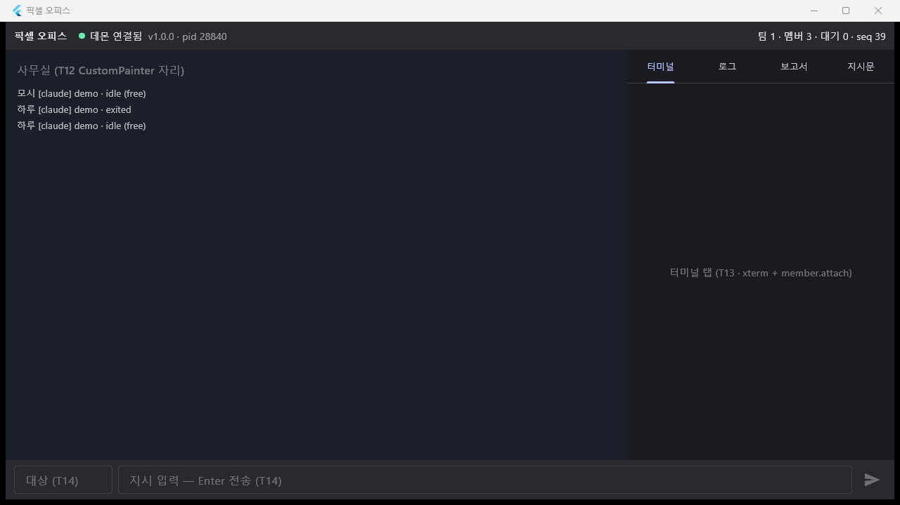
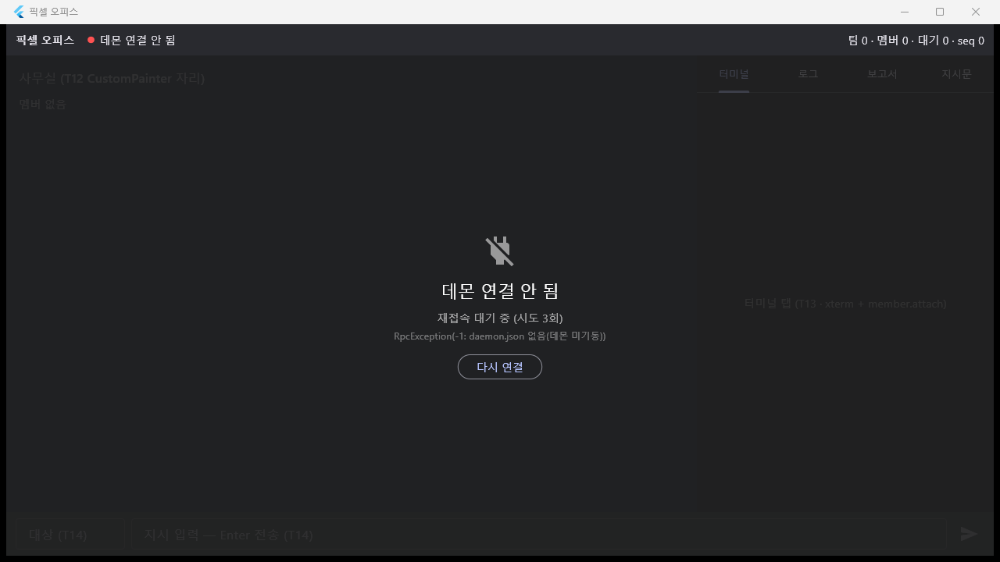

# T11 — Flutter 앱 골격 (RPC 클라이언트 · 상태 모델 · 레이아웃 자리)

- 날짜: 2026-09-15
- 마일스톤: M1
- 관련 설계: 01-설계문서.md §구성 요소 3 "Flutter 데스크탑", §2 오피스 이벤트 스키마, `dev/daemon/PROTOCOL.md`(hello/snapshot/replay, 재접속 규칙), 04-결정기록 D-09
- 커밋: (미커밋 — 이 태스크는 커밋하지 않음)

## 목표

데몬(T07)에 붙는 Flutter Windows 앱의 뼈대. 이 태스크가 끝나면 앱이 `daemon.json` 의 토큰으로 `hello` 해 스냅샷을 받고, 끊기면 스스로 재접속하며(`since = lastSeq`), 팀/멤버/pending/task/이벤트가 Riverpod 프로바이더로 노출된다. T12(사무실 캔버스)·T13(터미널·로그 탭)·T14(지시 바)는 여기 프로바이더만 보고 화면을 그리면 된다.

## 한 것

`flutter create --platforms=windows --project-name pixel_office dev/app` 후:

- `dev/app/pubspec.yaml` — `flutter_riverpod ^3.3.2`, `web_socket_channel ^3.0.3`, `xterm ^4.0.0`(T13용, 지금은 미사용). `path_provider` 없음 — daemon.json 경로는 `Platform.environment['LOCALAPPDATA']` 로 직접.
- `dev/app/lib/rpc/daemon_info.dart` — `DaemonInfo{wsPort, hookPort, token, pid, startedAt, version}`, `defaultPath()`(`PIXEL_DATA_DIR` > `%LOCALAPPDATA%\pixel-office`), `read()`(없거나 깨지면 null), `wsUrl`.
- `dev/app/lib/rpc/rpc_client.dart` — JSON-RPC 2.0 over WebSocket.
  - `connect(url)` / `hello(token, since)` / `call(method, params)` — id 상관, 에러 응답 → `RpcException(code, message, data)`, 타임아웃 `-2`, 끊김 `-1`(대기 중 호출 전부).
  - `lastSeq` = `snapshot.seq`(hello 결과·`snapshot` 알림)와 통과한 `event.seq` 의 최댓값. hello 응답의 seq 는 **응답 핸들러 안에서 동기적으로** 반영해 뒤따르는 replay 보다 먼저. `events` 스트림은 `seq <= lastSeq` 를 버린다(재접속 규칙 2). `notifications` 는 원본 전부.
  - `stateStream`: disconnected/connecting/connected(소켓 열림 ≠ connected, hello 성공 시 connected). `hellos` 스트림은 hello 결과를 그대로 흘려 상태 층이 스냅샷을 재적용.
  - `start(urlProvider, tokenProvider)` 자동 재접속 루프: 실패/끊김 → 1s→2s→4s→5s(상한) 후 재시도, 한 번 동기화된 뒤엔 `since = lastSeq`. token 은 시도마다 다시 읽는다(데몬 재기동마다 바뀜). `attemptStream`(실패 횟수 변화 — daemon.json 이 없어 소켓을 열지도 못한 시도는 stateStream 에 안 나타나므로 이걸로 UI 갱신), `retryNow()`, `stop()`, `close()`.
- `dev/app/lib/model/` — `team.dart`(Team, Engine), `member.dart`(Member, MemberStatus 7종, DerivedStatus(+free, waiting_reports), MemberRank, HiredBy), `office_event.dart`(OfficeEvent, OfficeEventKind 11종, EventDetail(자유 키 + `oneLine` 요약), EventRef), `pending.dart`(Pending, PendingType/Status, `summary`), `task.dart`(Task, TaskStatus, ReportStatus, `userActor`), `snapshot.dart`(Snapshot, MemberStatusNotice, DaemonNotice/NoticeLevel), `models.dart` 배럴. 전부 `fromJson`, snake_case 와이어 값은 enum `.wire`/`.parse`.
- `dev/app/lib/state/office_state.dart` — Riverpod.
  - `OfficeState`(불변, copyWith): connection, daemonVersion/pid, lastSeq, reconnectAttempts, lastError, `teams`/`members`/`derived`/`pending`/`tasks` 맵, `events`(전역 링 2000), `memberEvents`(멤버별 링 2000), `latestEvent`(말풍선), `notices`(50).
  - `OfficeNotifier`(build 시 `client.start()`): hello → 스냅샷 **교체**(링버퍼는 유지) + derived 계산(v1a: idle ∧ 배정 task 없음 → free); `member.status` → status 갱신 / `member` 행 삽입 / waiting 을 벗어나면 그 멤버의 열린 pending 제거 / exited·error 면 그 멤버의 열린 task 제거; `event` → 링버퍼·latestEvent, `waiting_approval{approvalId}`/`asking{questionId}` 로 pending 추가(payload 는 detail 로 구성, `fromEvent:true`), `error{pendingId}` 로 제거, `reporting{taskId}` 로 task 제거; `daemon.notice` 보관. 편의 메서드 `instruct`(taskId 로 로컬 queued 행 추가), `respondApproval`, `respondQuestion`, `applyEvent`, `upsertTask/removeTask/removePending`.
  - 프로바이더: `rpcClientProvider`, `daemonConnectorProvider`, `officeProvider`, `connectionStateProvider`, `daemonVersionProvider`, `daemonPidProvider`, `reconnectAttemptsProvider`, `lastSeqProvider`, `teamsProvider`, `membersProvider`, `memberProvider(id)`, `memberStatusProvider(id)`, `derivedStatusProvider(id)`, `membersOfTeamProvider(teamId)`, `openPendingProvider`, `openTasksProvider`, `globalEventsProvider`, `memberEventsProvider(id)`, `latestEventProvider(id)`, `noticesProvider`.
- `dev/app/lib/main.dart` — `ProviderScope` + `MaterialApp`(dark, title '픽셀 오피스'). 레이아웃: `TopBar`(연결 상태 점·라벨, `v버전 · pid`, `팀 N · 멤버 N · 대기 N · seq N`) / `OfficeArea`(T12 자리; 지금은 멤버 한 줄씩 `이름 [engine] 팀 · status (derived) 💬 마지막 이벤트`) / `RightPanel`(터미널·로그·보고서·지시문 탭 자리) / `CommandBar`(비활성 입력, T14) / `DisconnectedOverlay`(connected 가 아니면 상단 바 아래 전체를 회색으로 덮고 "데몬 연결 안 됨" + 시도 횟수 + 마지막 오류 + "다시 연결" 버튼).
- `dev/app/windows/runner/main.cpp` — 창 제목 `L"픽셀 오피스"`(픽셀 오피스).
- `dev/app/test/fake_daemon.dart` — `dart:io` `HttpServer` + `WebSocketTransformer` 가짜 데몬: hello 토큰 검증(-32001 + close 4001), hello 전 메서드 거부, `since` replay, `echo{delayMs}`/`fail`/`hang`/`empty`, `push`/`emitEvent`/`closeAll`.
- `dev/app/test/rpc_client_test.dart` 8건, `test/model_test.dart` 8건, `test/office_state_test.dart` 6건.
- `dev/app/README.md` — 실행, 구조, RPC 동작, daemon.json 위치, 프로바이더 표.

## 검증

```
$ flutter --version
Flutter 3.41.7 • channel stable · Dart 3.11.5

$ cd dev/app && flutter analyze
Analyzing app...
No issues found! (ran in 3.2s)

$ flutter test          (최종 코드로 2회 연속; 그 전 버전으로도 3회 연속 통과)
00:05 +22: All tests passed!
00:05 +22: All tests passed!

$ flutter build windows --release
Building Windows application...                                     8.3s
√ Built build\windows\x64\runner\Release\pixel_office.exe
```

테스트가 확인하는 것:
- rpc_client: hello 결과(daemon/snapshot)·`lastSeq = snapshot.seq`·상태 전이 / 응답 순서가 뒤바뀌어도 id 로 상관 / `fail` → `RpcException(-32003, 'bad state', {why:test})`, 없는 메서드 -32601, 인증 후 오류는 소켓 유지 / 토큰 불일치 → -32001 후 disconnected / 미접속 -1·대기 중 끊김 -1·무응답 -2 / **replay dedupe**: history 1..7, `hello{since:5}` → snapshot.seq 7 → replay 6,7 은 `notifications` 에는 있고 `events` 에는 없음; 라이브 8,8(중복),9,3(과거) → `events` 는 [8,9], lastSeq 9; `snapshot` 알림 seq 20 → lastSeq 20 / **재접속**: 데몬이 끊으면 disconnected→connecting→connected, 두 번째 hello 의 `since == 5`(=lastSeq), 재접속 후 라이브 이벤트 계속 / 데몬 없음: 시도 횟수 증가·lastError, `daemon.json 없음` 경로, 같은 포트에 데몬이 다시 뜨면 붙음.
- model: 설계문서 §2 이벤트 예시, PROTOCOL 의 Team/Member/Pending(approval·question)/Task/Snapshot/member.status/daemon.notice 파싱, kind 11종·status 7종 wire 왕복, 모르는 값은 FormatException.
- office_state: 가짜 데몬에 실제로 붙어 스냅샷 → 맵/derived(free) / member.status(행 삽입, 모르는 멤버 무시, waiting 해제 시 pending 제거, exited 시 task 제거) / event → 링·latestEvent·pending 파생·error{pendingId}·reporting{taskId}·과거 seq 버림 / daemon.json 없음 → reconnectAttempts·lastError 반영 / 링버퍼 2000 초과 시 앞에서 버림 / 재접속 시 스냅샷 재적용 + 링 유지 + `since`.

실제 데몬(pid 28840, ws 7420, v1.0.0)에 릴리즈 exe 를 20초 띄운 뒤 창만 `PrintWindow` 로 캡처(전체 화면 캡처 없음):

```
> daemon pid 28840 alive=True wsPort=7420 / port open=True
> title=[픽셀 오피스] hwnd=2232594
> printwindow=True size=1280x720 saved=docs\worklog\img\T11-app.png
```

 — 상단 바 `● 데몬 연결됨 v1.0.0 · pid 28840 | 팀 1 · 멤버 3 · 대기 0 · seq 39`, 사무실 자리에 멤버 3명(`모시 idle (free)`, `하루 exited`, `하루 idle (free)`).

끊김 표시: `PIXEL_DATA_DIR` 을 빈 폴더로 주고(daemon.json 없음) 6초 후 캡처:

 — 상단 바 `● 데몬 연결 안 됨 | 팀 0 · 멤버 0 · 대기 0 · seq 0`, 사무실 위 회색 오버레이 + "데몬 연결 안 됨" + `재접속 대기 중 (시도 3회)` + `RpcException(-1: daemon.json 없음(데몬 미기동))` + "다시 연결" 버튼. (6초에 3회 = 1s→2s→4s backoff 대로.)

## 발견한 함정

- **MSVC 소스의 한글 리터럴**: `main.cpp` 는 BOM 없는 파일이고 runner CMake 에 `/utf-8` 이 없어 `L"픽셀 오피스"` 를 넣으면 C2146/C2059 로 빌드 실패(코드페이지 949 해석). `\uXXXX` 이스케이프로 넣었다. 편집 도구가 `\u` 를 실제 문자로 풀어 버려 두 번 실패 — PowerShell `[char]92` 로 써서 해결.
- **Windows 는 닫힌 loopback 포트 접속 실패에 ~2초**(SYN 재전송) 걸린다(`WebSocketChannel.connect` + `ready` 실측 2073ms). 데몬이 죽었는데 daemon.json 이 남아 있으면(하드 킬) 시도마다 2초 + backoff. 테스트는 시도 횟수를 폴링으로 기다린다.
- **Dart broadcast 스트림은 늦게 구독하면 놓친다**(비동기 전달). 테스트에서 `firstWhere` 를 끊김 뒤에 붙였더니 간헐 타임아웃 → 처음부터 모은 리스트를 폴링. 앱 쪽은 `OfficeNotifier.build()` 에서 `start()` 전에 구독하므로 문제 없음.
- **daemon.json 이 없으면 소켓을 열지 않으므로 stateStream 에 아무 변화가 없다** — 첫 캡처에서 오버레이가 "시도 0회"·원인 없음으로 굳어 있었다. `RpcClient.attemptStream`(실패 횟수 변화) 을 추가해 `OfficeNotifier` 가 reconnectAttempts/lastError 를 갱신하도록 고침(테스트 추가).
- `hello` 결과는 `hellos` → `connected` 순서로 내보낸다. 반대로 하면 구독자가 connected 를 봤을 때 스냅샷이 아직 안 들어와 있다.
- **재접속 규칙 2 를 문자 그대로 따르면 replay 는 전부 버려진다**: `snapshot.seq` 는 hello 시점의 최신 seq 라 `seq > since` 인 replay 가 모두 `<= snapshot.seq`. T08 콘솔 클라이언트와 동일한 동작이고 상태(members/pending/tasks)는 스냅샷이 맡으니 정합성은 맞지만, 끊긴 동안의 이벤트가 로그 탭·말풍선에 남지 않는다. T13 로그 탭은 과거를 `events.query` 로 채우면 되고, replay 를 로그에 살리고 싶으면 `RpcClient.notifications` 의 `event` 를 쓰면 된다(상태 파생에는 쓰지 말 것). → 남은 것.
- Riverpod 3: `StateProvider` 대신 `Notifier`/`NotifierProvider` + `Provider.family` 로 작성. `ref.watch(officeProvider.select(...))` 로 슬라이스.
- Dart 3.11 null-aware 맵 요소는 값 쪽에 `'k': ?v`(키 쪽 `?'k'` 는 경고).

## 결정

- 사무실 렌더링 CustomPainter(D-09) 는 T12 — 이 태스크는 자리만.
- 상태 층의 pending/task 파생 규칙(이벤트로 추가, status 변화·error{pendingId}·reporting 으로 제거)은 클라이언트 휴리스틱이며 재접속 스냅샷이 항상 덮어쓴다. 데몬에 "pending 닫힘" 알림이 없어서 생긴 것 — 04 에 새 결정 번호는 붙이지 않음(프로토콜 변경 없음).

## 남은 것

- T12: `OfficeArea` 를 CustomPainter 로. `membersProvider`/`derivedStatusProvider`/`latestEventProvider` 사용.
- T13: `RightPanel` 터미널 탭(`xterm` + `member.attach/term/type/resize`, 재접속 시 attach 재호출), 로그 탭(`globalEventsProvider`/`memberEventsProvider` + `events.query` 로 과거).
- T14: `CommandBar`(대상 선택, Enter 전송 → `OfficeNotifier.instruct`), `DisconnectedOverlay` 에 "데몬 시작"(detached 스폰), `noticesProvider` 표시.
- replay 이벤트를 로그에 살릴지(위 함정) — T13 에서 결정.
- `flutter_riverpod` 3.4 / 기타 의존성 업데이트는 나중에.
