# T19 — v1a 시연

- 날짜: 2026-09-16
- 마일스톤: M2 (완료 판정)
- 관련 설계: 01-설계문서.md §Success Criteria v1a 1~6 · §구성 요소 1 · §3 Flutter 데스크탑
- 커밋: (상위에서)

## 목표

데몬 + Flutter 앱을 실제로 띄워 **v1a 성공 기준 1~6**을 창 캡처와 콘솔 출력으로 한 번에 통과시키고, 남은 결함을 기록한다.
겸사겸사 D-22(TeamTools MCP 도구 자동 허가)를 구현해 `ask_user` 흐름에서 허가 카드가 먼저 뜨던 어색함을 없앤다.

## 한 것

### Part A — D-22 구현 (데몬)

- `dev/daemon/src/adapters/ClaudeHooksAdapter.ts`
  - 새 상수 `TEAM_TOOL_PREFIX = 'mcp__team__'`.
  - `onPermissionRequest()`: `tool_name` 이 `mcp__team__` 로 시작하면 **`req.hold()` 전에** `req.respond(allow())` 로 즉시 허가하고
    반환한다. pending 을 만들지 않고 `waiting_approval` 이벤트도 남기지 않으며 status 도 건드리지 않는다
    (`PreToolUse` 가 이미 `running{tool}` 을 남긴 뒤다). 파일 머리의 매핑 표에도 한 줄 추가.
- `dev/daemon/test/adapters/ClaudeHooksAdapter.test.ts`
  - 새 테스트 1건: `PermissionRequest(mcp__team__*) → 즉시 allow, pending/이벤트 없음 (D-22); mcp__other__ 는 그대로 사용자에게`.
    `mcp__team__ask_user` 는 `state()==='responded'` · `sent==[allow()]` · `created` 0건 · `heldPendingIds()` 빈 배열 ·
    이벤트 `['thinking','running']` · status `working`. 이어서 `mcp__github__create_issue` 는 여전히 `held` + approval pending +
    `waiting_approval` 이벤트 + status `waiting_approval` 인지까지 같은 테스트에서 확인한다.

### Part B — 시연

데몬 `dev/daemon`(`npx tsx src/index.ts`, 7420/7421/7422, 데이터 `%LOCALAPPDATA%\pixel-office`), 콘솔 클라이언트
`npx tsx src/cli/index.ts --exec …`, 앱 `dev/app`(`flutter build windows --release` → `pixel_office.exe`),
창 캡처 `tool\capture-window.ps1`(창 단위). 팀 `demo` cwd = `D:\myproject\pixel-office\dev\spike-0\sandbox`.

시연 도중 앱 UI 를 실제로 클릭해야 하는 곳(캐릭터 선택·탭 전환·허가 버튼)은 임시 PowerShell 스크립트로
`SetForegroundWindow` → `SetCursorPos`(위젯 안으로 몇 픽셀씩 이동 = hover) → `mouse_event` 다운/업 → 커서 원위치 복원으로
눌렀다. 스크립트는 스크래치패드에만 두고 저장소에는 넣지 않았다(시연용 1회성).

## 검증

### 준비 — 낡은 상태 정리

기존 `daemon.json` 의 pid 28840 은 죽어 있었고 DB 에는 T1x 때의 멤버 3명이 남아 있었다. 데몬을 띄우면 `--resume` 으로
되살아나므로 팀을 지우고 새로 만들어 빈 사무실에서 시작했다.

```
$ npx tsx src/index.ts            # 1차 데몬 (pid 10544)
[office] recover 하루(m_4a2df8958509): --resume 66676fbf-…, assigned 0, requeued 0, expired 0
[office] recover 모시(m_36531b8400a7): --resume 357de20d-…, assigned 0, requeued 0, expired 0
[office] 복구: 2명 재개, 0건 만료
[daemon] pixel-office daemon v1.0.0 pid=10544
[daemon] ws        : ws://127.0.0.1:7420
[office] mcp       : http://127.0.0.1:7422/mcp/<memberToken> (TeamTools: ask_user)

po> team delete demo      → #56~#59 idle/clocked out, 팀 삭제: demo
po> team create demo "D:\myproject\pixel-office\dev\spike-0\sandbox"
팀 생성: t_f988313c39b6  demo  …  members=0/4
```

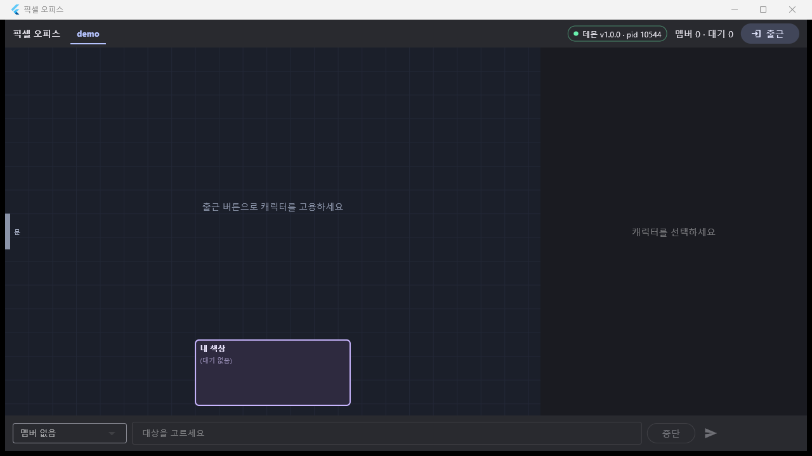 — 상단 `● 데몬 v1.0.0 · pid 10544`, `멤버 0 · 대기 0`, "출근 버튼으로 캐릭터를 고용하세요".

### 기준 1 — 멤버 2명 고용 → 각자 지시 → 둘 다 일함

```
po> hire demo claude 하루   → 출근: m_62ebad39f76f  하루 [claude] starting  pid=13756
po> hire demo claude 모시   → 출근: m_5375a822c18b  모시 [claude] starting  pid=25988
po> say 하루 sandbox 폴더 안의 파일 이름을 전부 읽어서 파일이 몇 개인지 한 줄로 말해줘.   → task#7
po> say 모시 1부터 30까지의 소수를 한 줄로 나열해줘. 도구는 쓰지 말고 바로 답해.          → task#8

#60 thinking 하루 [TASK#7 from user] …
#61 thinking 모시 [TASK#8 from user] …
#62 text 모시 2, 3, 5, 7, 11, 13, 17, 19, 23, 29
#65 running 하루 Bash ls -1A "…/sandbox" — List all entries in sandbox folder
#67 text 하루 sandbox 폴더에는 파일이 8개 있습니다 (cli.txt, hello.txt, …)
```

두 세션이 동시에 도는 그림을 잡으려고 조금 더 긴 지시를 한 번 더 넣었다(각자 같은 파일을 12번 Read).

```
po> say 하루 sandbox/hello.txt 를 Read 도구로 한 번에 하나씩 총 12번 읽어라(병렬 금지, 순서대로). 다 읽으면 '하루 완료'라고만 말해줘.  → task#11
po> say 모시 sandbox/t10.txt  를 Read 도구로 한 번에 하나씩 총 12번 읽어라(병렬 금지, 순서대로). 다 읽으면 '모시 완료'라고만 말해줘.  → task#12
#115 reading 하루 Read …\hello.txt
#116 reading 모시 Read …\t10.txt
… (교대로 12회씩) …
#121 text 하루 하루 완료   #124 text 모시 모시 완료
```

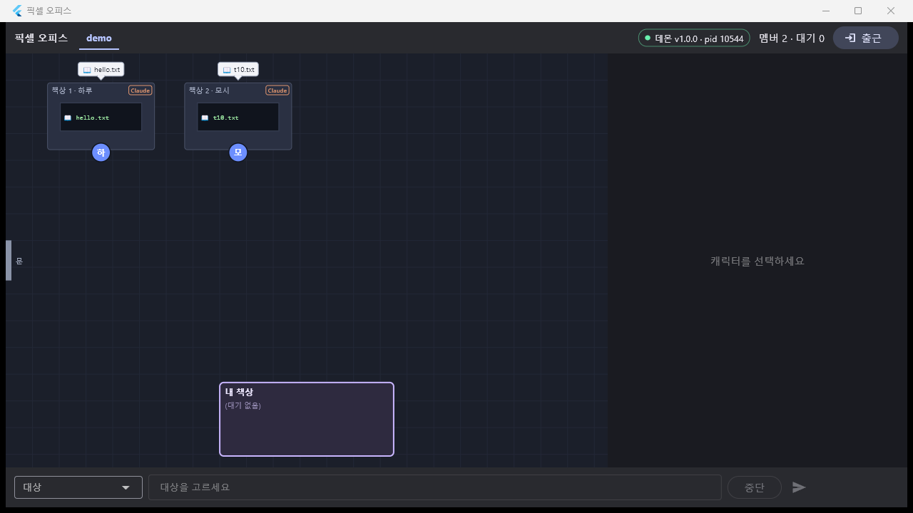 — 책상 1 하루 · 책상 2 모시, 캐릭터 둘 다 파란색(작업 중),
말풍선 `hello.txt` / `t10.txt`, 책상 모니터에도 같은 줄. 상단 `멤버 2 · 대기 0`.

### 기준 2 — 터미널 탭에 실제 화면, 직접 타이핑(슬래시 명령 포함)

앱에서 캐릭터(모시)를 클릭 → 오른쪽 패널 **터미널** 탭.

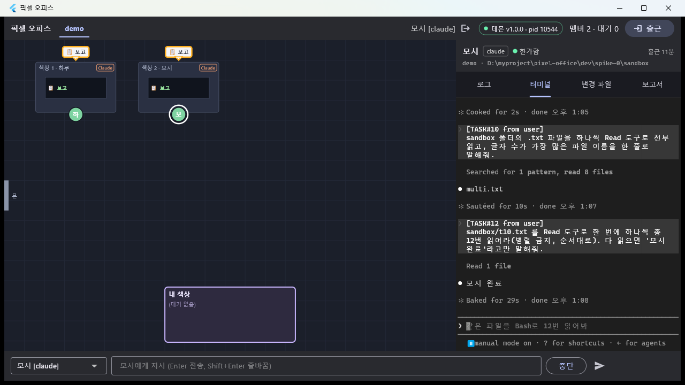 — 실제 Claude TUI 가 그대로 보인다: `[TASK#10 from user]` / `[TASK#12 from user]`
프롬프트, `Searched for 1 pattern, read 8 files`, `● multi.txt`, `✻ Baked for 29s`, 하단 입력 상자와
`⏸ manual mode on · ? for shortcuts · ← for agents`. 한글·박스 문자 깨짐 없음.

같은 화면을 콘솔에서도 확인하고(`attach`), **슬래시 명령**을 직접 타이핑해 먹는 것을 확인했다(`type` = 터미널 탭이 쓰는
`member.type` RPC 와 동일 경로).

```
po> attach 하루
── 하루 화면 (120x40) ──
[screen] ▝▜██████▀Opus 5 (1M context) · Claude Max
[screen]   ▝▝ ▝▝  D:\myproject\pixel-office\dev\spike-0\sandbox
[screen] ❯ [TASK#7 from user] …
[screen] ⏸ manual mode on · ? for shortcuts · ← for agents

po> type 하루 /status
po> attach 하루
[screen]    Settings  Status   Config   Usage   Stats
[screen]    Version:                 2.1.270
[screen]    Session ID:              da325f4a-8a54-451a-acae-df32310ffd5f
[screen]    cwd:                     D:\myproject\pixel-office\dev\spike-0\sandbox
[screen]    Model:                   Default (Opus 5 with 1M context …)
[screen]    MCP servers:             2 connected · /mcp          ← T17 --mcp-config 주입 확인
[screen]    Setting sources:         User settings, Command line arguments
[screen]                             Esc to cancel
po> type 하루 \e\e          ← 다이얼로그 닫힘, 빈 프롬프트로 복귀
```

터미널 탭 위젯 자체(키 입력 → `member.type`, 리사이즈, 탭 전환 시 detach/attach, 스크롤백 캐시)는 T13·T18 위젯 테스트가
덮는다. 이번 실기에서는 `SendKeys` 로 앱 터미널에 키를 넣어 보는 것은 실패했고(포커스가 xterm 위젯에 안 들어갔다),
타이핑은 `member.type` RPC 로만 실증했다.

### 기준 3 — Bash 허가 → 내 책상 → 허가/거부

```
po> say 하루 셸 명령 "echo t19-allow > t19-allow.txt" 를 Bash 도구로 실행해줘. 다른 건 하지 마.   → task#13
po> pending
a_587f4fd7db28  approval  하루  Bash echo t19-allow > t19-allow.txt
po> members
m_62ebad39f76f  하루 [claude] waiting_approval …
```

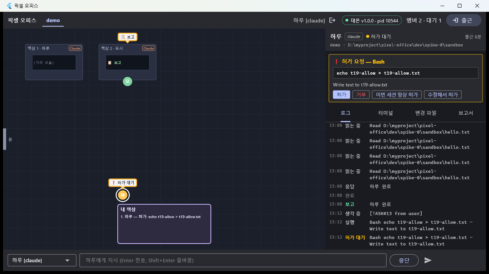 — 하루가 **내 책상 앞**에 `❗ 허가 대기` 말풍선으로 서 있고, 내 책상 목록에
`1. 하루 — 허가: echo t19-allow > t19-allow.txt`, 상단 `대기 1`. 캐릭터를 클릭하면 오른쪽에
`❗ 허가 요청 — Bash` 카드(명령 박스 + `Write text to t19-allow.txt` + 허가 / 거부 / 이번 세션 항상 허가 / 수정해서 허가)와
백필된 로그 탭.

**앱 카드의 "허가" 버튼을 실제로 눌러** 통과시켰다(= `approval.respond{behavior:'allow'}`).

```
#127 thinking 하루 [TASK#13 from user] …
#128 running 하루 Bash echo t19-allow > t19-allow.txt — Write text to t19-allow.txt
#129 waiting_approval 하루 …  approval=a_587f4fd7db28
#130 text 하루 실행했습니다. `t19-allow.txt` 생성 완료.
$ cat dev/spike-0/sandbox/t19-allow.txt → t19-allow
```

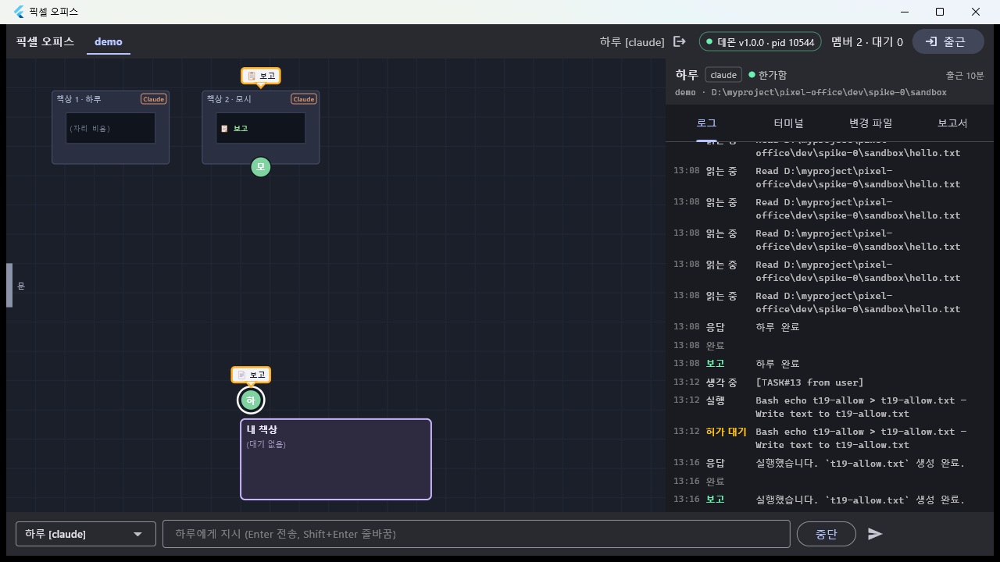 — 카드가 사라지고 헤더가 `● 한가함`, 내 책상 `(대기 없음)`, `대기 0`.

거부는 콘솔로:

```
po> say 하루 셸 명령 "echo t19-deny > t19-deny.txt" 를 Bash 도구로 실행해줘. 다른 건 하지 마.   → task#14
po> deny a_3b371432a89e 지금은 파일을 만들지 마
status 하루 → working (working)
deny: a_3b371432a89e
#136 text 하루 명령이 거부되었습니다 ("지금은 파일을 만들지 마"). `t19-deny.txt`는 생성하지 않았고, 다른 작업도 하지 않았습니다.
$ ls dev/spike-0/sandbox/t19-deny.txt → No such file or directory
```

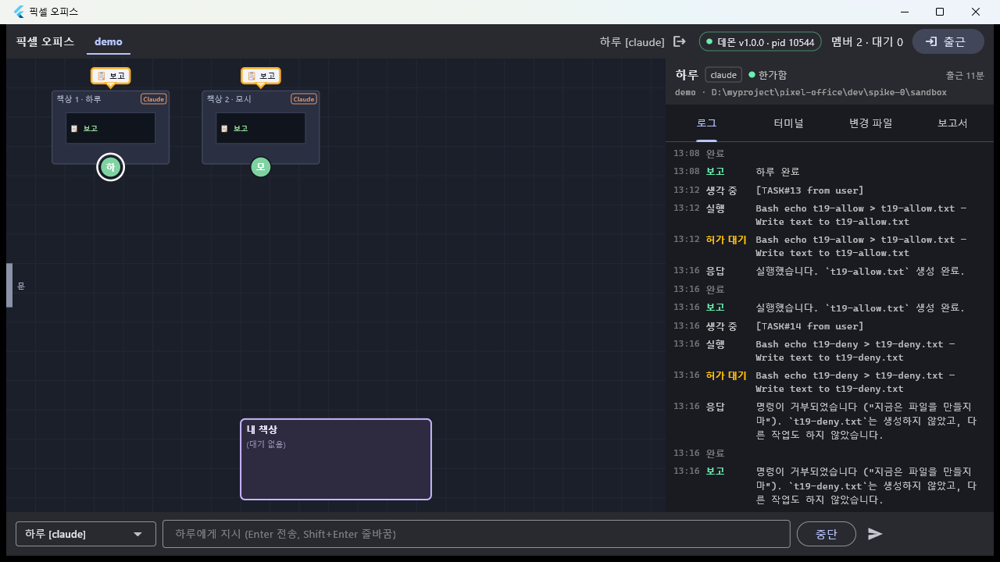 — 하루가 **책상 1 자리로 돌아가** 있고 내 책상은 `(대기 없음)`.
키 입력 없이 hook 결정(allow/deny)만으로 처리됐다(허가 전 `running`, 허가 후 곧바로 `text` — TUI 프롬프트 흔적 없음).

### 기준 4 — `ask_user` 질문 → 답 → 재개 (+ D-22 확인)

```
po> say 모시 team MCP 서버의 ask_user 도구로 나에게 '점심은?' 하고 물어봐 (옵션: 김밥, 라면). 답이 오면 그 메뉴를 한 줄로 말해줘.
task#15 → 모시

#139 thinking 모시 [TASK#15 from user] …
#140 running 모시 ToolSearch
#141 running 모시 mcp__team__ask_user
#142 asking  모시 ask_user — 점심은?   question=q_24b252981e1d      ← waiting_approval 이벤트 없음 (D-22)
#143 text    모시 질문을 등록했습니다 (q#q_24b252981e1d). 답변이 오면 메뉴를 알려드릴게요.
#144 idle    모시
po> pending
q_24b252981e1d  question  모시  (질문 내용 없음)
```

T17 통합 로그에 있던 `waiting_approval {tool: mcp__team__ask_user}` 가 **사라졌다** — Part A 가 실기에서 그대로 동작한다.
멤버 화면에도 그 근거가 찍힌다.

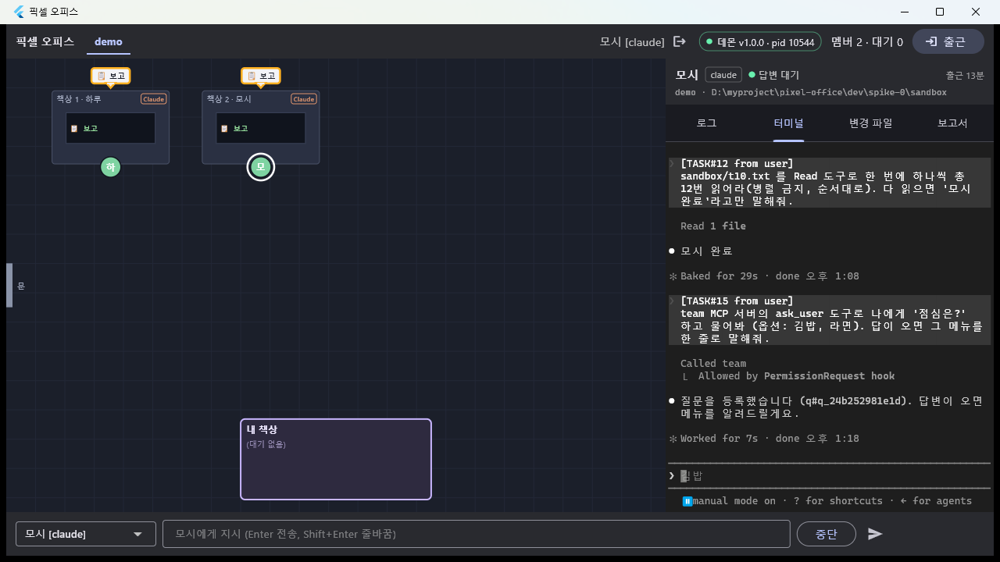 — 터미널 탭에 `Called team` / `└ Allowed by PermissionRequest hook`,
이어서 `● 질문을 등록했습니다 (q#q_24b252981e1d)…`. 헤더 상태는 파생 `● 답변 대기`.

```
po> answer q_24b252981e1d 점심은?=김밥
status 모시 → idle (free)
answer: q_24b252981e1d {"점심은?":"김밥"}
#146 thinking 모시 [ANSWER q#q_24b252981e1d] ⏎ 김밥
#147 text     모시 김밥
```

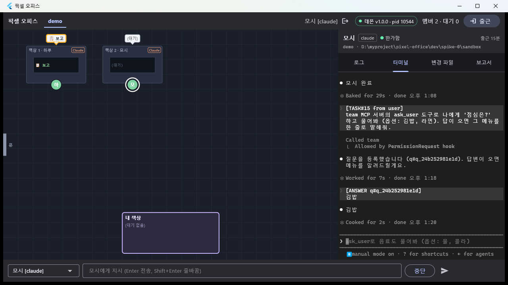 — 터미널에 `[ANSWER q#q_24b252981e1d] / 김밥` 주입과 모델 응답 `● 김밥`.

**결함:** 앱에서 `ask_user` 질문 카드가 뜨지 않고 캐릭터도 내 책상으로 오지 않는다(아래 함정 1). 데몬·프로토콜·콘솔은 정상.

### 기준 5 — 창 닫았다 열기

```
$ taskkill /IM pixel_office.exe /F   → SUCCESS (PID 28784)
$ start build\windows\x64\runner\Release\pixel_office.exe
```

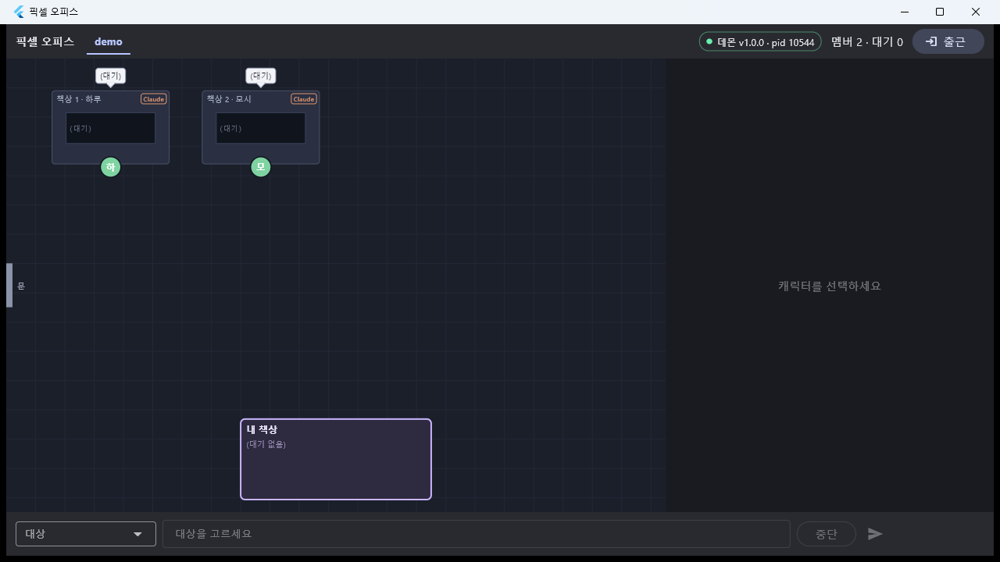 — 멤버 2명이 각자 책상에 그대로, 상단 `데몬 v1.0.0 · pid 10544 / 멤버 2`.
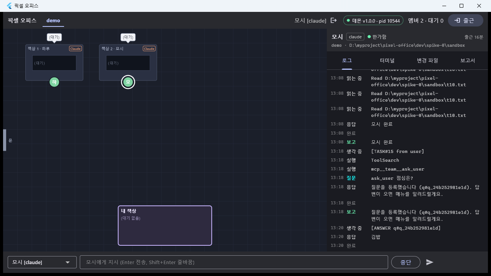 — 모시를 고르면 로그 탭에 닫기 **이전** 이벤트(읽는 중 → 응답 → 보고 →
`ask_user 점심은?` → `[ANSWER …]` → `김밥`)가 그대로 있다(D-21 `events.query` 백필). 터미널 탭도 다시 붙으면 현재 화면부터
그려진다.

### 기준 6 — 데몬 죽음 → 재시작 → `--resume` (+ "재지시 필요")

"재지시 필요" 를 같이 보려고 **허가를 열어 둔 채로** 죽였다.

```
po> say 하루 셸 명령 "echo t19-redo > t19-redo.txt" 를 Bash 도구로 실행해줘. 다른 건 하지 마.   → task#16
po> pending → a_becc991dd86d  approval  하루  Bash echo t19-redo > t19-redo.txt
$ taskkill /PID 10544 /F   → SUCCESS
$ Get-Process -Id 13756,25988 → (없음)      ← taskkill /F 면 claude.exe 자식도 같이 죽는다(T10 과 동일, D-17 가드는 유지)
```

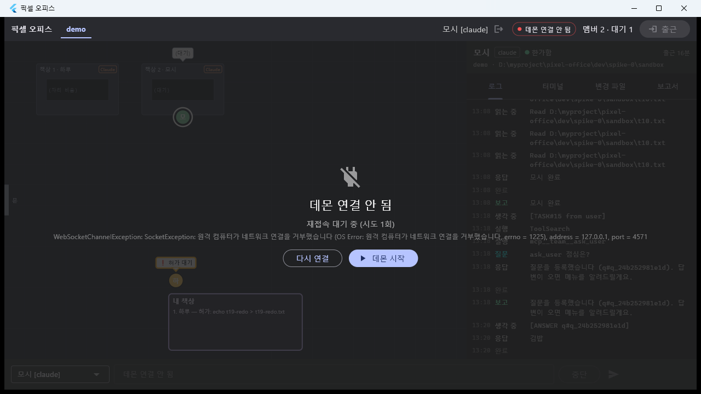 — 회색 사무실 + "데몬 연결 안 됨 / 재접속 대기 중 (시도 1회)" + `다시 연결` ·
`데몬 시작` 버튼, 상단 뱃지 빨강, 지시 바 비활성.

```
$ npx tsx src/index.ts            # 2차 데몬 (pid 25204)
[office] recover 하루(m_62ebad39f76f): --resume da325f4a-…, assigned 1, requeued 0, expired 1
[office] recover 모시(m_5375a822c18b): --resume b92bdb8e-…, assigned 0, requeued 0, expired 0
[office] 복구: 2명 재개, 1건 만료

#152 error    하루 재지시 필요: 허가 요청이 재시작으로 만료됨   approval=a_becc991dd86d
#153 text     하루 resumed        #154 text 모시 resumed
#155 thinking 모시 [RESUMED] 데몬이 재시작됐다. 진행 중이던 작업: 없음. 마지막 확인된 행동: idle; reporting …
#156 thinking 하루 [RESUMED] 데몬이 재시작됐다. 진행 중이던 작업: task#16: 셸 명령 "echo t19-redo > t19-redo.txt" …
#157 running  하루 Bash ls -1A "…/sandbox" — List sandbox contents to check current state
#160 running  하루 Bash echo t19-redo > t19-redo.txt
#161 waiting_approval 하루 …  approval=a_db2f2e400c3c        ← 스스로 다시 시도 → 새 허가 요청
```

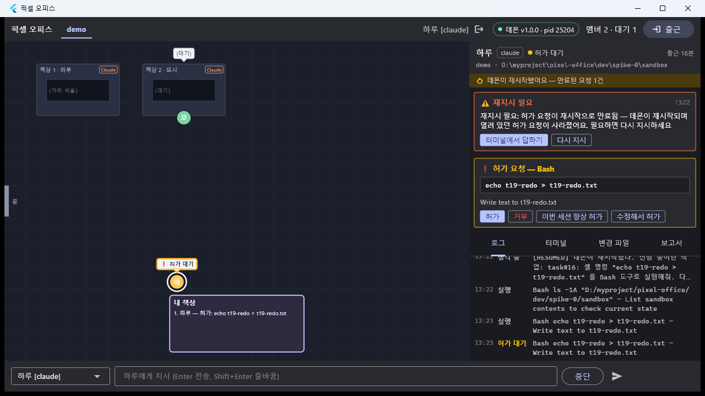 — 앱이 새 데몬(pid 25204)에 붙었고 멤버 2명이 돌아왔다. 하루를 고르면
`⏱ 데몬이 재시작됐어요 — 만료된 요청 1건` 배너, `⚠ 재지시 필요` 카드("데몬이 재시작되며 열려 있던 허가 요청이
사라졌어요…" + `터미널에서 답하기` · `다시 지시`), 그 아래 resume 후 새로 올라온 `❗ 허가 요청 — Bash` 카드.
카드의 `허가` 를 눌러 마무리 → `t19-redo.txt` 생성, `#164 reporting 하루 재시작 전 승인이 만료돼 있었습니다. … 다시 실행해 생성 완료했습니다.`

이전 대화 기억:

```
po> say 모시 아까 점심 메뉴가 뭐였지? 한 줄로 답해.   → task#17
#166 text 모시 김밥입니다.
```

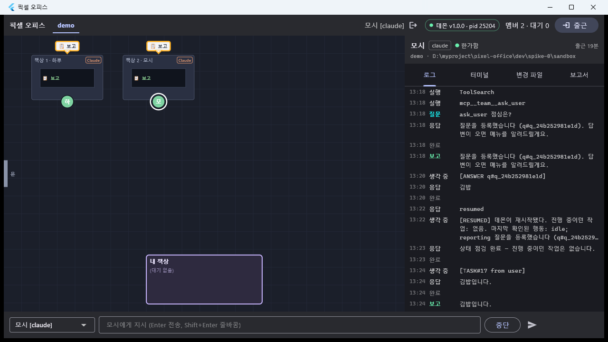

### 정리

```
po> fire 하루 / fire 모시 → #169~#172 session ended: prompt_input_exit → clocked out
$ taskkill /IM pixel_office.exe /F
$ Get-Process -Id 25204 → node   (데몬은 켜 둔 채로 종료)
```

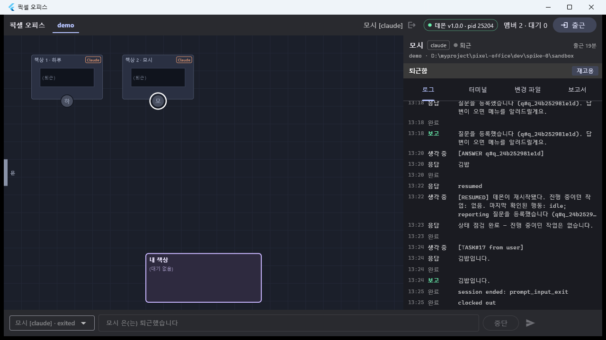 — 두 책상 `(퇴근)`, 패널에 `퇴근함 / 재고용`.

### 테스트

```
$ cd dev/daemon && npx tsc --noEmit
(출력 없음, EXIT=0)

$ npx tsx --test "test/**/*.test.ts"
ℹ tests 186  ℹ suites 32  ℹ pass 182  ℹ fail 0  ℹ skipped 4   (PIXEL_IT 미설정 통합 4건)

$ npx tsx --test test/adapters/ClaudeHooksAdapter.test.ts
  ✔ PermissionRequest(mcp__team__*) → 즉시 allow, pending/이벤트 없음 (D-22); mcp__other__ 는 그대로 사용자에게 (1.434ms)
ℹ tests 19  ℹ pass 19  ℹ fail 0

$ cd dev/app && flutter build windows --release
√ Built build\windows\x64\runner\Release\pixel_office.exe
```

### 성공 기준 ↔ 증거

| # | 기준 | 증거 | 결과 |
|---|---|---|---|
| 1 | 멤버 2명 고용 → 각자 지시 → 둘 다 일함 | `hire`×2 (pid 13756/25988), task#7·#8·#11·#12, 이벤트 #60~#126,  | ✅ |
| 2 | 터미널 탭에 실제 화면 + 직접 타이핑(슬래시 포함) |  (앱 터미널 탭), `attach 하루` 화면 덤프, `type 하루 /status` → Status 패널, `\e\e` 로 복귀. 위젯 레벨은 T13·T18 테스트 | ✅ |
| 3 | Bash 허가 요청 → 내 책상 → 허가/거부 |   , `t19-allow.txt` 생성 / `t19-deny.txt` 미생성, 키 입력 없이 hook 결정 | ✅ |
| 4 | 질문 → 답 → 재개 | 이벤트 #139~#147, `answer` → `[ANSWER q#…]` → `김밥`,   | ⚠ 데몬·콘솔 ✅ / 앱 카드·이동 ✗ (함정 1) |
| 5 | 창 닫았다 열어도 세션·로그 복원 |   | ✅ |
| 6 | 데몬 죽음 → 회색 → 재시작 `--resume`, 열린 허가는 "재지시 필요" |   , `[office] 복구: 2명 재개, 1건 만료`, #152 error 재지시 필요 | ✅ |
| — | D-22 | #141 `running mcp__team__ask_user` 바로 뒤 #142 `asking` (waiting_approval 없음), 화면 `Allowed by PermissionRequest hook`, 단위 테스트 1건 | ✅ |

## 발견한 함정

1. **(버그) `ask_user` 질문은 앱에 카드가 뜨지 않고 캐릭터도 내 책상으로 오지 않는다.** 기준 4 의 유일한 미달 항목.
   - 재현: 멤버에게 `mcp__team__ask_user` 를 시키고 앱에서 그 멤버를 선택 → 헤더는 `● 답변 대기`(파생)인데 질문 카드가 없고,
     사무실에서도 자기 책상에 앉아 있으며 내 책상 목록은 `(대기 없음)`.
   - 원인: T17 의 `ask_user` 는 **턴을 붙잡지 않으므로** 질문이 열린 채로 멤버의 **raw `member.status` 가 `idle` 로 돌아간다**
     (파생 status 만 `waiting_answer`). 앱은 두 군데에서 raw status 를 본다.
     - `dev/app/lib/state/office_state.dart:297` — `if (!n.status.isWaiting) { 그 멤버의 열린 pending 을 전부 제거 }`
       → `asking` 이벤트로 만들어 둔 question pending 이 곧바로 지워진다 → 카드 없음.
     - `dev/app/lib/office/office_scene.dart:161,167` — 내 책상 줄에 세울 멤버를 `m.status.isWaiting` 으로 고른다
       → `idle` 이라 줄에 안 선다.
   - 고칠 방향(이 태스크 범위 밖이라 손대지 않음): 두 판정 모두 **파생 status**(`DerivedStatus.waitingAnswer`) 또는
     "열린 pending 이 있는가" 를 기준으로 바꾸기. 응답이 끝나면 데몬이 pending 을 닫고 `member.status` 를 다시 쏘므로
     제거 타이밍은 그대로 유지된다. TUI `AskUserQuestion`(raw status 가 `waiting_answer`)은 지금도 정상.
2. **(버그) 콘솔 클라이언트가 `ask_user` pending 의 질문을 못 읽는다.** `pending` 이 `(질문 내용 없음)` 으로 나오고
   `answer <id> <label>` 은 `질문 원문을 모릅니다` 로 거절한다. `dev/daemon/src/cli/format.ts` 의 `questionsOf()` 가
   TUI 모양(`payload.questions[]`)만 보고 T17 의 `{source:'ask_user', question, options}` 를 모른다.
   우회: `answer <id> <질문원문>=<label>` (`answer q_… 점심은?=김밥`). 앱과 같은 payload 를 다루도록 고치면 된다.
3. **콘솔 `type` 으로는 ESC 를 단독으로 못 보낸다.** `typedPayload()` 가 `\n`/`\r` 로 끝나지 않는 입력에 Enter(`\r`)를 붙이므로
   `type 하루 \e` 는 `ESC CR`(= Alt+Enter)로 나가 다이얼로그가 안 닫힌다. `\e\e` 로 보내면 닫힌다. 앱 터미널 탭은 xterm 이
   키를 그대로 보내므로 해당 없음.
4. **Claude 2.1.270 이 턴이 끝나면 입력 상자에 "다음 지시" 고스트 제안을 채워 둔다.** 예: 하루 화면에
   `❯ 이번엔 hold.txt를 20번 순서대로 읽어줘`, 모시 화면에 `❯ 같은 파일을 Bash로 12번 읽어봐`. 우리가 넣은 적 없는 문자열이라
   처음엔 입력 큐 누수로 의심했지만, 다음 지시를 붙여넣으면 그냥 덮인다(task#7 → #9 → #11 연속 정상). 상태 표시줄도
   `⏸ manual mode on · ? for shortcuts · ← for agents` 로 바뀌었는데 `isPromptReady()` 패턴(`? for shortcuts`)은 그대로 걸린다.
   **책상 모니터·터미널 탭에 이 제안 문구가 사람 말처럼 보일 수 있다**는 점만 알아 두면 된다.
5. **읽기 전용 셸은 허가를 안 탄다.** `ls -1A …` / `find … | wc -l` 은 `running` 만 찍히고 `PermissionRequest` 가 없었다.
   허가 흐름을 시연하려면 `echo … > 파일` 처럼 쓰기 명령을 써야 한다.
6. **Flutter 창은 합성 메시지 클릭(PostMessage/SendMessage WM_LBUTTONDOWN)에 반응하지 않는다.** 실제 `mouse_event` 여야 하고,
   버튼은 **누르기 전에 포인터가 위젯 안으로 들어오는 이동(hover)** 이 한 번 있어야 눌린다(그냥 SetCursorPos 후 즉시 클릭하면
   캐릭터 선택은 되는데 카드 버튼은 안 눌렸다). 자동 시연 스크립트를 또 만들 일이 있으면 이 순서를 지킬 것.
7. **오른쪽 패널은 "선택된 멤버" 전용이다.** 허가·질문 카드와 재지시 카드 모두 캐릭터를 클릭해야 보인다. 선택이 없으면
   내 책상 상자의 줄 목록(`1. 하루 — 허가: …`)과 상단 `대기 N` 만이 단서다. 설계대로이긴 하나, 대기 중인 멤버가 있을 때
   자동 선택하거나 `PendingInbox`(이미 구현돼 있고 배선만 안 됨)를 내 책상 패널에 붙이는 걸 M6 에서 검토.
8. 낡은 `daemon.json`(T17 이전) 에는 `mcpPort` 가 없다. 데몬이 새로 쓰므로 문제는 없지만, pid 로만 생사 판단하면
   죽은 데몬을 살아 있다고 볼 수 있으니 `Get-Process -Id <pid>` 로 확인하고 시작할 것.

## 결정

- D-22 를 구현했다(`mcp__team__*` PermissionRequest 는 데몬이 즉시 allow). 새 결정은 없다.

## 남은 것

- **함정 1(앱 `ask_user` 카드·이동)** — v1a 기준 4 의 UI 절반. `office_state.dart` / `office_scene.dart` 를 파생 status
  기준으로 바꾸고 위젯 테스트 추가. 이 태스크의 수정 허용 범위 밖이라 손대지 않았다.
- **함정 2(콘솔 `ask_user` pending 표시·답)** — `cli/format.ts questionsOf()` 확장.
- 함정 7 의 "대기 중인 멤버 자동 선택 / 내 책상 인박스 배선" — M6 레이아웃과 같이.
- `SessionStart(source=compact)` 재주입 확인(T10 에서 이월) — 이번에도 긴 세션이 없어 못 봤다. M5 로.
- 앱 터미널 탭에 OS 키 입력을 넣는 자동화는 실패했다(`SendKeys` 가 xterm 위젯에 안 들어감). 실기 타이핑 검증은 사람이 하거나
  `member.type` RPC 로 대신한다.
