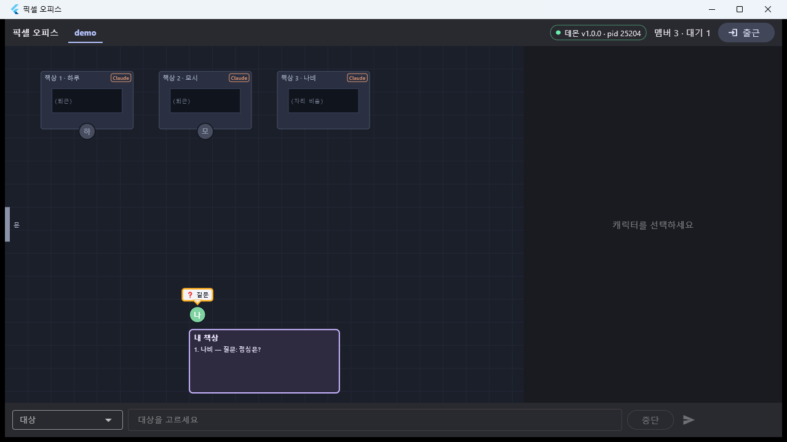
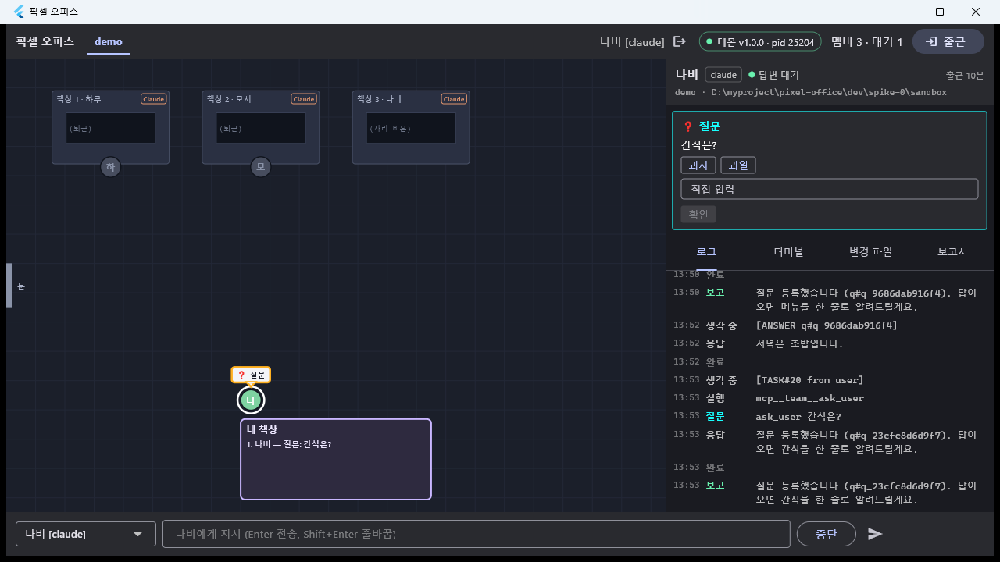
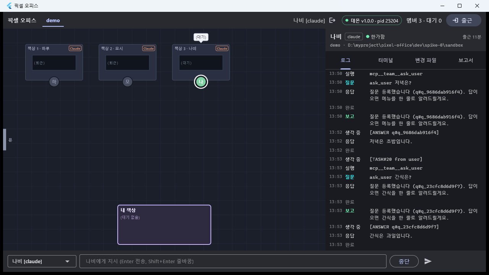
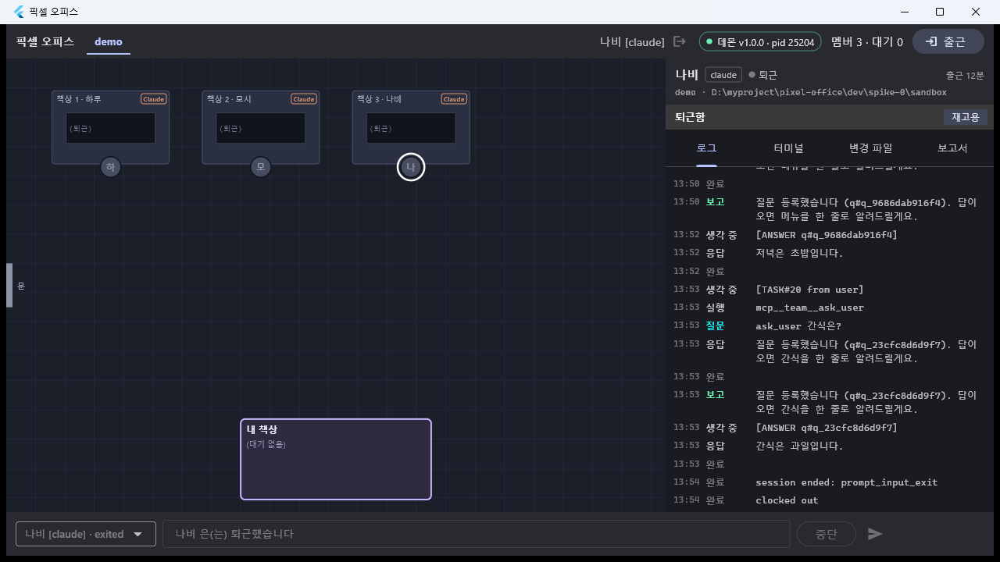

# T19b — `ask_user` 결함 3건 수정

- 날짜: 2026-09-16
- 마일스톤: M2 (T19 후속 — **M2 완료** 판정은 그대로)
- 관련 설계: 01-설계문서.md §Success Criteria v1a 4 · §3 Flutter 데스크탑 / PROTOCOL.md §TeamTools MCP · `member.status.derived` / D-19 · D-22
- 커밋: (상위에서)

## 목표

T19 "발견한 함정" 1~3 을 고친다. 핵심은 **v1a 성공 기준 4 의 앱 절반** — TeamTools `ask_user` 질문이 앱에
질문 카드로 뜨고 캐릭터가 내 책상으로 오는 것. 덤으로 콘솔 클라이언트의 `pending` 표시·`answer <id> <label>`,
`type <member> \e`(ESC 단독) 도 고친다. 데몬 본체는 손대지 않는다(T19 에서 정상 확인).

## 한 것

### 버그 1 — 앱: `ask_user` 질문 카드·내 책상 이동 (기준 4)

원인은 T19 가 짚은 그대로다. `ask_user` 는 **턴을 붙잡지 않으므로**(T17) 질문이 열린 채 멤버의 raw
`member.status` 가 `working` → `idle` 로 돌아가고, 파생 status 만 `waiting_answer` 다. 앱은 세 군데에서
raw status 만 봤다.

- `dev/app/lib/model/member.dart`
  - `DerivedStatus.isWaiting` 추가(`waiting_approval | waiting_answer`).
  - `DerivedStatus.fromStatus(...)` 에 `hasOpenQuestion` 파라미터 추가 — 스냅샷에서 파생 상태를 계산할 때
    PROTOCOL 의 v1a 규칙("idle 인데 열린 질문 pending 이 있으면 `waiting_answer`")을 그대로 따른다.
    이게 없으면 창을 다시 열었을 때 파생이 `free` 로 계산돼 말풍선·헤더가 `(대기)`/`한가함` 으로 보였다.
- `dev/app/lib/model/pending.dart`
  - `Pending.isAskUser` — payload `source == 'ask_user'` 인 질문(D-19: `tool_input` 없음).
- `dev/app/lib/state/office_state.dart`
  - **pending 제거 규칙**(기존 297줄 `if (!n.status.isWaiting) { 그 멤버 pending 전부 제거 }`)을 바꿨다.
    이제 pending 이 사라지는 경로는 셋뿐이다:
    (a) `error{pendingId}`, (b) 스냅샷에서 빠짐,
    (c) `member.status` 의 **raw 와 파생이 둘 다** waiting 이 아님 —
    단 `ask_user` 질문은 **raw 가 `idle` 이거나 종료(exited/error)** 일 때만 함께 지운다.
    마지막 단서는 실기에서 추가로 발견한 것이다(아래 함정 1): 데몬은 `asking` 직후 `PostToolUse` 로
    status 를 `working` 으로 되돌리므로, "raw·파생 둘 다 non-waiting" 만으로 지우면 방금 만든 질문 pending 이
    즉시 지워진다. 데몬의 파생 규칙은 **raw 가 idle 일 때만** 열린 질문 유무를 알려 주므로, working/starting
    동안에는 `ask_user` 질문을 건드리지 않는다.
  - `asking` 이벤트 → pending 생성 시 payload 를 스냅샷과 같은 모양으로:
    `detail.tool == 'ask_user'` 면 `{source:'ask_user', question: detail.summary, options: detail.options}`.
    (T15 `parseQuestions` 가 이 모양을 이미 알고 있어 QuestionCard 가 옵션 버튼까지 그린다.)
  - `_applySnapshot` 에서 열린 question pending 을 가진 멤버는 `hasOpenQuestion: true` 로 파생 계산.
- `dev/app/lib/office/office_scene.dart`
  - `OfficeScene.build` 에 `derived` 맵 파라미터 추가. 내 책상 줄 판정(161·167줄의 `m.status.isWaiting`)을
    **"열린 pending 이 있다" ∨ "파생이 waiting" ∨ "raw 가 waiting"** 으로 바꿨다.
  - `summarize` / `isAlertFor` 에 `derived` 옵션 추가 — 파생이 `waiting_answer`/`waiting_approval` 이면
    마지막 이벤트(`idle`)보다 `❓ 질문`/`❗ 허가 대기` 가 앞선다. 안 그러면 질문을 기다리며 내 책상에 서 있는데
    말풍선이 `(대기)` 였다.
- `dev/app/lib/office/office_view.dart`
  - `officeDerivedProvider`(파생 맵 슬라이스) 추가, `officeSceneProvider` 가 같이 watch.
- `dev/app/lib/panel/pending_card.dart` — **수정 없음**. T15 `parseQuestions` 가 `{question, options?}` 를 이미
  질문 하나로 읽고, `_send()` 가 `answers = {question: label}` 로 보낸다(기존 테스트 "QuestionCard M2 ask_user
  형태 {question, options?} 도 질문 하나로" 가 덮고 있다). 카드가 안 뜬 것은 순전히 상태 층 문제였다.

테스트(추가·수정):

- `dev/app/test/office_state_test.dart` — 4건 추가
  `ask_user asking → payload(source/question/options) 생성`, `asking → waiting_answer → working → idle` 순서에서
  pending 유지, 답 뒤 `derived: free` 에 제거 / 스냅샷의 열린 `ask_user` 질문 → idle 멤버 파생 `waiting_answer` /
  파생이 `waiting_approval` 인 동안 허가 pending 유지 / `working` 알림은 `ask_user` 질문만 남기고 허가·TUI 질문은 제거.
- `dev/app/test/office/office_scene_test.dart` — `summarize`/`isAlertFor` 의 derived 케이스,
  "열린 pending 이 있으면 raw status 와 무관하게 줄에 선다"(기존 테스트의 반대 방향으로 규칙이 바뀌어 수정),
  "ask_user 질문이 열린 멤버(raw idle · 파생 waiting_answer)도 줄에 서고 말풍선은 ❓ 질문" 신규.
- `dev/app/test/office/office_view_test.dart` — 위젯 레벨: 줄로 걸어갔다가 답하면 자리로 복귀 + 시맨틱 라벨.
- `dev/app/test/panel/pending_card_test.dart` — 라이브 `asking{tool:'ask_user'}` → 카드(옵션 포함) →
  raw idle 에도 유지 → 옵션 클릭 → `question.respond{answers:{'점심은?':'김밥'}}` → 카드 사라짐.
- `dev/app/test/office/office_fixtures.dart` (`askUserQuestion` 헬퍼), `office_harness.dart`(`twoMembers` 에
  `derived`·`extraEvents`).

### 버그 2 — 콘솔: `ask_user` pending 의 질문을 못 읽음

- `dev/daemon/src/cli/format.ts` `questionsOf()` 가 두 모양을 다 읽는다:
  TUI `{questions:[{question, options:[{label}…]}]}` 와 TeamTools `{source:'ask_user', question, options: string[]}`.
  옵션 라벨 추출은 `labelsOf()` 로 공통화. → `pending` 이 `점심은? [김밥|라면]` 으로 찍히고,
  질문이 하나이므로 `answer <id> <label>` 이 그대로 먹는다.
- `dev/daemon/src/cli/index.ts` `onEvent()` — `asking{tool:'ask_user'}` 로 만든 로컬 pending 에도 같은 payload 를
  넣어 둔다. `refresh`(스냅샷 재수신) 없이도 `pending` 이 질문·옵션을 찍고 `answer <id> <label>` 이 먹는다.
- `dev/daemon/test/cli/parse.test.ts` — `questionsOf`/`pendingSummary` 의 ask_user 케이스 1건 추가
  (본문을 모르면 여전히 빈 배열 → `answer` 가 `question=label` 을 요구한다는 것까지).

### 버그 3 — 콘솔: `type <member> \e` 가 Alt+Enter 로 나감

- `dev/daemon/src/cli/parse.ts`
  - `isEscapeOnly(data)` 신설 — `stripAnsi()`(format.ts 의 CSI/OSC/제어문자 정규식) 로 지우고 **남는 글자가 없으면**
    "키 입력만" 으로 본다. `\e`, `\e\e`, `\e[A`, `\x03` 이 여기 걸리고, `\t`·`\n`·`\r` 은 stripAnsi 가 남기므로 안 걸린다.
  - `typedPayload()` 는 `\n`/`\r` 로 끝나거나 `isEscapeOnly` 면 Enter 를 붙이지 않는다.
    빈 문자열은 그대로 Enter 한 번(`''` → `'\r'`).
- `dev/daemon/src/cli/index.ts` — `help` 의 `type` 항목 아래에 한 줄 추가:
  `이스케이프·제어문자만(\e, \e\e, \e[A, \x03 …)이면 Enter 를 붙이지 않는다 — ESC 단독 전송용(T19b)`.
- `dev/daemon/test/cli/parse.test.ts` — 기존 테스트에 `''`·`hello\e` 케이스 추가, 신규 테스트 1건
  (`\e` → `\x1b`, `\e\e`, `\e[A`, `\x03`, `\x1b[B`, `isEscapeOnly` 경계).
  기존 기대값 `typedPayload('\\x03') === '\x03\r'` 는 새 규칙대로 `'\x03'` 으로 바꿨다.

## 검증

### 단위 테스트

```
$ cd dev/app && flutter analyze
No issues found! (ran in 2.9s)
$ flutter test
00:11 +141 ~1: All tests passed!        (두 번 실행, 둘 다 동일)

$ cd dev/daemon && npx tsc --noEmit
(출력 없음, EXIT=0)
$ npx tsx --test "test/**/*.test.ts"
ℹ tests 292  ℹ suites 46  ℹ pass 287  ℹ fail 0  ℹ skipped 5   (PIXEL_IT 미설정 통합 테스트)
```

### 실기 — 데몬 pid 25204(T19 의 2차 데몬, 계속 켜 둔 것), 팀 `demo`

앱은 `flutter build windows --release` → `pixel_office.exe`, 창 캡처는 `dev/app/tool\capture-window.ps1`(창 단위).
캐릭터·카드 버튼 클릭은 T19 함정 6 의 방법 그대로 — `SetForegroundWindow` → `SetCursorPos` 로 위젯 안으로
몇 픽셀씩 이동(hover) → 실제 `mouse_event` 다운/업 → 커서 원위치. 스크립트는 스크래치패드에만 두었다(1회성).

**준비 — 멤버 고용 + 질문 1회차**

```
$ npx tsx src/cli/index.ts --exec "hire demo claude 나비"
출근: m_91d215195468  나비 [claude] starting  pid=6004
po> say 나비 team MCP 서버의 ask_user 도구로 나에게 '점심은?' 하고 물어봐 (옵션: 김밥, 라면). 답이 오면 그 메뉴를 한 줄로 말해줘.
task#18 → 나비

#173 thinking 나비 [TASK#18 from user] …
#174 running  나비 ToolSearch
#175 running  나비 mcp__team__ask_user
#176 asking   나비 ask_user — 점심은?   question=q_267f005c70da     ← waiting_approval 없음 (D-22)
#177 text     나비 질문 등록했습니다 (q#q_267f005c70da). …
#178 idle     나비                                                  ← raw status 가 idle 로 돌아온다

po> members
m_91d215195468  나비 [claude] idle  member team=demo pid=6004
po> pending
q_267f005c70da  question  나비  점심은? [김밥|라면]                  ← 버그 2 수정 (T19: "(질문 내용 없음)")
    Q: 점심은?  → 김밥 | 라면
```

 — 앱을 띄우면 나비가 **내 책상 앞**에 `❓ 질문` 말풍선으로 서 있고,
내 책상 목록에 `1. 나비 — 질문: 점심은?`, 상단 `대기 1`. raw status 는 `idle` 이다(책상 3 모니터는 `(자리 비움)`).
T19 에서는 이 화면이 그냥 `(대기 없음)` · `대기 0` 이었다.

**질문 2회차 — 콘솔에서 `answer <id> <label>`(버그 2)**

```
po> say 나비 … '저녁은?' … (옵션: 초밥, 파스타) …            → task#19
#185 asking 나비 ask_user — 저녁은?   question=q_9686dab916f4
status 나비 → waiting_answer → working → #187 idle

po> pending
q_9686dab916f4  question  나비  저녁은? [초밥|파스타]
    Q: 저녁은?  → 초밥 | 파스타
po> answer q_9686dab916f4 초밥                              ← T19: "질문 원문을 모릅니다" 로 거절되던 형식
answer: q_9686dab916f4 {"저녁은?":"초밥"}
#189 thinking 나비 [ANSWER q#q_9686dab916f4] ⏎ 초밥
#190 text     나비 저녁은 초밥입니다.
```

**질문 3회차 — 앱을 켜 둔 채 라이브로(버그 1 의 이벤트 경로), 카드로 답하기**

```
po> say 나비 … '간식은?' … (옵션: 과자, 과일) …             → task#20
#194 asking 나비 ask_user — 간식은?   question=q_23cfc8d6d9f7
status 나비 → waiting_answer (waiting_answer)
status 나비 → working (working)        ← 이 알림이 예전 규칙에서 방금 만든 pending 을 지웠다(함정 1)
#196 idle 나비
```

 — 나비를 클릭하면 오른쪽에 `❓ 질문 / 간식은? / [과자] [과일] / 직접 입력`
카드. 헤더는 `● 답변 대기`(파생), 캐릭터는 내 책상에 `❓ 질문` 말풍선, 내 책상 `1. 나비 — 질문: 간식은?`, 상단 `대기 1`.
로그 탭에 `질문 ask_user 간식은?` 이 그대로 있다.

카드의 **`과일` 버튼을 실제로 눌러** 답했다(= `question.respond{answers:{'간식은?':'과일'}}`).

 — 카드가 사라지고 나비가 **책상 3 자리로 돌아가** 있다.
내 책상 `(대기 없음)`, 상단 `대기 0`, 헤더 `● 한가함`, 로그에 `[ANSWER q#q_23cfc8d6d9f7]` → `간식은 과일입니다.`

**버그 3 — `type 나비 \e` 한 번으로 다이얼로그가 닫힌다**

```
po> type 나비 /status
po> attach 나비
[screen]    Settings  Status   Config   Usage   Stats
[screen]    Version:                 2.1.270
[screen]    MCP servers:             2 connected · /mcp
[screen]                             Esc to cancel

po> type 나비 \e          ← T19 에서는 ESC CR(=Alt+Enter) 로 나가 안 닫혔다(\e\e 로 우회)
po> attach 나비
[screen] ● 간식은 과일입니다.
[screen] ────────────────────────────────────────────❯
[screen]  ⏸ manual mode on · ? for shortcuts · ← for agents
```

**정리**

```
po> fire 나비 → #201 session ended: prompt_input_exit / #202 clocked out → exited
$ taskkill /IM pixel_office.exe /F   → SUCCESS
$ Get-Process -Id 25204 → node       (데몬은 켜 둔 채로 종료)
```

 — 책상 3 `(퇴근)`, 패널에 `퇴근함 / 재고용`.

### 성공 기준 4 ↔ 증거

| 기준 | 증거 | 결과 |
|---|---|---|
| 4 질문 → 답 → 재개 (앱 절반) |   , 라이브 `asking` 이벤트 경로·스냅샷 경로 둘 다, 카드 버튼으로 `question.respond` | ✅ |
| T19 함정 2 (콘솔 표시·답) | `pending` → `점심은? [김밥|라면]`, `answer q_9686dab916f4 초밥` → `#189 [ANSWER …] ⏎ 초밥` | ✅ |
| T19 함정 3 (`type \e`) | `/status` → `\e` 한 번 → 프롬프트 복귀 | ✅ |

## 발견한 함정

1. **`asking` 바로 뒤에 오는 `member.status{working}` 이 방금 만든 질문 pending 을 지운다.**
   `ask_user` 는 `PostToolUse` 로 status 가 곧 `working` 이 되므로(PROTOCOL §TeamTools MCP 3),
   "raw·파생이 둘 다 non-waiting 이면 그 멤버의 pending 을 전부 닫는다" 는 규칙만으로는 부족하다.
   **처음에는 이 규칙만 넣고 넘어갈 뻔했다** — 스냅샷 경로(창을 새로 열면 pending 이 스냅샷으로 들어온다)로는
   증상이 안 보이고, 앱을 켜 둔 채 라이브로 질문을 시켜야 재현된다. 실기 2회차에서 잡았다.
   고침: 데몬의 파생 규칙이 열린 질문을 반영하는 건 **raw 가 idle 일 때뿐**이므로, `ask_user` 질문은
   raw 가 `idle`/종료 일 때만 같이 닫는다. TUI `AskUserQuestion` 질문·허가는 예전대로 즉시 닫힌다.
2. **파생 status 를 스냅샷에서도 계산해야 한다.** `member.status` 알림만 파생을 실어 주므로, 창을 다시 열면
   앱이 파생을 `free` 로 계산해 캐릭터는 (열린 pending 덕에) 줄에 서지만 말풍선·헤더는 `(대기)`/`한가함` 이었다.
   `DerivedStatus.fromStatus` 에 `hasOpenQuestion` 을 넣어 PROTOCOL 규칙과 맞췄다.
3. **`\x03`(Ctrl+C) 도 이제 Enter 가 안 붙는다.** 기존 테스트가 `typedPayload('\\x03') === '\x03\r'` 를 기대하고
   있었는데, "이스케이프·제어문자만이면 Enter 없음" 규칙에 함께 걸린다. 의도한 변경이다
   (Ctrl+C 뒤에 Enter 를 하나 더 넣을 이유가 없다). `int <member>`(= `member.interrupt`) 는 이 경로를 쓰지 않는다.
4. T19 함정 6(합성 클릭 무시, hover 먼저)·7(오른쪽 패널은 선택된 멤버 전용)은 이번에도 그대로였다.
   자동 클릭 스크립트는 hover 이동을 넣어야 카드 버튼이 눌린다.

## 결정

새 결정 없음. D-19(질문 pending 의 TUI/`ask_user` 구분 = `payload.tool_input` 유무)와
PROTOCOL 의 `member.status.derived` 규칙을 앱이 그대로 따르도록 맞췄을 뿐이다.

## 남은 것

- T19 함정 7 "대기 중인 멤버 자동 선택 / `PendingInbox` 를 내 책상 패널에 배선" — 그대로 M6 레이아웃과 같이.
  (지금도 카드를 보려면 캐릭터를 클릭해야 한다.)
- `SessionStart(source=compact)` 재주입 확인 — 여전히 M5.
- 앱 터미널 탭에 OS 키 입력을 넣는 자동화(T19 남은 것) — 이번에도 `member.type` RPC 로 대신했다.
