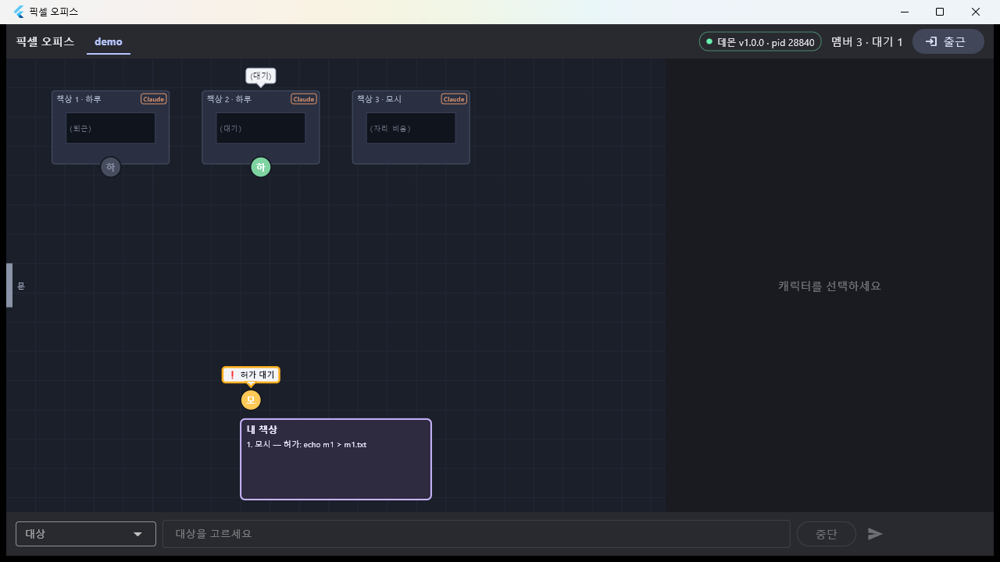
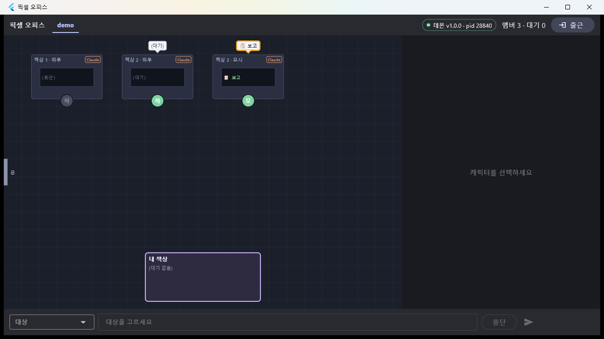

# T1x — M1 배선·실기 확인 (T12·T13·T14 통합)

- 날짜: 2026-09-15
- 마일스톤: M1 (완료 판정)
- 관련 설계: 01 §3 Flutter 데스크탑
- 커밋: (아래)

## 목표
병렬로 만든 세 위젯(사무실 캔버스·오른쪽 패널·지시 바/상단 바)을 `main.dart`에 배선하고, 실제 데몬에 붙여 캐릭터가 이벤트로 움직이는 것을 창 캡처로 확인한다.

## 한 것
- `lib/main.dart`: 골격의 플레이스홀더 4개를 `TopBar`/`OfficeView`/`RightPanel`/`CommandBar`로 교체. 선택 멤버 상태 `selectedMemberIdProvider`(멤버가 사라지면 자동 해제), 활성 팀 `activeTeamIdProvider`로 사무실 필터. 끊김 오버레이에 `DaemonStartButton`, 알림 `NoticeBanner` 추가.
- `tool/capture-window.ps1`: 프로세스 메인 창만 `PrintWindow`로 캡처(전체 화면 금지 규칙). ASCII 전용(PowerShell 5.1이 BOM 없는 파일을 ANSI로 읽어 한글 주석이 파싱을 깨뜨림).

## 검증
```
$ flutter analyze                → No issues found!
$ flutter test                   → +89 ~1: All tests passed!  (T11 22 + T12 31 + T13 15 + T14 21)
$ flutter build windows --release → pixel_office.exe (26s)
```
실기(데몬 pid 28840, 팀 demo, 멤버 3):
```
po> say 모시 셸 명령 "echo m1 > m1.txt"를 실행해줘. …
#42 waiting_approval 모시 Bash echo m1 > m1.txt  approval=a_39f1f8ae579b
```
 — 책상 1(하루, 퇴근 회색)·책상 2(하루, "(대기)" 말풍선)·책상 3(모시, 자리 비움). 모시가 **내 책상 앞 큐**에 "❗ 허가 대기" 말풍선으로 서 있고 큐 목록 `1. 모시 — 허가: echo m1 > m1.txt`. 상단 바: 팀 탭 `demo`, `● 데몬 v1.0.0 · pid 28840`, `멤버 3 · 대기 1`, `출근` 버튼. 지시 바: 대상 드롭다운·입력·중단·전송.

`allow` 후 재캡처: 

## 발견한 함정
- 창 캡처 스크립트의 한글 주석 → PowerShell 5.1 파싱 오류. ASCII로 다시 씀.
- `Get-Process`의 `MainWindowTitle`은 콘솔 인코딩 때문에 깨져 보이지만 핸들은 정상 → 제목 대신 프로세스명으로 창을 찾는다.
- 오른쪽 패널(터미널 attach)과 지시 바 전송은 위젯 테스트로 검증됐고, 실기에서는 캐릭터 클릭이 필요해 이번 캡처엔 없음 → T19(v1a 시연)에서 사용자가 직접 확인.

## 결정
없음 (D-09·D-21 적용).

## 남은 것
- 터미널 탭 전환 시 스크롤백 리셋(T13 남은 것) → T18.
- 캐릭터 이동 애니메이션·알림 카드 → M2(T15·T16).
