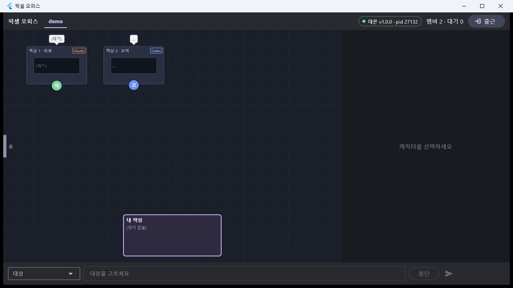
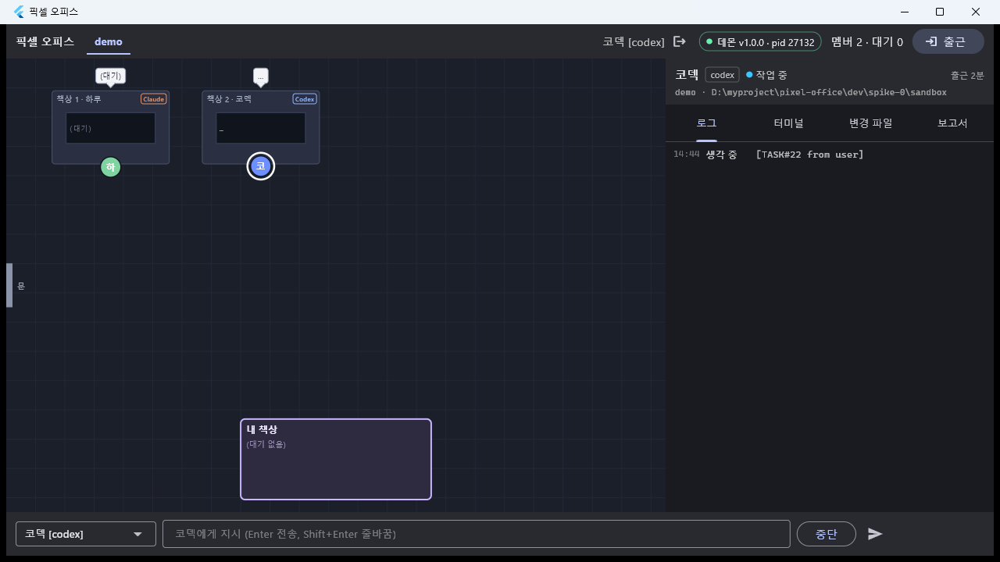
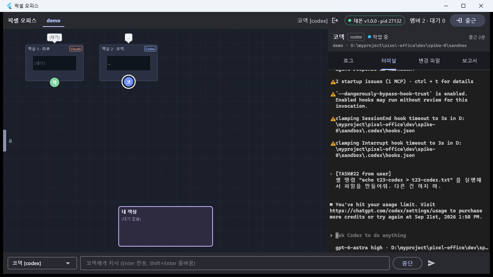
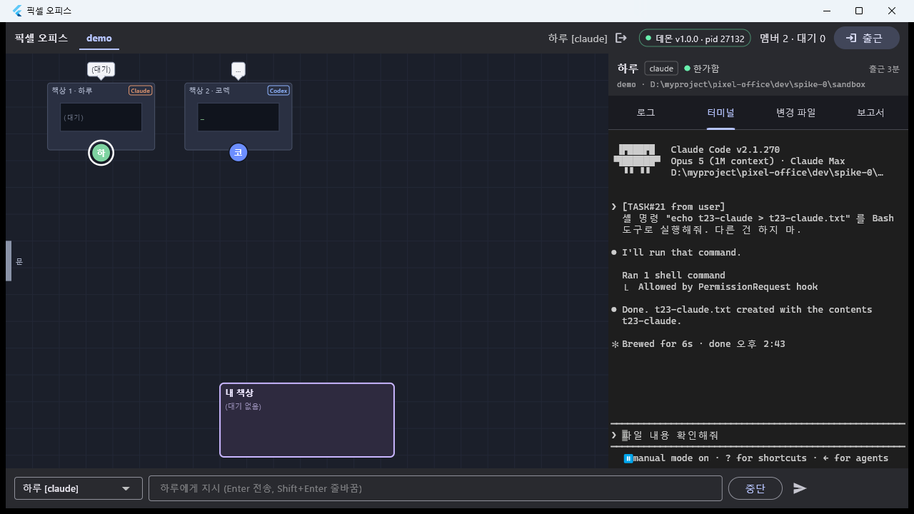
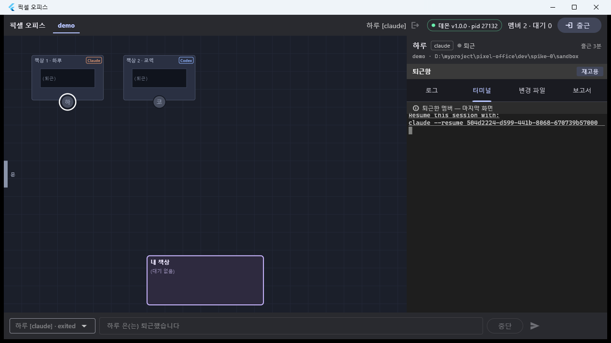

# T23 — 혼합 팀 확인 (M3 완료 판정)

- 날짜: 2026-09-16
- 마일스톤: M3 (완료 판정)
- 관련 설계: 01-설계문서.md §What Makes This Cool "엔진 혼합" · §2 오피스 이벤트 스키마(Claude / Codex 열) · §구성 요소 1(어댑터·TeamTools MCP) / 02 §④ / 04 D-19, D-22, D-23
- 커밋: (미커밋 — 상위에서)

## 목표

**M3 완료 기준 = "혼합 팀에서 Codex 캐릭터가 동작"** 을 판정한다. 같은 팀(`demo`, 같은 cwd)에 Claude 팀원 하나와
Codex 팀원 하나를 두고, ① 단위 레벨에서 실측 hook 로그를 번갈아 흘려 이벤트·pending·스냅샷·퇴근·MCP 가 **멤버별로 독립**인지,
② 실기에서 데몬 + Flutter 앱으로 두 캐릭터가 각자 책상·배지·터미널로 보이는지를 증거와 함께 남긴다.

ChatGPT 계정이 **사용량 한도(리셋 2026-09-21 13:58, D-23)** 라 Codex 는 부팅·화면·hook 왕복까지만 되고 **모델 턴이 안 돈다.**
그래서 이 문서의 마지막 절에 T20·T21·T22·T23 이 이월한 항목을 **한 번에 돌릴 수 있는 체크리스트 하나**로 합쳐 둔다.

## 한 것

### 1. 단위 레벨 혼합 팀 테스트 (신규)

- `dev/daemon/test/office/MixedTeam.test.ts` (10건) — 가짜 pty + 가짜 HookReceiver 위의 진짜 `Office`/`Store`.
  팀 `demo` 하나에 `하루`(claude) · `코덱`(codex) 을 출근시키고, **실측 hook 로그를 파일에서 읽어** 번갈아 흘린다.
  - 페이로드 출처: `dev/spike-0/hooklog-2.json`(Claude 23건: SessionStart/UserPromptSubmit/PreToolUse(AskUserQuestion·Bash·Write)/
    PermissionRequest/PostToolUse/Notification/Stop/SessionEnd) · `dev/spike-0/hooklog-codex.json`(Codex 4건: SessionStart(resume)/
    UserPromptSubmit/Stop/SessionEnd). 두 로그에 없는 조합(Claude `Read`, Codex `cat`/`echo >`/`apply_patch`)은
    **같은 로그의 실제 PreToolUse 봉투를 그대로 쓰고 `tool_name`/`tool_input` 만 갈아 끼워** 만든다(Codex 쪽 키 목록은
    `run-codex6.log` 44행 그대로 — `session_id,turn_id,transcript_path,cwd,hook_event_name,model,permission_mode,tool_name,tool_input,tool_use_id`).
  - 검사 항목:
    1. **이벤트 매핑이 설계 §2 표대로 갈린다** — Claude `Read`→`reading` / `Bash`→`running` / `Write`→`editing`(도구 이름표),
       Codex `cat notes.txt`→`reading` / `echo hi > ../outside.txt`→`running` / `apply_patch`→`editing`(명령 휴리스틱),
       detail 도 각자(`path` / `cmd`+`summary` / 패치 본문의 `*** Update File:` 경로).
    2. **실측 로그 전체 재생** — 번갈아 흘려도 남의 멤버 이벤트가 생기지 않고, `session_id` 도 각자 최신 값
       (Claude 는 로그 후반 `/clear` 로 `d5477a7c-…`, Codex 는 `01a09f50-…`).
    3. **허가 pending 이 멤버별** — 각자 어댑터가 자기 것만 붙들고(`office.adapter.heldPendingIds` / `office.codexAdapter.…`),
       한쪽을 `allow` 해도 다른 쪽 hook 은 그대로 보류, 나중에 같은 결정 JSON 을 돌려준다.
    4. **질문 pending 두 종류 동시 공존** — Claude TUI `AskUserQuestion`(payload 에 `tool_input` 있음, D-19)과
       Codex 턴 종료 질문 폴백(`source:'ask_user'`, `fallback:'codex-stop'`, raw status 는 `idle` 유지, T22 함정 4)이 서로 독립.
    5. **스냅샷** — 멤버 2명이 각자 `engine`·`memberToken`·스폰 인자(Claude `mcpConfigPath`, Codex `mcpUrl`)로 들어 있고,
       pending 도 멤버별로 각자 엔진의 detail(`description` vs Codex 의 한국어 승인 문구)을 싣는다.
    6. **퇴근 격리** — 코덱 퇴근 → 코덱 pending 만 만료·세션만 종료, 하루는 `waiting_approval` 그대로에 세션도 살아 있고
       이어서 `allow`·`Stop` 까지 정상. 반대 방향(하루 먼저 퇴근)도 같다.
    7. **TeamTools MCP 토큰** — 퇴근·비정상 종료 모두 **그 멤버 토큰만** `mcp.dispose`. (한 번의 퇴근에서 같은 토큰이
       두 번 끊길 수는 있다 — pty exit 경로 + `finishMember` 경로. 다른 멤버 토큰이 섞이지 않는 것이 요점.)

### 2. 문서

- `dev/daemon/README.md` — ① 환경변수 표에 `PIXEL_MCP_PORT`(7422) 추가 + 세 포트가 `daemon.json` 에 적힌다는 설명,
  ② `PIXEL_CODEX_EXE` **자동 탐지 순서**(T22 `resolveCodexExe`) 문단, ③ **새 절 "Codex 팀원 (M3)"** — hook 주입·스폰 인자·
  MCP 주입·이벤트 매핑·첫 idle·자동 통과 다이얼로그·퇴근(Ctrl+C 한 번)·폴백·유령 정리 + 9/21 재확인 목록 포인터,
  ④ 구조 트리의 `adapters/`·`office/` 설명 갱신 + `mcp/` 추가, ⑤ 데이터 흐름 도식을 엔진 중립으로.
- `dev/app/README.md` — 짧은 절 "엔진(Claude / Codex)" 하나. 앱에는 엔진 분기가 없고 `member.engine` 은 배지·헤더 칩에만 쓴다는 것
  (T23 실기로 확인). 앱 코드는 건드리지 않았다.

## 검증

### 단위 테스트

```
$ cd dev/daemon && npx tsc --noEmit
(출력 없음, EXIT=0)

$ npx tsx --test test/office/MixedTeam.test.ts
  ✔ 같은 사무실에서 각 엔진의 도구가 표대로 매핑된다 (Claude 이름표 / Codex 명령 휴리스틱)
  ✔ 실측 로그 전체 재생: 두 로그를 번갈아 흘려도 각자 자기 이벤트만 쌓는다
  ✔ 허가 pending 이 멤버별로 따로 열리고, 한쪽 응답이 다른 쪽을 건드리지 않는다
  ✔ Codex 질문 폴백 pending 과 Claude TUI 질문 pending 이 동시에 열려도 서로 독립 (T22)
  ✔ 스냅샷에 두 멤버가 각자 엔진으로 들어 있다
  ✔ 스냅샷의 pending 은 멤버별로 구분되고, 각자 엔진의 detail 을 싣는다
  ✔ 한 명의 퇴근이 다른 한 명의 상태·pending·세션을 건드리지 않는다
  ✔ 반대 방향: Claude 퇴근 후에도 Codex 는 hook 을 계속 처리한다
  ✔ TeamTools MCP 연결은 멤버 토큰별로 따로 끊긴다
  ✔ 프로세스가 죽어도 그 멤버 토큰만 dispose 되고 다른 멤버는 멀쩡하다
ℹ tests 10  ℹ pass 10  ℹ fail 0

$ npx tsx --test "test/**/*.test.ts"
ℹ tests 328  ℹ suites 50  ℹ pass 323  ℹ fail 0  ℹ skipped 5   (= opt-in 통합 테스트, PIXEL_IT 미설정)
```

### 실기 — 준비

기존 데몬(pid 25204)은 **T19 시점(13:22)에 뜬 것이라 T20~T22 코드를 안 들고 있었다**(Codex 어댑터·`resolveCodexExe`·
MCP 주입 전부 없음). 그래서 정중히 내리고 현재 소스로 다시 띄웠다. 멤버가 전부 `exited` 라 복구 대상은 없었다.

```
po> shutdown                       # 구 데몬 pid 25204
$ npx tsx src/index.ts             # 새 데몬 (백그라운드)
[office] mcp       : http://127.0.0.1:7422/mcp/<memberToken> (TeamTools: ask_user)
[daemon] pixel-office daemon v1.0.0 pid=27132
[daemon] data dir : C:\Users\User\AppData\Local\pixel-office
[daemon] ws        : ws://127.0.0.1:7420
[daemon] hook port : 7421 (D:/myproject/pixel-office/dev/daemon/src/hooks/hook.js)
[daemon] listening

po> team delete demo                                                   # T19/T19b 의 exited 멤버 3명 정리
po> team create demo "D:\myproject\pixel-office\dev\spike-0\sandbox"
팀 생성: t_9a84d569bd61  demo  D:\myproject\pixel-office\dev\spike-0\sandbox  leader=-  members=0/4
```

### 실기 — 혼합 고용 → 둘 다 idle

```
po> hire demo claude 하루
출근: m_2f4a271d680e  하루 [claude] starting  member team=demo pid=27464
po> hire demo codex 코덱
출근: m_a35f8ef479aa  코덱 [codex] starting  member team=demo pid=28108

(25초 뒤)
po> members
m_2f4a271d680e  하루 [claude] idle  member team=demo pid=27464
m_a35f8ef479aa  코덱 [codex] idle  member team=demo pid=28108
```

- 하루의 `idle` 은 `SessionStart` hook, 코덱의 `idle` 은 **화면 부팅 감시**(`watchBootReady`, T20) 로 올라온 것이다.
- `PIXEL_CODEX_EXE` 를 주지 않았는데 스폰됐다 — T22 자동 탐지가 실기에서 그대로 동작(데몬 로그에 오류 없음).
- 데몬 로그: `[office] 코덱: passed first-run dialog (model-switch-offer)` — 모델 전환 제안 다이얼로그 자동 통과.
  폴더 신뢰 다이얼로그는 이 cwd 가 이미 신뢰돼 있어 뜨지 않았다.

### 실기 — 하루(Claude): 허가 필요한 Bash → 허가 → 보고

```
po> say 하루 셸 명령 "echo t23-claude > t23-claude.txt" 를 Bash 도구로 실행해줘. 다른 건 하지 마.
task#21 → 하루

po> pending
a_21bf21cfafa4  approval  하루  Bash echo t23-claude > t23-claude.txt
po> members
m_2f4a271d680e  하루 [claude] waiting_approval  member team=demo pid=27464
m_a35f8ef479aa  코덱 [codex] idle              member team=demo pid=28108      ← 코덱은 영향 없음

po> allow a_21bf21cfafa4
status 하루 → working (working)
allow: a_21bf21cfafa4

$ cat dev/spike-0/sandbox/t23-claude.txt
t23-claude

po> query demo
#203 thinking 하루 [TASK#21 from user] ⏎ 셸 명령 "echo t23-claude > t23-claude.txt" 를 Bash 도구로 실행해줘. 다른 건 하지 마.
#204 running 하루 Bash echo t23-claude > t23-claude.txt — Write text to a file
#205 waiting_approval 하루 Bash echo t23-claude > t23-claude.txt — Write text to a file  approval=a_21bf21cfafa4
#206 text 하루 Done. `t23-claude.txt` created with the contents `t23-claude`.
#207 idle 하루
#208 reporting 하루 Done. `t23-claude.txt` created with the contents `t23-claude`.  task#21
```

### 실기 — 코덱(Codex): 지시 → 사용량 한도 화면

```
po> say 코덱 셸 명령 "echo t23-codex > t23-codex.txt" 를 실행해서 파일을 만들어줘. 다른 건 하지 마.
task#22 → 코덱

po> query demo
#209 thinking 코덱 [TASK#22 from user] ⏎ 셸 명령 "echo t23-codex > t23-codex.txt" 를 실행해서 파일을 만들어줘. 다른 건 하지 마.

po> members
m_2f4a271d680e  하루 [claude] idle     member team=demo pid=27464
m_a35f8ef479aa  코덱 [codex] working   member team=demo pid=28108
```

지시가 pty 에 들어가고 `UserPromptSubmit` hook 이 발화해 `thinking` 까지는 정상. 그 뒤 모델 턴이 시작되지 않고 한도 안내로 끝난다.

**`attach 코덱` (데몬 ScreenModel 120x40, 발췌)**

```
╭──────────────────────────────────────────────────────────╮
│ >_ OpenAI Codex (v0.154.0)                               │
│ model:     gpt-6-astra high   /model to change           │
│ directory: D:\myproject\pixel-office\dev\spike-0\sandbox │
╰──────────────────────────────────────────────────────────╯
⚠ 2 startup issues (1 MCP) · ctrl + t for details              ← 사용자 전역 설정의 다른 MCP(우리와 무관, T20 함정 7)
⚠ `--dangerously-bypass-hook-trust` is enabled. Enabled hooks may run without review for this invocation.
⚠ clamping SessionEnd hook timeout to 3s in D:\myproject\pixel-office\dev\spike-0\sandbox\.codex\hooks.json
⚠ clamping Interrupt  hook timeout to 3s in D:\myproject\pixel-office\dev\spike-0\sandbox\.codex\hooks.json

› [TASK#22 from user]
  셸 명령 "echo t23-codex > t23-codex.txt" 를 실행해서 파일을 만들어줘. 다른 건 하지 마.

■ You've hit your usage limit. Visit https://chatgpt.com/codex/settings/usage to purchase more credits or try again at
Sep 21st, 2026 1:58 PM.

› Ask Codex to do anything
  gpt-6-astra high · D:\myproject\pixel-office\dev\spike-0\sandbox
```

**`attach 하루` (같은 시점, 발췌)**

```
▐▛███▛█ClaudeCodev2.1.270
▝▜██████▀Opus5(1Mcontext)·ClaudeMax
▝▝▝▝D:\myproject\pixel-office\dev\spike-0\sandbox

❯[TASK#21fromuser]
셸명령"echot23-claude>t23-claude.txt"를Bash도구로실행해줘.다른건하지마.

●I'll run that command.
 Ran 1 shell command
⎿ Allowed by PermissionRequest hook            ← 키 입력 없이 hook 결정으로 통과(D-04)
● Done. t23-claude.txt created with the contents t23-claude.
✻Brewedfor6s·done오후2:43
────────────────────────────────────────────────────────────────────❯ 파일내용확인해줘   ← Claude 2.1 의 고스트 제안(T19 함정 4)
⏸manualmodeon·? for shortcuts · ← for agents
```

(콘솔의 `[screen]` 덤프는 공백을 압축해 찍는다 — 앱 터미널 탭에서는 아래 캡처처럼 정상으로 보인다.)

### 실기 — Flutter 앱

```
$ cd dev/app && flutter build windows --release
√ Built build\windows\x64\runner\Release\pixel_office.exe
$ start build\windows\x64\runner\Release\pixel_office.exe        # pid 29944
$ powershell -File tool\capture-window.ps1 -Out ..\..\docs\worklog\img\T23-*.png
```

캐릭터·탭 클릭은 T19 함정 6 의 방법 그대로(`SetForegroundWindow` → 위젯 안으로 몇 픽셀씩 이동(hover) → 실제 `mouse_event`
다운/업 → 커서 원위치). 스크립트는 스크래치패드에만 두었다(1회성).

 — **책상 1 · 하루 `Claude` 배지(초록 = 한가함)**, **책상 2 · 코덱 `Codex` 배지(파랑 = 작업 중)**.
상단 `● 데몬 v1.0.0 · pid 27132 · 멤버 2 · 대기 0`. 두 엔진이 같은 사무실에 나란히 있다.

 — 코덱을 클릭하면 패널 헤더가 `코덱 [codex] ● 작업 중`, 로그 탭에
`생각 중 [TASK#22 from user]`, 지시 바 대상이 `코덱 [codex]` 로 바뀐다.

 — **터미널 탭에 실제 Codex TUI 가 그대로 그려진다**: `⚠ 2 startup issues (1 MCP)`,
`--dangerously-bypass-hook-trust` 경고, `clamping … hook timeout to 3s` 두 줄, `› [TASK#22 from user]` + 한글 지시문,
`■ You've hit your usage limit … Sep 21st, 2026 1:58 PM.`, 하단 `› Ask Codex to do anything` + `gpt-6-astra high · …`.
한글·박스 문자·색 전부 정상.

 — 같은 탭에서 하루를 고르면 헤더가 `하루 [claude] ● 한가함`, 터미널에는 Claude TUI
(`Ran 1 shell command` / `⎿ Allowed by PermissionRequest hook` / `Done. t23-claude.txt created…`). **엔진이 달라도 앱은 같은 위젯 하나로 그린다.**

 — `fire 하루` / `fire 코덱` 뒤 두 책상 모두 `(퇴근)`, 패널 `퇴근함 / 재고용`.

```
po> fire 하루
#210 idle 하루 session ended: prompt_input_exit
#211 idle 하루 clocked out
po> fire 코덱
#212 idle 코덱 session ended: other          ← Codex 는 Ctrl+C 한 번으로 종료(SessionEnd reason=other)
#213 idle 코덱 clocked out
po> members
m_2f4a271d680e  하루 [claude] exited  ...
m_a35f8ef479aa  코덱 [codex] exited  ...
```

### 실기 — 유령 프로세스 없음 / 데몬 유지

```
$ taskkill /IM pixel_office.exe /F        → SUCCESS (PID 29944)
$ Get-Process -Id 27464,28108             → (없음)                 # 두 멤버의 CLI 자식
$ Get-Process codex                       → (없음)                 # codex.exe 0개
$ claude.exe 개수: 고용 전 14 → 정리 후 14, 새로 늘어난 pid 없음     # 남은 14개는 사용자 본인의 Claude Code 세션
$ Get-Process -Id 27132                   → node                   # 데몬은 켜 둔 채로 종료
```

## M3 완료 판정

**판정: M3 완료(실기 일부 9/21 이월).** 완료 기준 "혼합 팀에서 Codex 캐릭터가 동작"의 구성 요소를
"지금 증명된 것 / 모델 턴이 필요해 이월한 것"으로 나눈다.

### 지금 증명된 것

| # | 항목 | 증거 |
|---|---|---|
| 1 | 같은 팀·같은 cwd 에 Claude/Codex 팀원 동시 출근, 둘 다 `idle` 도달 | 실기 `members` (하루 idle / 코덱 idle), 코덱은 `watchBootReady` 로 |
| 2 | 스폰 경로가 엔진별로 갈린다(`.codex/hooks.json` + 플래그 / `--settings`) | T20 단위 + 실기(코덱 화면의 hook 경고 3줄) |
| 3 | `PIXEL_CODEX_EXE` 없이 자동 탐지된 `codex.exe` 로 스폰 | 실기(환경변수 미설정, 스폰 성공), `test/config/codexExe.test.ts` |
| 4 | 첫 실행 다이얼로그 자동 통과(한도 안내의 모델 전환 제안 → Esc) | 데몬 로그 `[office] 코덱: passed first-run dialog (model-switch-offer)` |
| 5 | Codex 세션에 TeamTools MCP 가 붙는다(`team`, 도구 `ask_user`) | T22 실기 `/mcp verbose` 캡처 |
| 6 | 지시 주입 → `UserPromptSubmit` hook → `thinking` 이벤트 | 실기 `#209 thinking 코덱 [TASK#22 …]` |
| 7 | 이벤트 매핑이 설계 §2 표대로 엔진별로 갈린다 | `MixedTeam.test.ts` 1·2, `CodexRouting.test.ts`, `codexMapping.test.ts`(실측 페이로드) |
| 8 | pending·status·세션·MCP 토큰이 **멤버별로 독립**(한쪽 허가/퇴근/사망이 다른 쪽에 영향 없음) | `MixedTeam.test.ts` 3·6·7 + 실기(하루 `waiting_approval` 동안 코덱 `idle`) |
| 9 | 스냅샷이 두 엔진 멤버를 각자 `engine` 으로 싣는다 | `MixedTeam.test.ts` 5 + 앱 배지 캡처 |
| 10 | 앱이 엔진 분기 없이 두 캐릭터를 그린다(책상 배지·패널 칩·터미널 탭) | `img/T23-1·2·3·4.png` |
| 11 | Claude 쪽 v1a 루프가 혼합 팀에서도 그대로(허가 → 파일 생성 → 보고) | 이벤트 #203~#208, `t23-claude.txt` |
| 12 | 퇴근이 엔진별 키로(Codex Ctrl+C 1회 / Claude `/exit`)·유령 프로세스 0 | 실기 `fire` 로그 + `Get-Process` |

### 9/21 이후로 이월한 것 (전부 **모델 턴이 필요**해서다 — D-23)

> **2026-09-21 해소.** 아래 목록 A~J 는 `worklog/T42-CodexLive.md` 에서 실기로 전부 돌렸다(I 만 조건 미발생으로 보류).
> Codex 캐릭터가 실제로 도구를 쓰는 구간도 그때 확인됐으므로 **M3 의 이월 칸은 비었다.**

아래 "9/21 이후 확인 목록" 이 유일한 이월 목록이다. Codex 캐릭터가 **실제로 도구를 쓰는** 구간
(`PreToolUse` → `PermissionRequest` → allow → 파일 생성 → `Stop` → 보고/질문 폴백)은 아직 실기로 못 봤고,
해당 구간은 스파이크 실측 페이로드(`run-codex6.log`, `hooklog-codex.json`)로 만든 단위 테스트로 대체돼 있다.

## 9/21 이후 확인 목록 (T20 + T21 + T22 + T23 통합, 한 번에 돌릴 것)

> **전부 끝났다 — 2026-09-21, `worklog/T42-CodexLive.md`.** 결과·증거·고친 결함은 거기 A~J 표에 있다.
> 이 절은 무엇을 물었는지의 기록으로 남긴다.

**전제:** ChatGPT 사용량 한도 리셋 **2026-09-21 13:58** 이후. 팀 `demo`, cwd `dev/spike-0/sandbox`.
순서대로 하면 한 번의 Codex 세션으로 대부분 끝난다.

- [x] **A. 통합 테스트 그린** — `cd dev/daemon && PIXEL_IT=1 npx tsx --test test/office/codex.integration.test.ts`
      (출근 → idle → `echo t20 > ../t20.txt` 지시 → `waiting_approval` → allow → idle → 파일 확인·삭제 → 퇴근 → 프로세스 종료).
      지금은 `timeout waiting for ...` 로 실패한다. → T20 검증 절 갱신. *(T20)*
      → **T42: 수정 후 통과.** 한도와 무관하게 rev 3 이전 RPC(`team.create`/`clockIn` force, `departmentId`, `snapshot`)로 죽고 있었다.
- [x] **B. Codex 도구 구간 이벤트 실물 대조** — A 가 남긴 이벤트로 `PreToolUse`→`running`/`reading`,
      `PostToolUse`, `Stop` 이 설계 §2 표와 맞는지 확인(단위 테스트가 쓰는 페이로드와 실물 키가 같은지도). *(T20/T23)*
      → **T42: 통과.** `apply_patch`→editing, `Get-Content …`→reading, `Set-Content …`→running.
- [x] **C. `ask_user` 실제 호출** — "team MCP 의 ask_user 로 나에게 물어봐" 지시 → `asking{tool:'ask_user'}` →
      `question.respond` → `[ANSWER q#…]` 왕복. T17 의 Claude 통합 테스트와 같은 시나리오의 Codex 판을 추가할 것. *(T22)*
      → **T42: 통과**(실기 이벤트 #1012~#1016).
- [x] **D. MCP 도구의 `tool_name` 실물** — C 에서 `PermissionRequest` 가 뜨는지, 뜬다면 이름이 `team.ask_user` 인지 다른 모양인지.
      확인 후 `src/adapters/CodexHooksAdapter.ts` 의 `TEAM_TOOL_NAMES` 휴리스틱을 정확한 이름으로 좁히고 `TODO(2026-09-21 이후)` 제거.
      (Codex 가 MCP 도구에 승인 프롬프트를 안 띄우면 D-22 는 Codex 에서 무의미해진다 — 그 결론도 기록.) *(T22)*
      → **T42: 확정.** 이름은 Claude 와 같은 `mcp__team__*`, **MCP 도구에는 PermissionRequest 가 안 뜬다** → D-22 는
      Codex 에서 무동작. 휴리스틱·TODO 삭제.
- [x] **E. 질문 폴백 실전** — 모델이 질문으로 턴을 끝내게 유도 → `asking{fallback:'codex-stop'}` → 답(봉투 없는 보통 프롬프트) →
      모델이 이어서 답하는지. `codexFallback.ts` 의 `QUESTION_PATTERNS` 오탐·누락 조정(특히 `which`/`should I`). *(T22)*
      → **T42: 통과.** 패턴 조정 불필요.
- [x] **F. 보고 폴백 실전** — 지시 → 작업 → `Stop` → task `reported`(report_text) 확인. *(T22)* → **T42: 통과.**
- [x] **G. `Interrupt` hook 실물 페이로드** — 턴이 도는 중 `member.interrupt`(Ctrl+C) → `Interrupt` hook 발화 페이로드 기록
      (어댑터는 payload 를 안 읽으므로 동작 영향은 없지만 02 §④ 의 마지막 미확인 항목이다). *(T20/02)*
      → **T42: 확정**(키 7개, `test/fixtures/hooklog-codex-t42.json`). Esc 중단도 같은 hook 을 낸다.
- [x] **H. Codex 승인 프롬프트 화면 픽스처** — `npx tsx test/screen/tools/capture-codex.ts <신뢰된 cwd>` 재실행
      (시나리오 4단계 `echo x > ../x.txt`). 문구·항목 순서·`esc` 효과 확정 후 `codex-0.154.json` 의 `approval-exec` 를
      `verified:true` 로. 같은 실행에서 **작업 중 화면(명령 출력 스트리밍) 픽스처** `working-*.txt` 도 나온다. *(T21)*
      → **T42: 통과.** `verified:true`. 항목 문구는 추정과 달랐고 키(enter/esc)는 맞았다.
- [~] **I. 턴 종료 없이 끝나는 화면의 idle 판정** — 아래 "발견한 함정" 1. 한도 화면이 아니라 정상 턴에서도
      `Stop` 이 안 오는 경우가 있는지 보고, 필요하면 화면 기반 idle 폴백을 M5 에 올린다. *(T23)*
      → **T42: 보류(조건 미발생).** 폴백은 T23b 에서 이미 들어갔고(D-25), 한도 화면 말고는 재현이 안 된다.
- [x] **J. 혼합 팀 실기 마무리** — A~F 를 통과한 뒤 이 문서의 "실기" 절을 **Codex 가 실제로 파일을 만드는** 판으로 한 번 더 찍고
      (`img/T23-*.png` 갱신), "M3 완료 판정" 의 이월 칸을 비운다. *(T23)*
      → **T42: 통과.** 새 캡처는 `img/T42-*.png` 로 따로 뒀다(이 문서의 T23 캡처는 그때의 기록으로 남긴다).

관련 없는 이월(모델 턴과 무관, 여기 목록 밖): `SessionStart(source=compact)` 재주입 확인 → M5.
Claude `login-success` 다이얼로그 미검증 → 상시.

## 발견한 함정

1. **(버그, 이 태스크에서는 안 고침) 모델 턴이 시작되지 않고 끝나면 Codex 멤버가 `working` 에 갇힌다.**
   사용량 한도 안내는 Codex 가 화면에만 찍고 `Stop` hook 을 내지 않는다. 데몬은 `UserPromptSubmit` 으로 `working` 으로
   올려 둔 뒤 내려 줄 근거가 없어 **퇴근할 때까지 `working`** 이다(앱에서도 파란 캐릭터 · `● 작업 중`). 부작용은 두 가지 —
   ① 사무실 표시가 틀리다, ② `InputQueue.isIdle` 게이트가 안 열려 **다음 지시가 큐에 머문다.**
   지금은 한도 때문에 재현되지만 원인은 "턴 종료 hook 없이 프롬프트로 돌아오는 화면" 일반이다.
   고칠 방향: Codex 부팅 감시(`watchBootReady`)와 같은 화면 기반 폴백 — `working` 인데 화면이 prompt ready 이고 busy 표시가
   없는 상태가 N초 지속되면 `idle{summary:'no turn'}`. `watchInterrupted` 와 로직이 거의 같다. **M5(T30) 또는 위 목록 I.**
   (이 태스크의 수정 허용 범위는 "확인을 막는 버그" 뿐이고 이건 혼합 팀 확인을 막지 않아 손대지 않았다.)
2. **`daemon.notice` 에 `하루: passed first-run dialog (approval-prompt)` 가 허가 대기 내내 2초마다 찍힌다(이번 7회).**
   Claude 2.1.270 은 `PermissionRequest` hook 을 **보류하는 동안에도 자기 TUI 허가 프롬프트를 화면에 띄운다**
   (그래서 사용자가 터미널 탭에서 먼저 답해 버릴 수도 있다 — hook 응답과 경합). ScreenModel 은 이걸 `approval-prompt`
   다이얼로그로 감지하고, T21 결정대로 `suggestedKeys: []` 라 **키는 안 나간다**(안전). 하지만 InputQueue 가 그래도
   `dialogPassed` 를 emit 해 "통과했다"는 알림이 반복된다. T21 이 이미 후속으로 적어 둔 것(`suggestedKeys.length === 0`
   이면 `blocked('approval')` 로)이 실기에서 확인된 셈이다. src/input 담당 태스크에서.
3. **데몬을 오래 켜 두면 코드가 낡는다.** 이번에 붙어 있던 데몬은 T19 시점 소스라 Codex 관련 코드가 아예 없었다
   (`hire demo codex` 를 그냥 돌렸으면 옛 경로로 실패했을 것). 실기 전에 `daemon.json` 의 `startedAt` 과 최근 커밋 시각을
   비교하고, 의심되면 `shutdown` 후 재기동할 것.
4. **콘솔 `attach` 덤프는 공백을 압축한다.** `[screen]` 줄의 Claude TUI 가 `❯[TASK#21fromuser]` 처럼 붙어 보이는데
   화면 자체는 멀쩡하다(같은 시점의 앱 터미널 탭 캡처가 근거). 콘솔 덤프를 증거로 쓸 때 오해하지 말 것.
5. **PowerShell 에서 `--exec` 안에 `>` 가 든 지시를 넘기면 리다이렉트로 먹힌다**(`알 수 없는 옵션: t23-claude`).
   지시문에 셸 메타문자가 있으면 bash 에서 작은따옴표로 감싸 넘기는 게 안전하다.
6. 코덱 책상의 모니터 텍스트(ScreenModel 마지막 비어 있지 않은 줄)가 `_` 하나로 보인다(`img/T23-1-office.png`).
   Codex 화면 맨 아래가 커서만 있는 줄이라 그렇다 — `skipLines` 에 빈/커서 줄 패턴을 더할 여지. 표시용이라 급하지 않다.

## 결정

새 결정 없음. 기존 결정(D-04 hook 결정 반환, D-19 질문 pending 구분, D-22 `mcp__team__*` 자동 allow, D-23 사용량 한도)이
혼합 팀에서도 엔진 공통으로 그대로 적용되는 것을 확인했을 뿐이다. 04-결정기록에 올릴 후보는 T20/T22 가 적어 둔 것과 동일
("모르는 명령은 `running`", "Codex 는 화면으로 첫 idle 을 판정한다", 폴백 질문의 `fallback:'codex-stop'` 표식, 질문 > 보고 우선).

## 남은 것

- ~~위 **"9/21 이후 확인 목록" A~J**~~ → **T42 에서 전부 소화**(`worklog/T42-CodexLive.md`). I 만 보류(조건 미발생).
- ~~함정 1(턴 없이 끝난 Codex 가 `working` 에 갇힘)~~ → T23b 에서 화면 기반 idle 폴백(D-25)으로 고쳐졌다.
  T42 실기에서는 발화 조건이 안 생겼다.
- ~~함정 2(`approval-prompt` 에서 `dialogPassed` 대신 `blocked`)~~ → T23b 에서 `dialogBlocked`(D-26)로 고쳐졌다.
- 함정 6(Codex 책상 모니터 텍스트) — tui-map `skipLines`, 급하지 않음.
- ~~M4 로: … Codex 팀장 허용 여부~~ → T42 에서 **부장·팀장 모두 codex 로 실기 통과**(create_team/delegate/report/
  ask_user/ask_parent/reply/hire/dismiss 8종). 하드 게이트는 원래 없었고 `daemon.notice{warn}` 한 줄뿐이다.
