# T29 — v1b 시연 (성공 기준 7 · 7-1 · 7-2 · 8/셸 뮤텍스)

- 날짜: 2026-09-16
- 마일스톤: M4 (완료 판정 — 실기 Codex 부분은 9/21 이월)
- 관련 설계: 01-설계문서.md §Success Criteria v1b 7 · 7-1 · 7-2 · 8 · 9 · §4 팀·직급 모델 · §멤버 지시문 주입, 04-결정기록.md D-29 · D-30, worklog T19(시연 방법·창 캡처) · T24b(팀장 UX) · T25(TeamTools) · T26a/T26b(지시문) · T27(셸 뮤텍스) · T28(후처리)
- 커밋: (상위에서 — 이 태스크는 커밋하지 않았다)

## 목표

데몬 + Flutter 앱을 실제로 띄워 **v1b 성공 기준 7 / 7-1 / 7-2** 와 **셸 뮤텍스**(03 기준 "8", 설계문서 번호로는 9)를
창 캡처와 이벤트 로그로 통과시킨다. 겸사겸사 T26b 가 남긴 후속(앱 팀원 템플릿에 도구 이름 줄) 하나를 닫는다.

## 한 것

### 코드 — 앱 팀원 기본 템플릿에 도구 이름 줄 (T26b "남은 것")

- `dev/app/lib/panel/instructions_tab.dart` — `memberInstructionTemplate` 마지막 줄에
  `도구 이름: mcp__team__report, mcp__team__ask_user (도구 목록에 없으면 ToolSearch로 찾는다).` 추가.
  데몬 `src/office/instructions/templates.ts` 의 `toolsLine('member')` 와 **글자 그대로 같은 문장**이다
  (팀장 템플릿은 이미 같았다 — T26a 결정 "둘이 갈라지면 데몬 쪽이 기준").
- `dev/app/test/panel/instructions_tab_test.dart` — "비어 있으면 기본 템플릿 넣기 — 팀원은 팀원 템플릿" 테스트에 그 줄 단언 추가.

그 밖의 코드 변경은 **없다**. 시연 중 데몬 결함 2건을 찾았지만(아래 함정 1·2) 둘 다 "어떻게 고칠지"가 설계 판단이라
T30 으로 넘겼다 — 시연 마지막에 데몬 동작을 바꾸지 않았다.

### 시연 환경

```
데몬   dev/daemon, npx tsx src/index.ts (pid 18928, ws 7420 / hook 7421 / mcp 7422)
       — 돌고 있던 낡은 데몬(pid 5800, T26b/T28 이전 코드)은 콘솔 `shutdown` 으로 내리고 새로 띄웠다.
앱     dev/app, flutter build windows --release → build\windows\x64\runner\Release\pixel_office.exe
콘솔   npx tsx src/cli/index.ts --exec "..."       (지시·허가·질문·지시문·조회)
캡처   dev/app/tool/capture-window.ps1 (창 단위) + 스크래치패드의 burst 루프(0.25~0.45초 간격)로 프레임을 모아
       필요한 순간만 docs/worklog/img/T29-*.png 로 추렸다. 클릭은 T19 의 click4.ps1(hover → mouse_event).
팀     v1b, cwd = D:\myproject\pixel-office\dev\spike-0\sandbox, 팀장 반장(claude)
```

시연은 두 번 돌렸다. **1차**(18:47~18:49)는 앱 캡처 타이밍을 놓쳐(한 바퀴가 1분 15초 만에 끝났다) 기준 7 의 중간 장면을
못 찍었고, **2차**(18:53 팀 재생성 ~ 19:16)를 본 기록으로 쓴다. 아래 이벤트 번호·시각은 전부 2차다.

## 검증

### 기준 7 — 팀장만 있는 사무실 → hire → delegate → report → dismiss

팀 생성 직후(1차 캡처, 같은 화면):

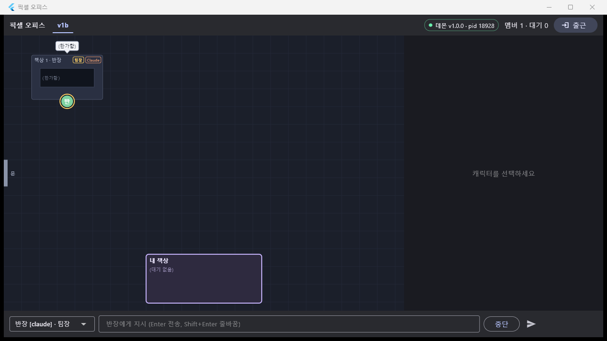 — 책상 1 반장, `팀장` 배지 + 금색 링, 상단 `멤버 1 · 대기 0`,
지시 바 대상이 `반장 [claude] · 팀장` 으로 고정(T24b).

```
po> say 반장 team MCP 도구로 팀원 두 명을 hire해라: '작가'(역할: 파일 작성)와 '검수'(역할: 검토).
    작가에게 delegate로 'demo29.txt에 오늘 날짜를 한 줄 써라', 검수에게 delegate로 '작가가 demo29.txt를 만들면
    내용을 읽고 한 줄로 평가해라'를 시켜라. 보고가 다 오면 report로 나에게 결과를 요약해라. 끝난 팀원은 dismiss해라.
task#29 → 반장
```

| 시각 | 이벤트 | 내용 |
|---|---|---|
| 18:55:35 | #270 thinking | `[TASK#29 from user]` |
| 18:55:37 | #271 running | `ToolSearch` (도구 이름 줄 → 지연 로딩된 MCP 도구를 바로 찾는다, D-22/T25) |
| 18:55:39 | #272·#273 running | `mcp__team__hire` ×2 → 작가(m_9d747d)·검수(m_3befba) `starting` (지시 후 **4초**) |
| 18:55:40~42 | status | 두 팀원 `idle` (문 입장 완료) |
| 18:55:43 | #275 delegating | task#30 → 작가 `assigned` |
| 18:55:45 | #278 delegating | task#31 → 검수 `assigned` |
| 18:55:48 | #283 idle / status | 팀장 raw `idle` + 파생 **`waiting_reports`** |
| 18:55:47 | #281 waiting_approval | 작가 PowerShell(demo29.txt 쓰기) |
| 18:55:48 | #285 running | 검수 `{waiting:'shell-lock', holder:작가}` — 셸 뮤텍스(아래 기준 8) |
| 18:56:59 | — | 작가 허가 `allow` → #286 재개 |
| 18:57:02 | #289 reporting | 작가 `status=done` (`demo29.txt` 생성, 내용 `2026-09-16`) |
| 18:57:00 → 18:57:08 | #287 → allow | 검수 허가 |
| 18:57:13 | #294 reporting | 검수 `status=done` |
| 18:57:13 | #295 thinking | 팀장에게 `[REPORTS task#30 …][REPORTS task#31 …]` **+ `[ALL_REPORTS_IN]`** 한 덩어리 |
| 18:57:15 | #296 reading | 팀장이 `demo29.txt` 를 직접 열어 교차 확인 |
| 18:57:19 | #300 reporting | 팀장 → 사용자 `report(task#29, done)` |
| 18:57:19~22 | #301·#304 running | `mcp__team__dismiss` ×2 → 작가·검수 `exited` → 문으로 퇴장 |
| 18:57:26 | #308 idle | 팀장 `free`. **한 바퀴 1분 51초** |

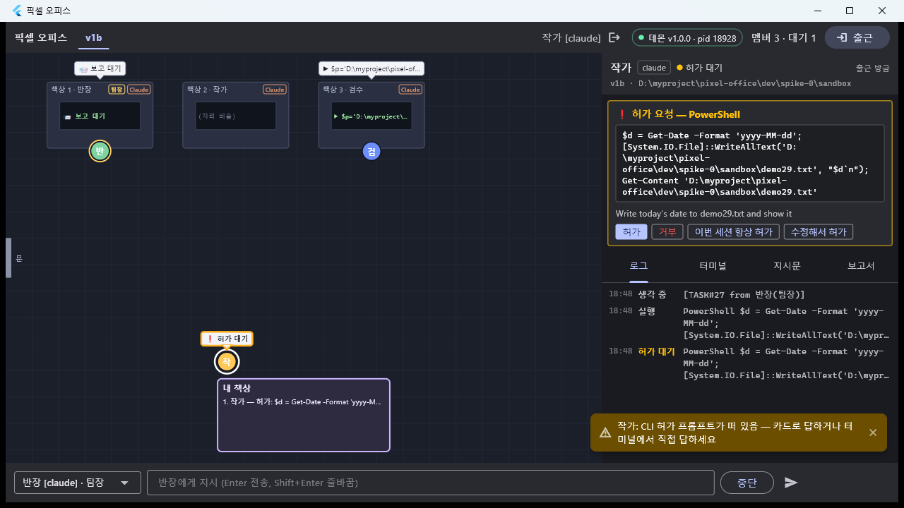 — (1차 캡처) 책상 1 반장(`보고 대기`), 책상 2 작가, 책상 3 검수.
작가가 **내 책상 앞**에 `❗ 허가 대기` 로 서 있고 오른쪽에 `❗ 허가 요청 — PowerShell` 카드(허가/거부/이번 세션 항상 허가/수정해서 허가).

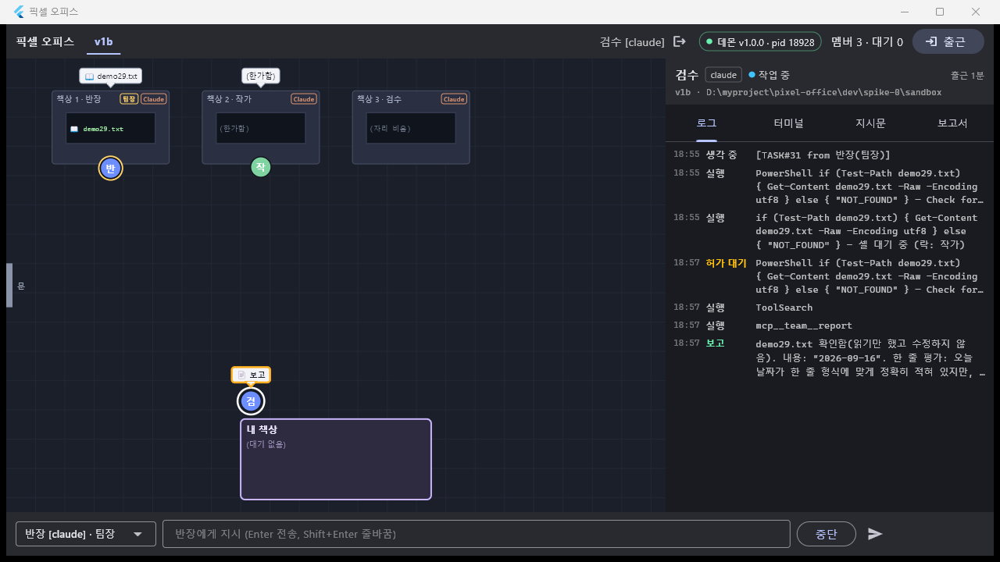 — 검수가 **내 책상 앞에 `📋 보고`** 로 와 있고(보고 방문 6초),
팀장 책상 모니터는 `📖 demo29.txt`.

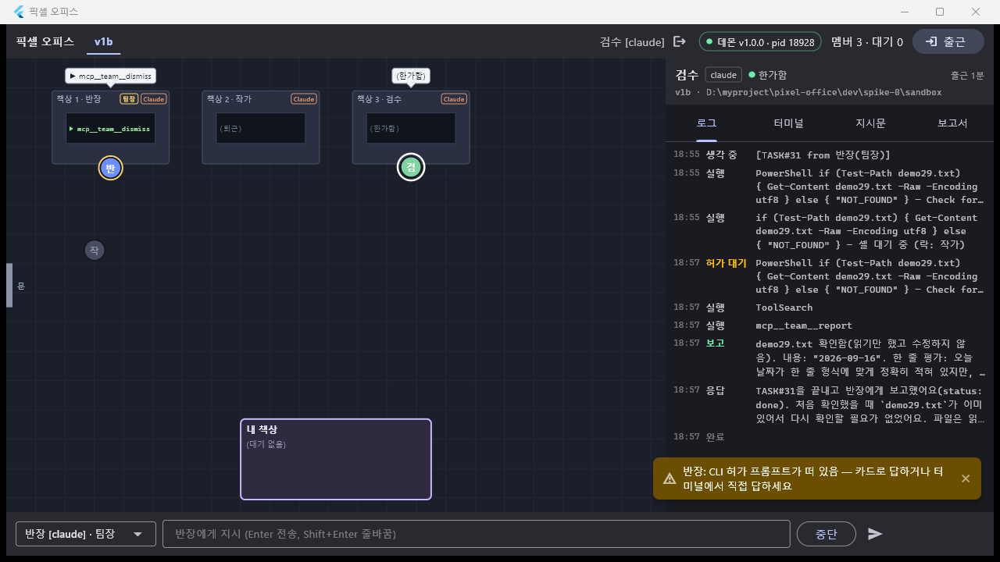 — 팀장 말풍선 `▶ mcp__team__dismiss`, 작가가 회색으로 **문 쪽으로 걸어 나가는 중**,
책상 2 는 이미 `(퇴근)`. 오른쪽 로그에 검수의 `… — 셸 대기 중 (락: 작가)` 줄이 남아 있다.

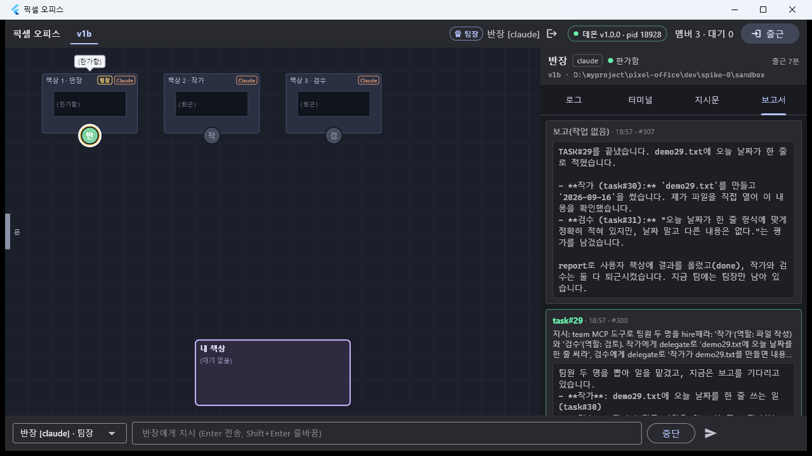 — 팀장 선택 → `보고서` 탭에 `task#29 · 18:57 · #300` 카드(지시문 + 취합 보고)와
턴 종료 텍스트 카드.

파일도 실제로 생겼다: `dev/spike-0/sandbox/demo29.txt` = `2026-09-16`.

task 표(DB):

```
#29 user→반장   reported done    ← 사용자 지시
#30 반장→작가   reported done    demo29.txt 생성
#31 반장→검수   reported done    한 줄 평가
```

### 기준 7-1 — 사용자 출근/퇴근 개입

**출근(앱 버튼).** 상단 `출근` → 다이얼로그(이름/엔진/지시문/팀·새 팀).

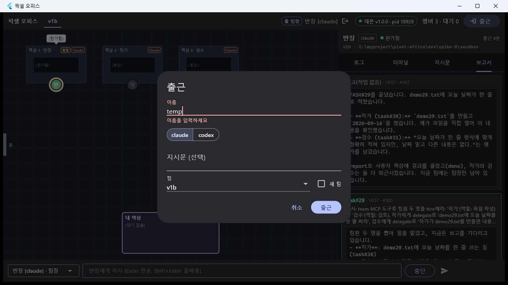 — 이름 기본값 힌트는 `이음`, 여기서는 `temp` 로 넣었다
(한글은 자동화로 못 넣었다 — 함정 7).

```
19:03:29 status m_3f3b74 → starting          ← 앱 출근 버튼 → member.clockIn
19:03:30 #309 thinking 반장 [TEAM] 팀원 변경: +temp(claude)      (출근 0.5초 뒤 팀장 pty 에 주입)
19:03:32 #310 text    반장 "팀원 temp(claude)가 들어온 것을 확인했습니다. … temp는 제가 뽑은 팀원이 아니라서
                            퇴근은 사용자만 시킬 수 있습니다."
```

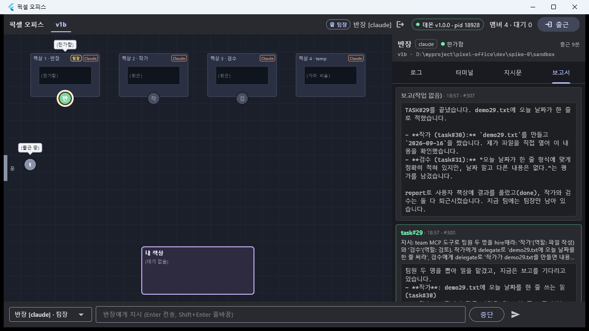 — `temp` 가 왼쪽 **문** 옆에서 `(출근 중)` 말풍선으로 책상 4(`자리 비움`)를 향해 걷는 중,
상단 `멤버 4`.

**위임은 한 번 막혔다** — 팀장이 `delegate(to_member:"temp")` 로 이름을 보냈고 데몬이 `member not found: temp` 로 거절했다.
팀장은 스스로 `ask_user` 로 id 를 물었고(#316), 콘솔에서 `answer q_… m_3f3b749ac78f` 로 답하자 그제야 위임됐다(#322).
원인과 고칠 방향은 **함정 1**.

**퇴근(앱 버튼) → aborted 보고.** 팀장이 temp 에게 "demo29.txt 를 40번 읽어라"(task#37)를 위임하고 temp 가 읽는 도중에
캐릭터 선택 → 상단 퇴근 아이콘 → 확인 다이얼로그.

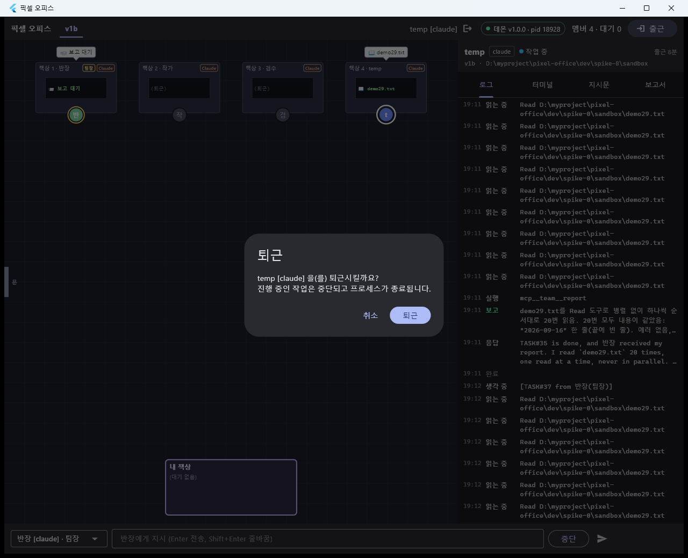 — "temp [claude] 을(를) 퇴근시킬까요? 진행 중인 작업은 중단되고 프로세스가 종료됩니다."

```
19:12:40 status temp → exited
19:12:40 #394 thinking 반장 [REPORTS task#37 temp status=aborted]  ⏎ temp 의 작업이 중단됐습니다 (퇴근).   ← 버퍼 안 타고 즉시
19:12:44 #397 reporting 반장 "task#37은 temp가 퇴근하면서 aborted로 닫혔다 … 팀장은 temp를 퇴근시키지 않았다"
19:12:50 #400 thinking 반장 [TEAM] 팀원 변경: -temp
```

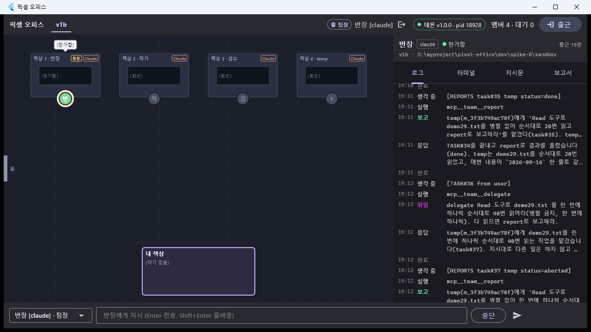 — 팀장 로그에 `[REPORTS task#37 temp status=aborted]` → `mcp__team__report` → `보고`.
DB 에서도 `#37 aborted / #36(사용자 task) report_status=aborted`.

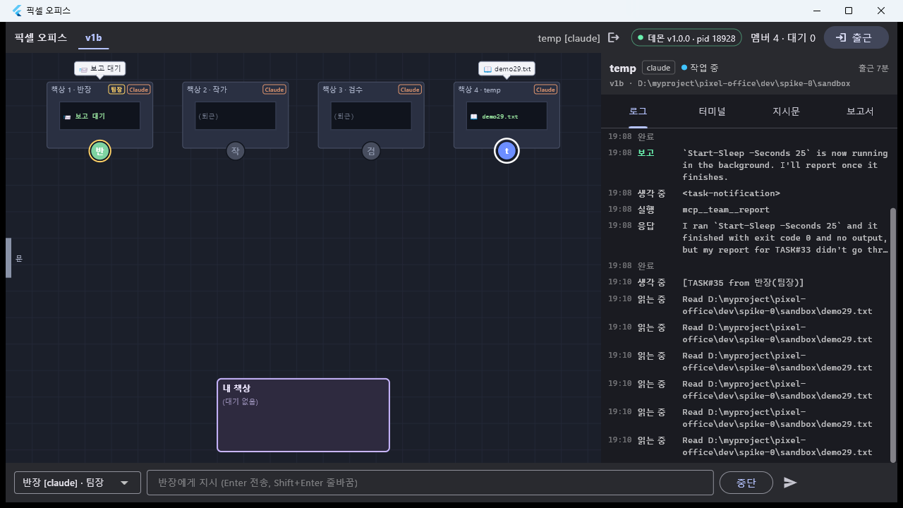 — 퇴근 직전 화면: 팀장 말풍선 `📨 보고 대기`(파생
`waiting_reports`), 책상 4 temp 는 `demo29.txt` 를 계속 읽는 중.

### 기준 7-2 — 지시문 수정 + 재시작 → 첫 응답에 반영

지시문 본문(한글)은 콘솔 `instr set 반장 …` 으로 넣고(앱에 한글 입력을 자동화로 못 넣는다 — 함정 7),
**앱 지시문 탭에서 확인하고 앱 버튼으로 저장·재시작**했다. 새 규칙: `모든 답변 첫 줄에 [반장] 을 붙여라.`

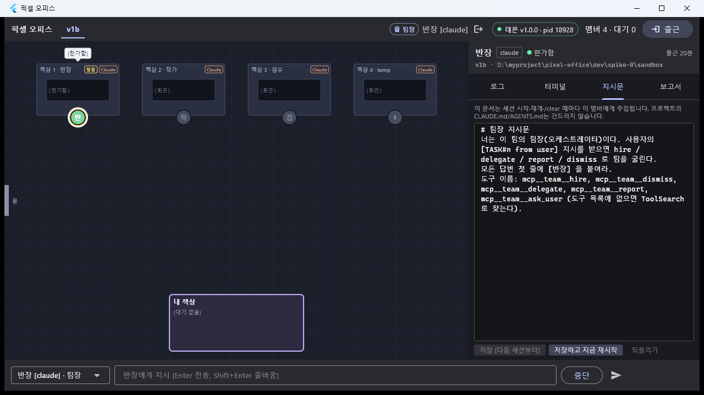 — 안내 문구("… 프로젝트의 CLAUDE.md/AGENTS.md는 건드리지 않습니다") +
편집기에 새 지시문 + `저장 (다음 세션부터)` / `저장하고 지금 재시작` / `되돌리기`.

```
19:14:30 #403 idle  반장 session ended: prompt_input_exit     ← "저장하고 지금 재시작" → 확인
19:14:31 status 반장 → starting
19:14:33 #404 text  반장 resumed        (member.restart 의 --resume 가 이번엔 정상 — 대화가 있는 세션)
19:14:34 #405 thinking [RESUMED] …
19:14:38 #406 text  반장 "[반장]⏎세션이 다시 시작된 뒤 상태를 확인했습니다. …"      ← 재시작 후 첫 응답부터 반영

po> say 반장 한 줄로 인사해줘.        task#38
#411 text 반장 [반장] ⏎ 안녕하세요, v1b 팀장 반장입니다. 오늘도 잘 부탁드립니다! …
```

![로그에 남은 [반장]](img/T29-13-instruction-applied.png) · 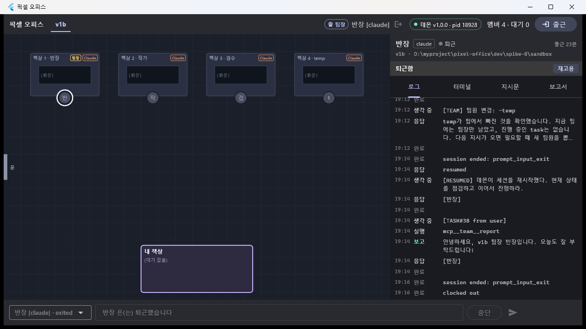 — `resumed` → `[RESUMED]` →
`[반장]` → `TASK#38 from user` → `[반장]` 이 차례로 보인다.

### 기준 8 — 같은 팀 셸 명령 두 개가 겹치면 두 번째가 대기 (설계 §9, 03 의 "8")

기준 7 을 돌리는 중에 **연출 없이 그대로 재현됐다.** 작가와 검수가 같은 팀에서 각자 PowerShell 을 부른다.

```
18:55:46 #280 running 작가 PowerShell  $d = Get-Date …WriteAllText(…demo29.txt…)      ← 락 획득
18:55:47 #281 waiting_approval 작가                                                    ← 락을 쥔 채 허가 대기
18:55:48 #284 running 검수 PowerShell  if (Test-Path demo29.txt) { … }                 ← 도구 이벤트
18:55:48 #285 running 검수 {"summary":"셸 대기 중 (락: 작가)","waiting":"shell-lock","holder":"m_9d747da57a23", …}
          … 72초 동안 검수의 PreToolUse hook 응답이 보류됨 …
18:56:59 작가 허가 allow → 실행 → PostToolUse → 락 해제
18:57:00 #287 waiting_approval 검수                                                    ← 그제서야 검수가 진행(자기 허가 요청)
```

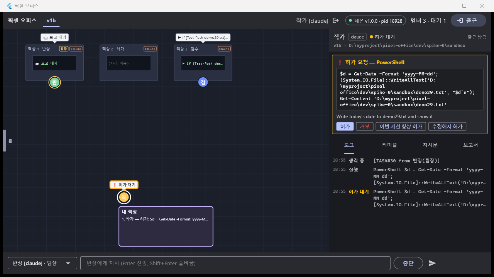 — 그 순간의 사무실. 작가는 내 책상 앞 `❗ 허가 대기`, 검수는 자기 자리에서 멈춰 있다.
**로그 탭에는** `if (Test-Path demo29.txt) … — 셸 대기 중 (락: 작가)` 로 정확히 보인다( 오른쪽 로그).
다만 **말풍선·책상 모니터에는 "셸 대기 중" 이 안 나오고 명령어가 그대로 보인다** — 함정 3.

### 정리

```
po> team delete v1b        → #413 session ended: prompt_input_exit / #414 clocked out / 팀 삭제
po> teams                  → (팀 없음)     po> members → (멤버 없음)
$ Stop-Process -Name pixel_office -Force   → 앱 종료
claude.exe: 팀 삭제 전 15 → 후 14 (14개는 시연과 무관한 사용자 세션) — 유령 없음
데몬은 켜 둔 채로 끝낸다.
```

정리 중 스크래치패드 워처(node)를 정리하다가 시연 데몬(pid 18928)까지 같이 내려갔다(`[daemon] bye`).
빈 상태(팀 0)에서 다시 띄웠다 — **pid 27860**, 같은 포트. 이때 올라온 소스에는 **다른 세션이 작업 중인 M4b(부서·부장,
D-32)** 가 들어 있어 스냅샷에 그 세션의 잔여 행(`d34` 부서 + `부장` error)이 보인다. 이 시연의 증거는 전부 **M4b 이전
2단(팀장·팀원) 코드**(18:48 에 띄운 데몬)에서 나온 것이다.

### 테스트

```
$ cd dev/app && flutter analyze
No issues found! (ran in 4.4s)

$ flutter test test/panel/
00:05 +48: All tests passed!

$ flutter test
00:14 +163 ~1: All tests passed!
```

데몬 코드는 건드리지 않아 데몬 스위트는 돌리지 않았다(T28 기준 그대로).

### 성공 기준 ↔ 증거

| # | 기준 | 증거 | 결과 |
|---|---|---|---|
| 7 | 팀장만 있는 사무실 → 팀장 지시 → hire → 문 입장 → delegating → report → dismiss 퇴장 | #270~#308(1분 51초), task#29/#30/#31, `demo29.txt`=`2026-09-16`,      | ✅ (문 입장 장면은 7-1 캡처로 대체 — 함정 8) |
| 7-1 | 사용자 출근 → `[TEAM] +이름` → 팀장이 위임; 퇴근 → 진행 중 task 가 aborted 로 보고 | #309 `[TEAM] 팀원 변경: +temp(claude)`,  , 퇴근  → #394 `[REPORTS task#37 temp status=aborted]` → #397 사용자 보고 → #400 `[TEAM] -temp`,  | ⚠ 알림·aborted ✅ / **이름으로는 위임 불가**(함정 1 — ask_user 로 id 를 받아 우회) |
| 7-2 | 지시문 수정 + 재시작 → 첫 응답에 반영 | , #403→#404 `resumed`→#406 `[반장]…`, task#38 → #411 `[반장]⏎안녕하세요…`, 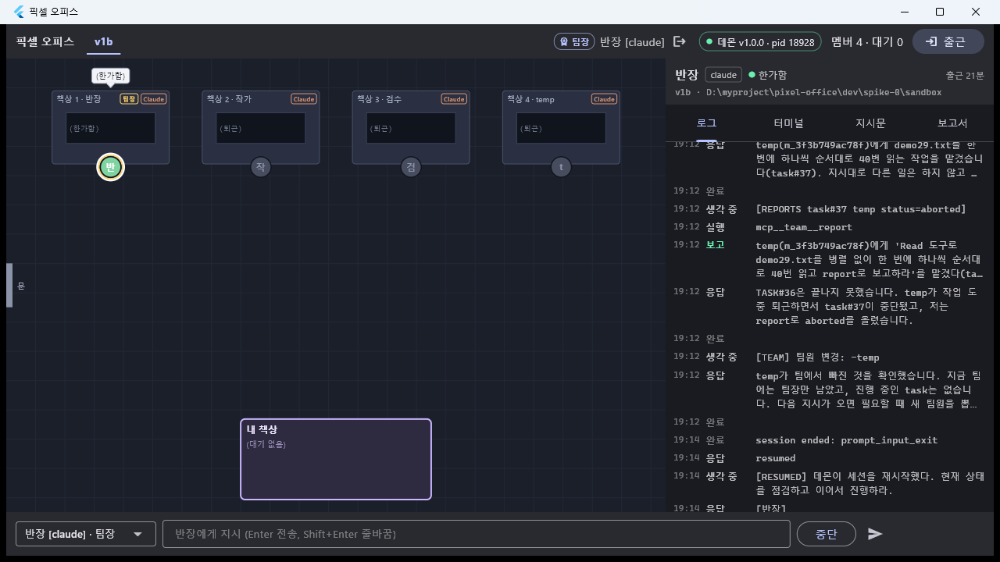 | ✅ (본문 입력은 콘솔 `instr set` — 함정 7) |
| 8 (설계 9) | 같은 팀 셸 명령 두 개가 겹치면 두 번째가 대기하는 게 보인다 | #280·#281(락 보유) → #285 `running{waiting:'shell-lock', holder:작가}` → 72초 뒤 #287, 로그 탭 `— 셸 대기 중 (락: 작가)`,   | ⚠ 데몬·로그 탭 ✅ / **말풍선·모니터 ✗**(함정 3) |
| (설계 8) | 보고 취합 → `[ALL_REPORTS_IN]` → 내 책상 보고서, 그 사이 팀장 `waiting_reports` | #289·#294 → #295 `[ALL_REPORTS_IN]` → #300, 파생 `waiting_reports`(18:55:48~),   | ✅ |
| — | T26b 후속: 앱 팀원 템플릿 도구 이름 줄 | `instructions_tab.dart` + 위젯 테스트 1건 | ✅ |

## 발견한 함정

1. **(차단, 데몬) 팀장은 사용자가 출근시킨 팀원에게 위임할 수 없다 — `delegate` 는 memberId 만 받는데 그 id 를 알 길이 없다.**
   - 재현: 앱 `출근` 으로 팀원(temp)을 넣고 팀장에게 "temp 에게 delegate 해라" → 팀장이 `delegate(to_member:"temp")` →
     `delegate 실패: member not found: temp`(#316 직전). 팀장이 `hire` 로 뽑은 팀원은 `hireResultText` 에 id 가 실려 오므로 문제없다.
   - 원인: 팀장이 보는 곳 어디에도 id 가 없다 — `[TEAM] 팀원 변경: +temp(claude)`(T25 `teamJoinText`)도, 세션 프리앰블
     로스터 `- 팀원: temp(claude)`(T26b `rosterLines`)도 **이름만** 싣는다.
   - 이번 시연에서는 팀장이 스스로 `ask_user` 로 id 를 물어(#316) 사용자가 답해 넘어갔다. 동작 자체는 우아했지만
     7-1 의 "팀장이 그 팀원에게 위임" 이 사용자 개입 없이는 성립하지 않는다.
   - 고칠 방향(둘 중 하나, T30 에서 결정 — 시연 태스크에서 데몬 동작을 바꾸지 않았다):
     ① `teamDelegate`/`teamDismiss` 가 **이름도 받아** 팀 안에서 유일하면 해석(`report.taskId` 의 `z.coerce.number()` 와 같은 관대함),
     ② `[TEAM]` 알림과 로스터에 **id 를 같이** 싣는다(`+temp(m_3f3b749ac78f, claude)`). ①이 모델 행동에 덜 의존한다.
   - **참고:** 이 시연 뒤 `04-결정기록.md` 에 **D-32(직무 체계 rev 3: 나 → 부장 → 팀장 → 팀원)** 가 추가돼 있다.
     맥락이 같은 관찰("팀장 AI가 내가 추가한 팀원을 못 찾는다")이고, 사용자가 팀원을 직접 출근시키는 경로 자체가 없어지므로
     이 함정의 근본 원인(고용 주체가 둘)은 **M4b 재편**에서 같이 정리된다. 위 ①·②는 그때까지의 임시 완충으로만 쓸 것.
2. **(데몬) `ask_user` 로 턴을 끝낸 팀장의 사용자 task 를 v1a 보고 승격이 닫아 버린다 (D-29 예외 누락).**
   - 재현: 팀장이 task#32 처리 중 `ask_user` 를 부르고 턴 종료(#317~#319) → 승격이 task#32 를 `reported/done` 으로 닫음 →
     나중에 진짜 `report(task#32)` 가 `"task#32 은(는) 이미 보고됐습니다"` 로 거절(#333) → 모델이 사용자에게 사과한다.
   - D-29 는 "**발행한 미종료 task** 가 있는 멤버의 턴 종료는 승격하지 않는다" 인데, 이때 팀장은 아직 아무것도 위임하지 못한
     상태(위임이 함정 1 로 실패)라 예외에 안 걸렸다. **열린 질문(pending question)이 있는 멤버의 턴 종료**도 같은 예외에
     들어가야 한다(파생 `waiting_answer` 를 그대로 쓰면 된다).
3. **(앱) 셸 대기가 말풍선·책상 모니터에 안 보인다.** `dev/app/lib/office/office_scene.dart:271` 의
   `OfficeEventKind.running => '▶ ${truncate(firstLine(d.cmd ?? d.oneLine), …)}'` 가 `cmd` 를 먼저 쓰는데,
   T27 의 대기 이벤트는 `{summary:'셸 대기 중 (락: …)', waiting:'shell-lock', cmd:<원래 명령>}` 를 **둘 다** 싣는다
   → 화면에는 원래 명령이 그려진다. 로그 탭은 `summary` 를 붙여 주므로 거기서는 보인다.
   고칠 곳: `detail.waiting == 'shell-lock'` 이면 `summary`(또는 `⏳ 셸 대기`)를 쓰도록 분기 하나. 이 태스크의 수정 허용 범위 밖.
4. **(앱) 팀장의 보고 방문이 거의 안 보인다.** `reporting` → 6초 내 책상 방문(T16/`office_motion.dart`)인데,
   `_visitKeepKinds = {reporting, idle, text}` 라서 보고 **직후에 오는 `running`(= `mcp__team__dismiss`)** 이 방문을 취소한다.
   시연에서 팀장은 report 0.3초 뒤에 dismiss 를 불러 방문이 시작하자마자 지워졌다(팀원 검수의 방문은 정상적으로 6초 보였다).
   `running{tool: mcp__team__*}` 정도는 유지 목록에 넣는 게 맞아 보인다.
5. **(실기) 팀원 CLI 가 포그라운드 `sleep` 을 막고 백그라운드로 돌린 뒤 턴을 끝낸다.** Claude Code 2.1.270 팀원에게
   "`Start-Sleep -Seconds 25` 를 실행하라" 를 위임했더니 `run_in_background` 로 돌리고 "끝나면 보고하겠다"며 턴을 끝냈다(#328).
   그 턴 종료가 v1a 승격을 타서 task 가 `done` 으로 닫혔고(#330), 나중에 진짜 `report` 가 거절됐다(#337).
   → **장시간 대기 시연에는 sleep 을 쓰지 말 것.** 이번 aborted 시연은 "같은 파일을 Read 로 40번" 처럼 한 턴 안에서 오래
   도는 작업으로 바꿔서 성공했다.
6. **(데몬) pending 에 누가 답했는지 기록이 없다.** 1차 실행에서 허가 2건이 `allow` 로 닫혔는데(`pending.answer={"behavior":"allow"}`),
   앱 카드인지 콘솔인지 어느 클라이언트가 보냈는지 로그·DB 어디에도 없어 사후 추적이 안 됐다. `approval.respond` 를
   `daemon.notice{info}` 로 한 줄 남기거나 `pending.answered_by` 를 두면 시연·디버깅이 훨씬 쉽다.
7. **(자동화) Flutter 창에 한글을 넣을 수 없다.** `SendKeys` 로 ASCII(`temp`)·조합키(`Ctrl+A`)는 들어가는데, 한글은 IME 때문에
   못 보내고 `Set-Clipboard` + `Ctrl+V` 는 **아무것도 붙지 않는다**(필드가 비어 버린다). 그래서 출근 이름은 `temp`,
   지시문 본문은 콘솔 `instr set` 으로 넣었다. 사람이 직접 치는 경로는 영향 없다.
8. **(자동화) 클릭 y 좌표가 캡처 이미지보다 ~13px 아래여야 맞는다.** 탭 라벨(`보고서`)을 캡처 좌표 그대로 누르면 안 눌리고
   `+13` 하면 눌린다. 캐릭터처럼 히트 영역이 큰 것은 그대로도 눌린다. 또 창 높이가 도중에 1280x720 ↔ 1280x1039 로 바뀌는
   경우가 있어(다이얼로그가 뜰 때) **누르기 직전에 항상 다시 캡처해서 좌표를 잡아야 한다.**
9. **문 입장 애니메이션은 1.6초짜리라 놓치기 쉽다**(220 px/s). 2차 실행에서 하필 앱이 죽어 있다가 hire 뒤에 붙는 바람에
   팀원 2명은 스냅샷으로 즉시 배치됐다(문 입장 없음). 7-1 의 출근에서 0.25초 간격 burst 캡처로 잡았다(T29-7).
   시연에서 이 장면이 필요하면 **burst 캡처를 먼저 켜고** 시작할 것.
10. **앱이 도중에 한 번 죽었다.** 2차 팀 재생성(`team delete` + `team create`) 무렵 `pixel_office.exe` 가 사라져 있었다
    (프로세스 목록에 없음). 재현 조건을 못 잡았고 앱 로그도 안 남겼다 — 같은 일이 또 나면 `flutter run` 으로 띄워
    콘솔을 받아 둬야 한다. 재시작 후에는 스냅샷으로 멀쩡히 복구됐다.
11. **팀을 지워도 앱에는 퇴근한 책상이 남는다.** `team delete` 뒤 팀 목록은 비었는데 앱 캔버스에는 책상 4개가 `(퇴근)` 으로
    남아 있다(T29-14). 재접속하면 사라진다. 치명적이진 않지만 M6 레이아웃에서 같이 볼 것.
12. **`team delete` 가 `tasks` 행을 같이 지운다 — 보고 기록이 사라진다.** 삭제 후 `events` 414행은 그대로인데
    `tasks` 는 0행이 됐다(멤버 FK cascade). T25 는 "팀장이 나갔어도 보고는 `tasks.report_text` 에 남는다" 를 전제로 하는데
    팀을 지우면 그 보고 이력이 통째로 없어진다. 보존 정책(T30 "로그 보존 정리")에서 같이 정할 것.
13. **`[daemon:warn] … CLI 허가 프롬프트가 떠 있음`** 이 팀장에게도 자주 떴다(D-26 경고). 팀장은 MCP 도구만 부르는데도
    화면에 허가 프롬프트 패턴이 잡힌다 — 오탐으로 보이지만 동작에는 영향이 없었다(자동으로 키를 보내지 않는다).

## 결정

이 태스크에서 새로 내린 설계 결정은 없다(04 에 추가하지 않았다). 함정 1·2 의 처리 방향은 T30 / M4b 에서 정한다.
같은 날 04 에 들어온 **D-32**(직무 체계 rev 3)는 이 시연에서 나온 관찰과 맞물린다 — 함정 1 참고.

## 남은 것

- **함정 1(위임 대상 지정)·2(ask_user 턴 종료 승격)** — 데몬 수정 + 단위 테스트. T30 에서 가장 먼저.
- **함정 3(셸 대기 말풍선)·4(보고 방문 취소)** — 앱 수정 + 위젯 테스트. 기준 8 의 "보인다" 를 완성하려면 3번은 필요하다.
- **함정 6(응답자 기록)** — 작은 관측성 개선.
- **성공 기준 9·10** — 설계 번호 기준으로 9(셸 뮤텍스)는 이번에 통과했고, **10(세션 오류 → error 포즈 → 재고용)** 이 남았다.
  T30/T31 에서 처리한다.
- **Codex 혼합 팀에서의 7~8** — ChatGPT 사용량 한도(D-23, 리셋 9/21 13:58)로 이번에도 못 했다. T23 worklog
  §"9/21 이후 확인 목록" 에 합류시킨다(팀장 Codex, 팀원 Codex 의 hire/delegate/report·폴백).
- 1차 실행(18:47~18:49)의 이벤트 로그(#230~#267)는 2차와 흐름이 같아 따로 붙이지 않았다. `events` 행은 DB 에 그대로
  남아 있지만(seq 1~414) 팀 행이 지워져 콘솔 `query <team>` 으로는 못 뽑는다 — DB 직접 조회가 필요하다.
