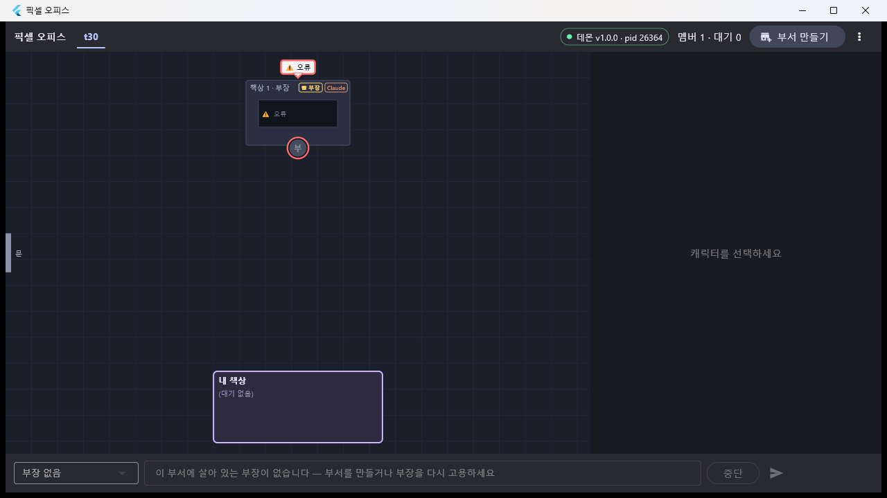
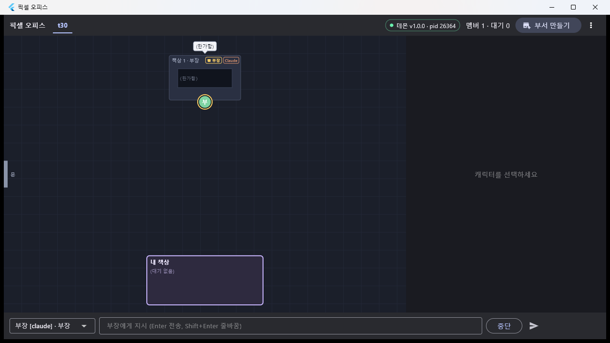

# T30 — 안정화: 오류·재고용·보존

- 날짜: 2026-09-17
- 마일스톤: M5 (T30. 남은 것은 T31 = v1b 성공 기준 9~10 · 문서 정리)
- 관련 설계: 01-설계문서.md §"interrupt / fire / error 공통 후처리" · §HookReceiver · §대기 정책 ·
  04-결정기록.md D-11 / D-15 / D-16 / D-25 / D-36 / D-38 / **D-39(이번)** / **D-40(이번)** ·
  worklog T38(함정 ⑤ 두 데몬) · T39(D-38 원인 + 딸린 관찰) · T23b · T18(재고용 배너)
- 커밋: (상위에서 — 이 태스크는 커밋하지 않았다. `docs/03-작업계획.md` 의 T30 체크박스도 상위/T31 몫)

## 목표

T38·T39 가 "M5(T30) 후보" 로 남긴 불안정 요소 셋(hook 핸들러 예외가 CLI 를 세워 둠 · 콘솔 재접속 폭주 · 두 데몬이 같은 DB)을
없애고, **프로세스가 죽었을 때 사무실에서 그게 보이고 한 번의 조작으로 되살아나는지**를 실기로 확인한다. 덧붙여 로그가
무한히 쌓이지 않도록 보존 정리를 제대로 돌린다. 끝나면 "켜 두고 며칠 쓰는" 사용이 견딜 만해진다.

## 한 것

### 1. hook 핸들러 예외가 CLI 를 세워 두지 않는다 (D-38 딸린 관찰 해소)

`src/adapters/BaseHooksAdapter.ts` — `handleHook` 이 **`req.hold()` 를 감싼 대리 요청**을 핸들러에 넘긴다. 그래서 핸들러가
어디서 던지든 그때까지 연 보류 핸들을 catch 가 들고 있다.

- `onHandlerError()`: ① `req.respond(PASS_THROUGH)` 가 먹지 않으면(= 이미 `hold()` 했다) `releaseHandle()` 로 그 보류를
  직접 pass-through 로 닫는다(D-11), ② 멤버에게 `error{summary:'hook handler failed: <메시지>', hookEvent}` 를 남기고
  (`appendEvent` 자체가 던져도 삼킨다 — D-38 은 store 가 통째로 망가진 경우였다), ③ `handler-error` 를 emit →
  Office 가 이미 `daemon.notice{level:'error'}` 로 올린다.
- `releaseHandle()`: 그 보류에 딸린 pending 행이 이미 등록됐으면 `expired` 로, 셸 게이트 보류였으면 `abort` 로
  대기 줄에서 뺀다(T27 규칙 그대로).
- `src/hooks/HookReceiver.ts` — **백스톱**. `dispatch` 의 catch 가 `state === 'held'` 면 그 핸들을 `cancel()` 한다.
  예전에는 `state === 'open'` 일 때만 응답해서, 리스너가 hold 뒤에 던지면 hook 프로세스가 영영 매달렸다.

새 테스트 `test/adapters/HandlerError.test.ts`(5건) — D-38 의 모양 그대로 `store.createPending` 을 던지게 만들어 재현.

### 2. 데몬은 하나만 (T38 함정 ⑤, D-40)

`src/office/singleton.ts`(신규) — `assertSingleDaemon({daemonJsonPath, probe, env})` + `DaemonAlreadyRunningError(exitCode 3)`.
`daemon.json` 의 pid 가 **살아 있고**(`process.kill(pid,0)`, `EPERM` 포함) 그 **ws 포트가 듣고 있으면**(127.0.0.1, 400ms) 거부.
둘 중 하나라도 아니면 예전처럼 덮어쓴다(죽은 pid = 크래시 뒤 재기동 / pid 재사용).

- `Office.start()` 맨 앞 — 포트를 열기도, `daemon.json` 을 쓰기도 **전에** 확인한다. 거부된 데몬은 살아 있는 데몬의
  `daemon.json` 을 건드리지 않는다.
- `src/index.ts` — `DaemonAlreadyRunningError` 를 잡아 메시지를 stderr 에 찍고 `process.exit(3)`.
- 탈출구 `PIXEL_FORCE_START=1`. 오류 메시지와 PROTOCOL 양쪽에 **"통합 테스트는 이것 대신 자기 `PIXEL_DATA_DIR` 을 쓰라"** 고 적었다.
- 테스트용 주입: `OfficeOptions.singletonProbe`.

새 테스트 `test/office/Singleton.test.ts`(9건).

### 3. 재접속 백오프 상한 (T38·T39 관찰: TIME_WAIT 16,000개 → EADDRINUSE)

`src/cli/RpcClient.ts` — `backoffDelay(attempt, opts)` 를 내보낸다: 1초에서 시작해 두 배씩, **30초 상한**, **±20% 지터**,
그리고 **어떤 입력에도 1초 미만이 나오지 않는다**(`intervalMs: 5` 같은 옛 호출부, `jitter: 5` 같은 과한 지터 포함).
`connectWithRetry` 가 이걸 쓰고, `onAttemptFailed(attempt, err, nextDelayMs)` 로 다음 대기를 알려 준다(마지막 시도면 `undefined`).

`src/cli/index.ts` — 자동 재접속이 **2초 고정 × 30회** → 백오프 × `AUTO_RECONNECT_ATTEMPTS`(8)회. `reconnecting` 플래그로
루프 중복(끊길 때마다 루프가 겹치는 폭주)을 막고, 포기하면 `데몬을 띄운 뒤 reconnect 를 입력하세요` 를 찍는다.
새 명령 **`reconnect`**(`src/cli/help.ts` "연결" 절에 추가).

앱(`dev/app/lib/rpc/rpc_client.dart`)은 **손대지 않았다** — 이미 `minBackoff 1s → maxBackoff 5s`(운영 배선 `RpcClient()` 가
기본값을 쓴다)이고 루프가 매 시도 전에 `Timer(backoff)` 를 기다리므로 1초보다 촘촘해질 수 없다. 앱은 상단에 "데몬 시작"
버튼이 있으니 멈출 이유가 없어 횟수 제한도 두지 않았다.

### 4. 오류 포즈 · 재고용 (앱)

`dev/app/lib/office/office_scene.dart` — `SceneMember.isError`(status == error). 요약 `⚠ 오류` 는 이미 있었다.
`dev/app/lib/office/office_painter.dart` —

- `OfficeColors.charError`(0xFFFF6B6B) 추가.
- 캐릭터: `isError` 면 직급 링 자리에 **붉은 링**(r+2, 2.5px). 죽은 세션의 직급보다 "죽었다" 가 먼저 보여야 한다.
- 말풍선: `if (m.isGone) return` → **`if (m.status == exited) return`**. 즉 **오류만 말풍선을 띄운다**(`⚠ 오류`, 붉은 테두리 + 굵게).
  퇴근은 예전처럼 회색 원·모니터로만.

패널 배너(`lib/panel/member_gone_banner.dart`)와 클릭 가능 여부는 **T18 이 이미 맞게 해 뒀다 — 고칠 것이 없었다**:
`OfficeLayout.hitTest` 는 회색 캐릭터도 좌석·책상으로 잡고, 배너는 `⚠ 오류로 종료됨 (code N)` + `재고용` 버튼을 그린다.
그걸 테스트로 못 박았다(`test/office/office_view_test.dart` 신규 1건 — 오류 말풍선 + 두 번의 탭이 모두 그 멤버를 고른다 +
퇴근은 말풍선 없음). 데몬 쪽은 `test/office/CrashRehire.test.ts`(4건).

### 5. 보존 정리 (D-39)

`src/store/Store.ts` — `DEFAULT_RETENTION{keepPerTeam:50_000, pendingDays:30, taskDays:90}`,
`pruneRetention(opts)` = `pruneEvents` + **`prunePending(days, now)`**(닫힌 `answered`/`expired`만) +
**`pruneTasks(days, now)`**(끝난 `reported`/`aborted`만). 열린 행(`open` pending, `queued`/`assigned` task)은 안 지운다.
`now` 인자는 테스트가 시간을 앞으로 밀기 위한 것.

`src/office/Office.ts` — `runRetention()`(절대 throw 하지 않는다, 실패는 `daemon.notice{warn}`) +
`startRetentionTimer()`(`RETENTION_INTERVAL_MS` 24h, **`unref()`**, `shutdown()` 에서 `clearInterval`).
`OfficeOptions.retentionIntervalMs` 로 주기를 바꾸거나(테스트) 0 으로 끌 수 있다.

새 테스트 `test/store/Retention.test.ts`(5건) + `test/office/CrashRehire.test.ts` "보존 정리 타이머"(2건).

### 6·7. hook timeout 상한 확정 · 재시작이 `ask_*` 를 살리는지 (확인만, 코드 변경 없음)

- 세션 설정의 `timeout: 86400`(D-16) 그대로. `src/pty/hookSettings.ts` `HOOK_TIMEOUT_SEC = config.hookTimeoutSec`,
  기존 테스트가 86400 을 단언하고, 이번 실기의 실제 파일에서도 확인했다(아래 검증). PROTOCOL 에 명문화했다.
- D-36(재시작이 `ask_user`/`ask_parent` 를 살린다)은 `test/office/AfterCare.test.ts` 3건이 그대로 통과 — 재확인만 했다.

### 8. 문서

`dev/daemon/PROTOCOL.md` 에 **"데몬 수명·안정화 (T30)"** 절 추가(단일 데몬 가드 · hook 핸들러 실패 계약 · hook timeout 상한 ·
보존 정책 · 재접속 백오프). `docs/04-결정기록.md` 에 **D-39**(보존)·**D-40**(단일 데몬).

## 검증

### 단위 테스트 · 타입

```
$ cd dev/daemon && npx tsc --noEmit
(출력 없음)

$ npm test
ℹ tests 509
ℹ suites 73
ℹ pass 502
ℹ fail 0
ℹ cancelled 0
ℹ skipped 7
ℹ todo 0
ℹ duration_ms 35805.5799
```

T39 기준 481 → **509**(추가 28건: HandlerError 5 · Singleton 9 · Retention 5 · CrashRehire 6 · RpcClient 백오프 3).
skipped 7 은 이전부터 있던 Codex 실기 의존 항목.

```
$ cd dev/app && flutter analyze
No issues found! (ran in 13.3s)

$ flutter test
00:11 +193 ~1: All tests passed!
```

새 데몬 테스트만 따로:

```
$ node --import tsx --test test/adapters/HandlerError.test.ts
▶ T30 hook 핸들러 예외
  ✔ D-38 재현: createPending 이 hold() 뒤에 던져도 보류가 pass-through 로 닫힌다 (PermissionRequest)
  ✔ ask_user(AskUserQuestion) 경로도 같다
  ✔ hold() 전에 던지면 respond 로 나간다(회귀: 예전 경로도 그대로)
  ✔ 핸들러가 이미 응답했으면 이중 응답하지 않는다
▶ T30 HookReceiver 백스톱
  ✔ 리스너가 hold() 뒤에 던지면 receiver 가 보류를 '{}' 로 닫는다

$ node --import tsx --test test/office/Singleton.test.ts
  ✔ daemon.json 이 없으면 그냥 통과한다
  ✔ pid 가 살아 있고 ws 포트가 열려 있으면 거부 — 메시지에 pid 와 끄는 법
  ✔ pid 가 죽었으면 통과한다(크래시 뒤 재기동) — 포트는 보지도 않는다
  ✔ pid 는 살아 있지만 ws 포트가 닫혀 있으면 통과한다(pid 재사용)
  ✔ PIXEL_FORCE_START=1 이면 확인 자체를 하지 않는다
  ✔ 깨진 daemon.json / pid 0 은 통과한다
  ✔ 기본 확인기: 자기 pid 와 없는 pid 는 "살아 있음" 이 아니다
  ✔ Office.start() 가 거부한다 — 그리고 살아 있는 데몬의 daemon.json 을 덮어쓰지 않는다
  ✔ Office.start() 는 죽은 pid 의 daemon.json 을 예전처럼 덮어쓴다
```

D-36 재확인(코드 변경 없음):

```
$ node --import tsx --test test/office/AfterCare.test.ts | grep restart
  ✔ restart: 열린 허가는 만료되지만 배정된 task 는 같은 세션이 이어 하므로 남는다
  ✔ restart: ask_user·ask_parent 질문은 살아남고 허가·TUI 질문만 만료된다(D-36)
  ✔ restart: 살아 있는 hook 보류는 끊는다 — 안 끊으면 죽는 CLI 가 응답을 기다리며 멈춘다(D-36)
```

### 실기 환경

```
데몬   dev/daemon, npx tsx src/index.ts — 기존 데몬(pid 22524, T39 빌드)을 콘솔 shutdown 으로 내리고
       이번 코드로 재기동 pid 26364 (ws 7420 / hook 7421 / mcp 7422)
앱     dev/app, flutter build windows --release → build\windows\x64\runner\Release\pixel_office.exe (1280x720)
콘솔   npx tsx src/cli/index.ts --exec "..."
캡처   dev/app/tool/capture-window.ps1(창 단위) → docs/worklog/img/T30-*.png 3장
부서   t30 (d_c6434add1b1b), cwd = dev/spike-0/sandbox, 부장 "부장"(claude, m_08fe03f040d5)
```

### 실기 1 — 부장에게 암구호를 기억시킨다

```
po> dept create t30 D:/myproject/pixel-office/dev/spike-0/sandbox claude 부장
부서 생성: d_c6434add1b1b  t30  ...  head=m_08fe03f040d5  팀 0개  멤버 1명
부장: m_08fe03f040d5  부장 [claude] starting  부장(head) @t30 pid=13128

po> say 부장 오늘의 암구호는 '초록 고래 47' 이다. 기억해 두고 '알겠다' 라고만 답해라.
task#21 → 부장
#683 thinking 부장 [TASK#21 from user] ⏎ 오늘의 암구호는 '초록 고래 47' 이다. …
#686 reporting 부장 알겠다  task#21
#687 text 부장 알겠다
#688 idle 부장
```


### 실기 2 — `taskkill /F` 로 부장의 claude.exe 를 죽인다 → 오류 포즈

```
$ taskkill /F /PID 13128
성공: 프로세스(PID 13128)가 종료되었습니다.

po> members
m_08fe03f040d5  부장 [claude] error  부장(head) @t30       ← status error (childPid 없음)
```



캡처에서 확인: 캐릭터 **붉은 링**(금색 직급 링 자리), 머리 위 **"⚠ 오류" 말풍선**(붉은 테두리·굵게 — 예전에는
`isGone` 이라 말풍선 자체가 안 떴다), 책상 모니터 `⚠ 오류`, 지시 바가 `부장 없음`/
`이 부서에 살아 있는 부장이 없습니다 — 부서를 만들거나 부장을 다시 고용하세요` 로 잠긴다.
캐릭터를 누르면 오른쪽 패널에 `⚠ 오류로 종료됨 (code 1)` + `재고용` 배너가 뜬다(T18, `test/panel/member_gone_banner_test.dart`).

### 실기 3 — 재고용 → 이전 문맥을 그대로 이어받는다

이번 세션에는 데스크탑 클릭 수단이 없어 배너 버튼 대신 **같은 RPC 를 부르는 콘솔 `rehire`** 로 했다
(`member.rehire{memberId}` — 배너 버튼과 완전히 같은 경로. 버튼 자체는 T18 위젯 테스트가 누르고 확인한다).

```
po> rehire 부장
status 부장 → starting (starting)
재출근: m_08fe03f040d5  부장 [claude] starting  부장(head) @t30 pid=18056

po> say 부장 아까 내가 말한 암구호가 뭐였지? 암구호만 답해라.
task#22 → 부장
#692 running 부장 mcp__team__report
#693 reporting 부장 초록 고래 47  task#22        ← 죽기 전 대화를 기억한다 = --resume 이 먹었다
#694 text 부장 초록 고래 47
#695 idle 부장
```

이벤트 열(`query t30 696 18`)로 본 한 줄 흐름:

```
#688 idle 부장
#689 error 부장 process exited (code 1)     ← 강제 종료
#690 text 부장 resumed                       ← SessionStart source=resume (= --resume)
#691 thinking 부장 [TASK#22 from user] ⏎ 아까 내가 말한 암구호가 뭐였지? …
#693 reporting 부장 초록 고래 47
```



### 실기 4 — 두 번째 데몬은 거부된다

```
$ cd dev/daemon && npx tsx src/index.ts
[daemon] 이미 데몬이 돌고 있습니다 — pid 26364 (ws 127.0.0.1:7420).
  같은 데이터 폴더를 두 데몬이 열면 DB 가 깨집니다(T38 함정 ⑤). 먼저 끄세요:
    콘솔에서 `shutdown`  또는  taskkill /F /PID 26364
  일부러 둘을 띄우려면 PIXEL_FORCE_START=1 (테스트는 그 대신 PIXEL_DATA_DIR 을 따로 주세요).
  daemon.json: C:\Users\User\AppData\Local\pixel-office\daemon.json
EXIT CODE: 3
```

살아 있는 데몬의 `daemon.json`(pid 26364, token …)은 그대로 남았다.

### 실기 5 — hook timeout 상한

```
$ grep -o '"timeout"[^,}]*' %LOCALAPPDATA%\pixel-office\sessions\m_08fe03f040d5\claude-settings.json | sort -u
"timeout": 86400
```

D-16 그대로. 바꾸지 않았고 PROTOCOL 에 못 박았다.

### 정리

`dept delete t30` 으로 부서를 지우고(`#696 session ended: prompt_input_exit` → `#697 clocked out`) 앱을 닫았다.
데몬(pid 26364, 이번 코드)은 켜 둔 채로 남긴다.

## 발견한 함정

1. **`req.respond()` 는 `hold()` 뒤에는 먹지 않는다 — 그래서 catch 하나로는 부족했다.** D-38 이 남긴 관찰 그대로인데,
   고치려고 보니 문제는 "핸들이 누구에게도 안 잡혀 있다" 는 것이었다(`createPending` 이 던지면 그 핸들을 `held` 맵에
   넣기 전이다). 어댑터 안 여기저기에 try/catch 를 뿌리는 대신 **진입점에서 `hold()` 를 감싸** 마지막 핸들을 들고
   있게 한 뒤 catch 한 곳에서 닫았다. 새로 생기는 hook 이벤트 핸들러도 자동으로 보호된다.
2. **단일 데몬 판정은 pid 만으로도, 포트만으로도 안 된다.** pid 만 보면 pid 재사용(윈도우에서 흔하다) 때문에 멀쩡한
   기동을 막고, 포트만 보면 7420 을 쓰는 다른 프로그램 때문에 막는다. **둘 다** 맞을 때만 거부한다.
3. **백오프 하한을 넣으면 기존 테스트가 느려진다.** `connectWithRetry({intervalMs: 5})` 로 즉시 재시도하던 테스트가
   진짜로 1초씩 기다리게 된다. 하한은 이 태스크의 목적 자체라 낮추지 않고, 그 테스트를 3회 → 2회로 줄여
   "실제로 1초 이상 기다렸다" 를 **단언하는** 테스트로 바꿨다(순수 계산은 `backoffDelay` 단위 테스트가 본다).
4. **오류 말풍선을 켜려면 `isGone` 이 아니라 `exited` 로 갈라야 한다.** `_paintBubble` 의 `if (m.isGone) return` 한 줄이
   퇴근과 오류를 같이 막고 있었다. 사무실에서 "죽었다" 가 안 보이면 사용자가 캐릭터를 누를 이유가 없고, 그러면
   재고용 배너에 도달하지 못한다 — 포즈와 배너는 한 흐름이다.
5. **실기에서 앱 버튼을 누르려면 릴리스 빌드를 다시 해야 한다.** 붉은 링은 페인터 변경이라 `flutter build windows
   --release` 없이는 예전 그림이 뜬다(빌드된 exe 가 9/15 자였다). 캡처 전에 빌드부터.
6. **`--exec "query <member>"` 는 멤버를 못 받는다.** 첫 인자는 **부서**고 그다음이 `beforeSeq`/`limit` 이다
   (`query t30 696 18`). `-` 를 넣으면 `beforeSeq` 파싱에서 죽는다. 고치지 않았다(설계상 부서 단위 조회).

## 결정

- **D-39** — 보존 정리는 하루에 한 번, 지우는 것은 끝난 이력뿐(pending 30일 / task 90일 / events 부서당 50,000건).
- **D-40** — 데몬은 하나만: `daemon.json` 의 pid 가 살아 있고 그 ws 포트가 듣고 있으면 기동 거부(exit 3), `PIXEL_FORCE_START=1` 이 유일한 탈출구.

## 남은 것

- **배너 `재고용` 버튼의 실기 클릭 캡처.** 이번 세션에는 앱 창을 클릭할 수단이 없어 같은 RPC(`member.rehire`)를 콘솔로
  불렀다. 버튼 → RPC 배선은 `test/panel/member_gone_banner_test.dart`(T18, 이번에도 통과)가 누르고 확인한다.
  T31 시연에서 사람이 한 번 눌러 캡처하면 닫힌다.
- **`docs/03-작업계획.md` 의 T30 체크박스와 커밋** — 이 태스크의 편집 범위 밖이라 손대지 않았다.
- **이벤트 코얼레스 점검**(03 의 T30 줄에 적힌 항목) — 이번에는 안 했다. 실기에서 이벤트가 눈에 띄게 몰리는 구간이
  없었고(한 턴에 5~7건), 합치려면 앱 말풍선·로그 탭의 기대가 같이 바뀐다. T31 시연에서 부서 하나에 팀 여럿을 돌려
  실제 초당 이벤트 수를 본 뒤 판단하는 쪽이 낫다.
- **부장을 codex 로 임명하는 실기**는 그대로 9/21 이후(D-23 사용량 한도).
