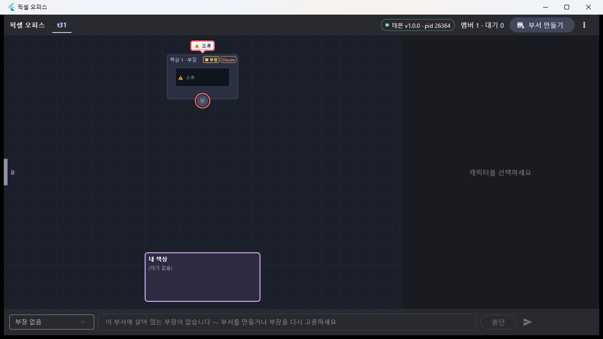
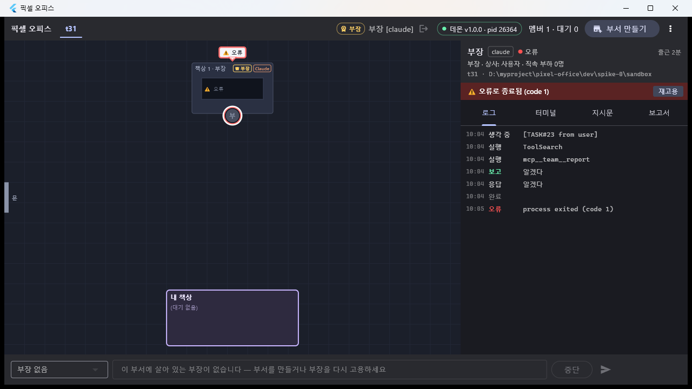
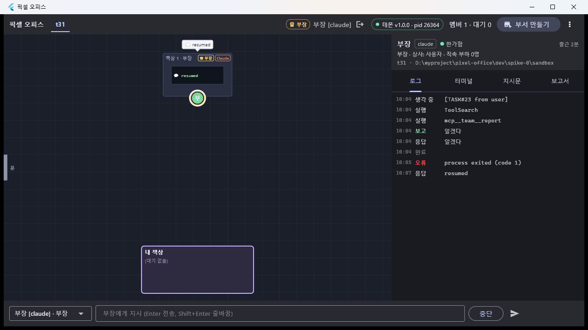
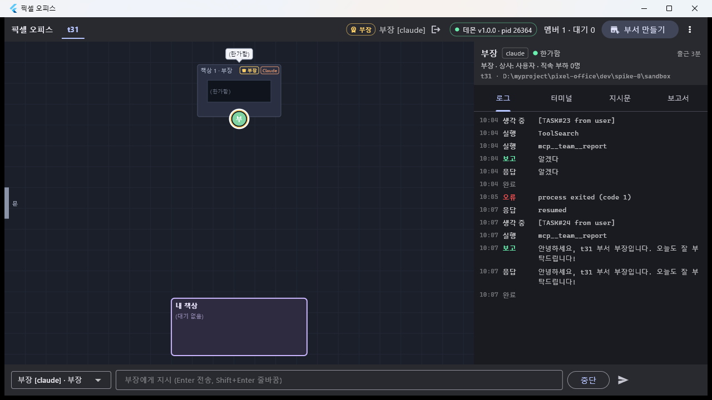
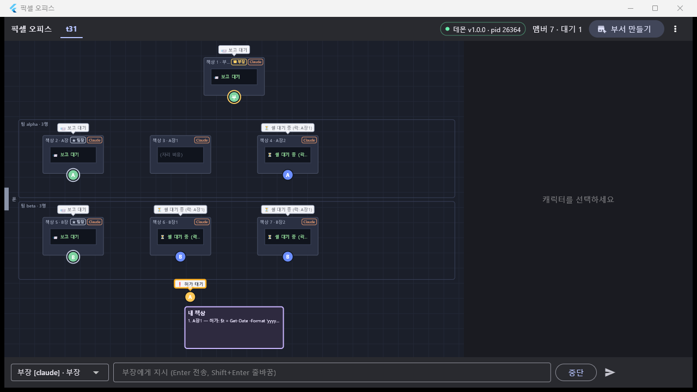
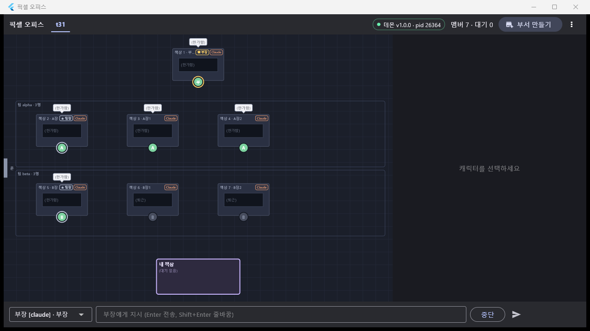

# T31 — v1b 시연(성공 기준 9~10) · 문서 정리 (M5 마무리)

- 날짜: 2026-09-17
- 마일스톤: M5 — **이 태스크로 M5 완료 = v1b 완료**
- 관련 설계: 01-설계문서.md §"Success Criteria — v1b" 9·10 · §"9. 셸 뮤텍스" · §"interrupt / fire / error 공통 후처리" ·
  04-결정기록.md D-27 / D-32 / D-39 / D-40 / **D-41(이번)** ·
  worklog T18(재고용 배너) · T19(클릭 기법) · T27(셸 뮤텍스) · T29(결함 ③) · T30("남은 것" 세 줄) · T37(앱 수정) · T39(기준 9 1차)
- 커밋: (상위에서 — 이 태스크는 커밋하지 않았다)

## 목표

T30 이 남긴 세 줄을 닫고 M5 를 끝낸다. ① 성공 기준 **10**(세션 오류 → 오류 포즈 → 재고용)을 **앱 배너의 `재고용` 버튼을 실제로 눌러서**
확인한다 — T30 은 클릭 수단이 없어 같은 RPC 를 콘솔로 불렀고, "사람이 한 번 눌러 캡처하면 닫힌다" 를 남겨 뒀다. ② 성공 기준 **9**(셸 겹침)를
빠르게 재확인한다. ③ T30 이 판단을 미룬 **이벤트 코얼레스**를 실제 밀도를 재서 결론 낸다. ④ README 전체와 04 를 정리한다.
끝나면 v1a·v1b 성공 기준 1~10 이 전부 실기로 닫히고, 남는 것은 M6(디자인)와 Codex 실기 목록(9/21 이후)뿐이다.

## 한 것

**코드는 한 줄도 바꾸지 않았다.** 시연을 막는 버그가 없었다(데몬 509 · 앱 193 그대로 그린). 바꾼 것은 문서 8개와 캡처 6장이다.

### 실기 환경

```
데몬   pid 26364 (T30 코드, ws 7420 / hook 7421 / mcp 7422) — 빈 사무실 상태에서 이어받아 그대로 씀
앱     dev/app/build/windows/x64/runner/Release/pixel_office.exe (T30 이 만든 릴리스 빌드, data\ 2026-09-17 09:52), 창 1280x720
콘솔   cd dev/daemon && npx tsx src/cli/index.ts --exec "..."
캡처   dev/app/tool/capture-window.ps1 (창 단위) → docs/worklog/img/T31-*.png 6장
클릭   스크래치패드 click.ps1 — SetForegroundWindow → 위젯 안으로 40/24/12/6/2/0 px 단계 이동(hover) → mouse_event 다운/업 → 커서 원위치
       (T19 함정 6 의 순서 그대로. 저장소에는 넣지 않았다 — 시연용)
부서   t31 (d_a9b2bb39645d), cwd = dev/spike-0/sandbox
```

### 1. 성공 기준 10 — 오류 포즈 → **배너 버튼 클릭** → 재고용

```
po> dept create t31 D:/myproject/pixel-office/dev/spike-0/sandbox claude 부장
부서 생성: d_a9b2bb39645d  t31  …  head=m_deda16bb429a  팀 0개  멤버 1명
부장: m_deda16bb429a  부장 [claude] starting  부장(head) @t31 pid=15352

po> say 부장 오늘의 암구호는 '파란 낙타 31' 이다. 기억해 두고 '알겠다' 라고만 답해라.
task#23 → 부장
#701 reporting 부장 알겠다  task#23
#703 idle 부장
```

```
$ taskkill /F /PID 15352
SUCCESS: The process with PID 15352 has been terminated.

#704 error 부장 process exited (code 1)
```

 — 캐릭터 **붉은 링**(금색 직급 링 자리) + 머리 위 **`⚠ 오류`** 말풍선(붉은 테두리),
책상 모니터도 `⚠ 오류`, 지시 바는 `부장 없음` / `이 부서에 살아 있는 부장이 없습니다 — 부서를 만들거나 부장을 다시 고용하세요` 로 잠긴다.

캐릭터를 **클릭**(이미지 좌표 430,213):

 — 오른쪽 패널 머리에 `부장 · 상사: 사용자 · 직속 부하 0명`,
그 아래 **`⚠ 오류로 종료됨 (code 1)`** + 우측 **`재고용`** 버튼. 로그 탭 마지막 줄 `10:05 오류 process exited (code 1)`.

**`재고용` 버튼을 실제 마우스로 클릭**(이미지 좌표 1236,169 — hover 후 `mouse_event`):

 — 배너가 사라지고 헤더가 `● 한가함`, 캐릭터는 초록 + 금색 직급 링,
말풍선·모니터 `resumed`, 로그에 `10:07 응답 resumed`, 지시 바가 `부장 [claude] · 부장` 으로 **다시 열린다**.

이어서 지시가 정상으로 돈다:

```
po> say 부장 한 줄로 인사해줘
task#24 → 부장

po> query t31 999999 12
#703 idle            부장
#704 error           부장 process exited (code 1)      ← taskkill
#705 text            부장 resumed                       ← SessionStart source=resume (= --resume). 새 pid 16888
#706 thinking        부장 [TASK#24 from user] ⏎ 한 줄로 인사해줘
#707 running         부장 mcp__team__report
#708 reporting       부장 안녕하세요, t31 부서 부장입니다. 오늘도 잘 부탁드립니다!  task#24
#709 text            부장 안녕하세요, t31 부서 부장입니다. 오늘도 잘 부탁드립니다!
#710 idle            부장
```



**T30 의 "배너 `재고용` 버튼 실기 클릭" 이 닫혔다.** 버튼 → `member.rehire` → `--resume` 경로가 위젯 테스트가 아니라 진짜 마우스로 확인됐다.

### 2. 성공 기준 9 — 셸이 겹치면 두 번째가 기다린다 (재확인)

3번(버스트)과 같은 실행에서 겸했다. 부서 t31 의 팀원 4명이 거의 동시에 PowerShell 쓰기를 시작한다.
락은 **부서 범위**(D-33)고 **읽기 전용 명령은 잡지 않는다**(D-27).

```
seq  시각(UTC)      멤버   무엇
741  01:09:24.411  A장1  running  PowerShell …Set-Content t31-A장1.txt      ← 락 획득
742  01:09:25.091  A장1  waiting_approval                                   ← 락을 쥔 채 사용자 허가 대기
745  01:09:25.921  A장2  running  {tool:PowerShell, cmd:…}
746  01:09:25.921  A장2  running  {"summary":"셸 대기 중 (락: A장1)","waiting":"shell-lock","holder":"m_6df64f34ba8e"}
747  01:09:26.504  B장1  running  …
748  01:09:26.504  B장1  running  {"summary":"셸 대기 중 (락: A장1)", …}
751  01:09:27.482  B장2  running  …
752  01:09:27.482  B장2  running  {"summary":"셸 대기 중 (락: A장1)", …}
     01:10:47      (콘솔 allow a_bc1b1d75cd5b)
753  01:10:47.832  A장1  running  ToolSearch                                 ← 실행 끝 → 락 해제
754  01:10:48.486  A장2  waiting_approval                                    ← 82.6초 만에 자기 차례
760  01:11:09.645  B장1  waiting_approval                                    ← 그다음
764  01:11:12.801  B장2  waiting_approval                                    ← 그다음
```

**도착 순 FIFO 로 정확히 한 명씩** 통과한다(A장2 → B장1 → B장2 = 막힌 순서 그대로).

 — 대기 중인 셋(A장2 · B장1 · B장2) 전부 말풍선과 책상 모니터가
**`⏳ 셸 대기 중 (락: A장1)`**, 락을 쥔 A장1 은 내 책상 앞에서 `❗ 허가 대기` + 내 책상 줄 `1. A장1 — 허가: $t = Get-Date -Format 'yyyy…`,
상단 `멤버 7 · 대기 1`. T29 결함 ③(명령어가 먼저 그려져 대기가 안 보이던 것)이 고쳐진 상태를 다시 확인했다.

### 3. 멀티 팀 버스트 — 이벤트 코얼레스 판단 (D-41)

T30 이 "부서 하나에 팀 여럿을 돌려 실제 초당 이벤트 수를 본 뒤 판단" 으로 미룬 항목. **부장 1명에게 한 번 지시해서** 아래를 다 만들게 했다:
팀 2개(`alpha`/`beta`) · 팀장 2명 · 팀원 4명 = **멤버 7명**, 각 팀원이 PowerShell 쓰기 + 읽기 확인 후 보고 → 팀장 취합 → 부장 취합 → 내 책상.

```
t31 (d_a9b2bb39645d)
  └ 부장 부장 [claude]
     ├ 팀 alpha  └ 팀장 A장  └ 팀원 A장1 · A장2
     └ 팀 beta   └ 팀장 B장  └ 팀원 B장1 · B장2
```

task#25~#31 **7건 전부 `reported`** 로 끝났다(부장 최종 보고: "팀장 2명과 팀원 4명이 모두 done 으로 보고했다. … 네 파일은 모두 작업 폴더에 있다").
허가 카드는 총 5건(팀원 4 + 부장의 확인 명령 1), 전부 콘솔 `allow`.

**밀도 실측** (events seq 711~798, 168.8초):

| 지표 | 값 |
|---|---|
| 전체 | **88건 / 168.8초 = 31.3건/분** |
| 분당(UTC) | 01:09 **42건** · 01:10 6건 · 01:11 **40건** |
| 멤버별 | 부장 17 · B장 17 · A장 15 · B장1 11 · B장2 11 · A장2 9 · A장1 8 → **최다 6.0건/분** |
| 종류별 | running 36 · idle 14 · thinking 10 · text 10 · reporting 7 · delegating 6 · waiting_approval 5 |
| 피크(부서 전체) | 임의의 **1초 창 6건** / 5초 창 17건 |
| 피크(멤버별) | **전원 1초 창 2건** |
| 같은 멤버·같은 종류가 1초 안에 연달아 | **6건 / 88건 (6.8%)** |

그 6건이 전부다 — 그리고 **하나도 합치면 안 되는 것들**이었다:

```
부장  713 → 714  running  gap 770ms  {tool: mcp__team__create_team}   ← 팀 두 개를 만든 두 번의 호출
A장   725 → 726  running  gap 579ms  {tool: mcp__team__hire}          ← 팀원 두 명을 고용한 두 번의 호출
B장   727 → 728  running  gap 710ms  {tool: mcp__team__hire}
A장2  745 → 746  running  gap   0ms  {waiting: shell-lock}            ← "시작했다" → "막혔다" (서로 다른 사실)
B장1  747 → 748  running  gap   0ms  {waiting: shell-lock}
B장2  751 → 752  running  gap   0ms  {waiting: shell-lock}
```

**결론: 코얼레스를 넣지 않는다 → D-41.** 앱 링버퍼 2,000건을 채우는 데 64분이고 피크가 1초 6건이라 양이 문제가 아니며,
합칠 후보 6건은 앞 셋이 "진짜 도구 호출 두 번", 뒤 셋이 **T37 이 방금 고친 `⏳ 셸 대기 중` 말풍선 그 자체**다.
게다가 `seq` 는 재접속 replay·`events.query` 백필(D-21)·중복 제거의 기준이라 합치면 "어디까지 봤나" 가 어긋난다.
되돌릴 기준선(5분 평균 300건/분 · 1초 창 50건 · 눈에 띄는 프레임 끊김)은 D-41 에 적었다.



### 4. 문서 정리

| 파일 | 한 것 |
|---|---|
| `README.md`(루트) | **새로 썼다** — 한 줄 소개 + 트리 그림, 마일스톤 표(M0~M6 상태 + v1b 완료), 9/21 이월이 한 목록이라는 안내, 폴더 지도, 실행(데몬 → 앱 → 콘솔), 검증 명령, 읽는 순서. 옛 6줄짜리 스텁을 대체 |
| `dev/daemon/README.md` | 머리말을 "M5 완료 = v1b" 로 갱신 + **단일 데몬 가드(D-40)** 문단, 환경변수 표에 `PIXEL_FORCE_START`, `npm test` 509건 명시, "아직 안 본 것(T39 몫)" → **"실기로 본 것(T39·T31)"** 으로 교체 |
| `dev/app/README.md` | 머리말에 **M5 오류 표시·재고용 배너** 문단 추가, `flutter test` 193건 명시, T29 결함 ③ 실기 확인 한 줄, **"창 캡처"** 절 신설(`capture-window.ps1` 사용법 + 상대 경로 주의 + Flutter 클릭 기법) |
| `docs/README.md` | 상태 열을 실제 상태로(01 APPROVED·02 남은 것 2건·03 M0~M5 완료·04 D-01~D-41·worklog 43편), 결정 이력에 **v1b 완료** 한 줄 |
| `docs/03-작업계획.md` | **T31 체크 + M5 완료**, 마일스톤 표에 "상태" 열 추가(전 단계 완료일·태스크), 9/21 이월이 한 목록이라는 각주, T30 줄 보강, **"순서와 병렬"** 을 실제로 걸어온 길(M4b 삽입 · Codex 분리)과 앞으로(M6 ∥ Codex 목록)로 다시 씀 |
| `docs/04-결정기록.md` | 맨 위에 **목차 표 D-01~D-41**(번호·날짜·한 줄·태스크, 본문 앵커 링크). 본문은 append 순서 그대로 두고 표만 번호 순. **D-41 추가** |
| `docs/01-설계문서.md` | "설계 변경 이력" 에 **D-38 · D-39 · D-40 · D-41** 네 줄 (본문은 규칙대로 안 고침) |
| `docs/02-실측-체크리스트.md` | "남은 것" 을 **정말 남은 두 갈래**(Codex 9/21 실기 · `SessionStart(source=compact)` 재주입)로 압축하고, 닫힌 6건을 **"닫힘" 표**로 옮김 |

## 검증

```
$ cd dev/daemon && npx tsc --noEmit
(출력 없음)

$ npm test
ℹ tests 509
ℹ suites 73
ℹ pass 502
ℹ fail 0
ℹ cancelled 0
ℹ skipped 7
ℹ todo 0
ℹ duration_ms 35907.6598

$ cd dev/app && flutter analyze
No issues found! (ran in 3.1s)

$ flutter test
00:12 +193 ~1: All tests passed!
```

T30 과 같은 숫자다(509 / 193) — 이 태스크는 코드를 바꾸지 않았다. skipped 7 은 Codex 실기 의존 항목.

### 성공 기준 표 (이번 태스크 몫)

| # | 기준 | 증거 | 결과 |
|---|---|---|---|
| 9 | 같은 팀(=부서)에서 셸 명령 두 개가 겹치면 두 번째가 대기하는 게 **보인다** | #741 락 획득 → #746/#748/#752 `{waiting:'shell-lock', holder:A장1}` 3명, 말풍선·모니터 `⏳ 셸 대기 중 (락: A장1)`; 해제 뒤 도착 순 FIFO(#754 → #760 → #764), 첫 대기 **82.6초** | ✅  |
| 10 | 세션 오류(프로세스 종료) → `error` + 오류 포즈, **재고용 가능** | `taskkill /F /PID 15352` → #704 `error process exited (code 1)`, 붉은 링 + `⚠ 오류` 말풍선 + 지시 바 잠김 → 캐릭터 클릭 → 배너 `⚠ 오류로 종료됨 (code 1)` + `재고용` → **실제 마우스 클릭** → #705 `text resumed`(새 pid 16888) → #706~#710 지시 정상 | ✅     |

**v1a 1~6(T19·T19b) + v1b 7~8(T29) + 트리 판 7~8(T39) + 9~10(T39·T31) = 성공 기준 전부 실기 통과.** Codex 엔진 판은 9/21 이후.

### 정리

```
po> dept delete t31
#803~#808 idle/clocked out (부장·A장·B장 — 팀원 4명은 이미 dismiss/exited)
부서 삭제: t31
po> depts   → (부서 없음)
po> members → (멤버 없음)
```

- 사무실에서 만든 파일(`dev/spike-0/sandbox/t31-*.txt` 4개) 삭제.
- 앱 종료. **유령 프로세스 없음** — 시연이 쓴 pid(15352 · 16888 · 30688 · 31452 · 25788 · 23756 · 8552 · 24948)는 하나도 안 남았다
  (남아 있는 `claude.exe` 들은 이 개발 세션 자신의 것으로, 데몬이 띄운 것이 아니다).
- **데몬 pid 26364 는 켜 둔 채로 남긴다**(빈 사무실).

## 발견한 함정

1. **`capture-window.ps1 -Out` 에 절대 경로를 주면 죽는다.** `Join-Path (Get-Location) $Out` 이라 절대 경로를 붙이면
   `D:\...\C:\Users\...` 가 되고 `GetFullPath` 가 `The given path's format is not supported` 로 던진다(그래도 `printwindow=True` 는
   찍혀서 성공처럼 보인다). **찍을 폴더로 `cd` 한 뒤 파일명만** 주는 게 맞다. 스크립트는 고치지 않았다(이 태스크의 수정 범위 밖).
2. **T29 함정 8 의 "클릭 y 를 +13 해야 한다" 는 이번에 재현되지 않았다.** 1280x720 · 배율 100% 에서 `GetWindowRect` 원점 + 캡처 이미지
   좌표가 **1:1** 로 맞았고(`재고용` 버튼처럼 높이 18px 인 것도 보정 없이 눌렸다), 오히려 +13 을 넣었으면 빗나갔다.
   → 보정값을 상수로 외우지 말고, **누르기 직전에 캡처해서 좌표를 잡고 큰 타깃(캐릭터·빈 캔버스)으로 한 번 검증**한 뒤 작은 버튼을 누를 것.
3. **`query <부서> 0 <n>` 은 아무것도 안 준다.** 첫 인자 뒤는 `beforeSeq` 라 `0` 은 "seq 0 이전" 이다. 최신을 보려면 `query t31 999999 12`.
   `-` 를 넣으면 `beforeSeq 은(는) 0 이상의 정수여야 합니다` 로 죽는다(T30 함정 6 의 연장). `--exec` 하나가 실패하면 뒤의
   `--wait-idle` 도 같이 날아가니, 조회는 지시와 **다른 호출로** 나누는 편이 낫다.
4. **죽은 직후 몇 초는 캐릭터가 문 쪽에 그려진다.** `taskkill` 3초 뒤 캡처에서 오류 캐릭터가 자기 책상이 아니라 왼쪽 문 근처
   (이동 중 좌표)에 있었다. 4초 더 기다리니 책상으로 돌아왔다 — **오류 포즈 캡처는 한 박자 쉬고** 찍을 것.
5. **(원인 미상) `error` 직후 캡처에서 오른쪽 패널이 저절로 선택 상태가 돼 있었다.** 그 사이 이 세션이 앱에 보낸 입력은 없다
   (`selectedMemberIdProvider` 를 바꾸는 코드 경로는 사무실 탭 `onSelectMember` 하나뿐이다). 사람이 만졌을 가능성이 가장 크다.
   시연 자체는 **빈 캔버스를 눌러 선택을 풀고(캡처로 확인) 다시 캐릭터를 눌러** 처음부터 만들었으므로 증거에는 영향이 없다.
6. **팀장이 보고 직후 팀원을 `dismiss` 하는지는 모델이 정한다.** 같은 지시였는데 B장은 B장1·B장2 를 퇴근시켰고 A장은 두 명을 남겼다.
   설계상 둘 다 정상이지만(팀장 재량), **시연에서 "멤버 N명" 장면이 필요하면 지시문에 "일이 끝나도 dismiss 하지 마라" 를 넣어야** 한다.
7. **부장이 스스로 허가를 받아야 하는 경우가 있다.** 마지막에 부장이 팀원들의 결과를 직접 검증하려고
   `Get-ChildItem t31-*.txt | ForEach-Object { Get-Content … }` 를 불러 허가 카드가 하나 더 떴다. 허가는 직급과 무관하게 전부
   사용자에게 온다는 D-32 그대로다 — 자동 시연 스크립트를 짤 때 "카드는 팀원 수만큼" 이라고 가정하면 안 된다.

## 결정

- **D-41** — 이벤트 코얼레스는 하지 않는다(부서 7명 실측 31.3건/분, 피크 1초 6건 · 멤버당 2건). 되돌릴 기준선도 함께 적었다.

## 남은 것

이 태스크 범위에서 못 한 것은 없다. M5 밖으로 나가는 것만 남는다.

- **M6(T32 → T33)** — 레이아웃 v2 확정, 스프라이트·포즈. 지금 바로 시작 가능(앞 단계와 의존 없음).
- **Codex 실기 목록 A~J**(worklog/T23-MixedTeam.md) + **부장을 codex 로 임명하는 rev 3 실기** — 2026-09-21 13:58 한도 리셋 이후.
- **`SessionStart(source=compact)` 재주입 확인** — T10 부터 이월. 긴 세션이 나야 보인다(02 "남은 것").
- `capture-window.ps1` 의 절대 경로 버그(함정 1) — 한 줄이면 고쳐지지만 이 태스크의 편집 범위 밖이라 두었다.
