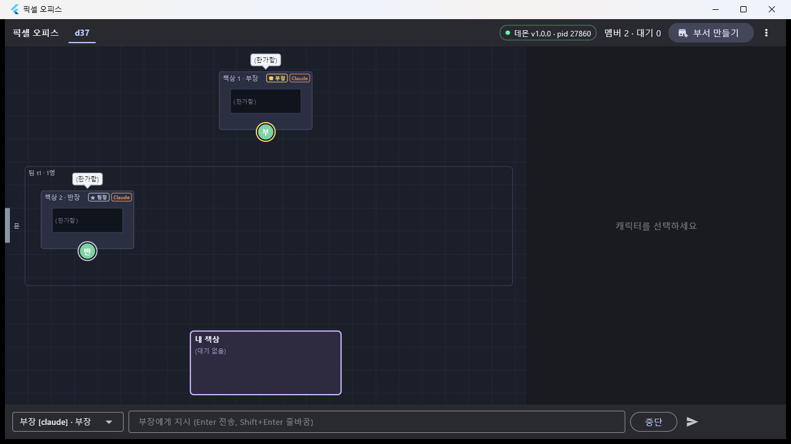
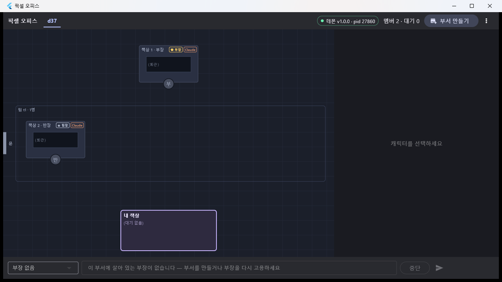

# T37 — 앱 트리 UI (직무 체계 rev 3)

- 날짜: 2026-09-16
- 마일스톤: M4b
- 관련 설계: 01-설계문서.md §"직무 체계 rev 3 (2026-09-16, D-32)" · 04-결정기록.md D-32 / D-33 / D-34 · dev/daemon/PROTOCOL.md
- 커밋: `<hash>` (완료 시)

## 목표

앱이 아직 2단(팀 = 탭, 팀장에게 지시)을 가정하고 있었다. 이 태스크가 끝나면 **화면이 트리를 그대로 보여 준다** —
상단 탭은 부서, 사용자가 만드는 것은 부서 하나(= 부장 임명)뿐이고, 사무실은 부장 책상이 맨 위·팀마다 클러스터로 나뉘며,
지시 바는 그 부서의 부장 하나로 고정된다. 내 책상에는 사용자 몫(허가 전부 + 부장 질문)만 오고, 상사에게 올라간
`ask_parent` 질문은 질문한 멤버가 **상사 책상 옆으로 걸어가** 표시된다. 덤으로 T29 결함 ③·④를 고친다.

## 한 것

### 1. 모델 (`lib/model/`)

- **신규 `department.dart`**: `Department{id, name, cwd, headId, createdAt}`.
- `member.dart`: `MemberRank` 를 `head|lead|member` 로 (레거시 `'leader'` → `lead` 로 읽는다). `label`(부장/팀장/팀원) ·
  `mark`(♛/★) · `talksToUser`(부장만) 추가. `Member` 에 `departmentId`, `parentId`, **nullable `teamId`**(부장은 팀 없음, D-33).
- `team.dart` `departmentId`, `task.dart` `teamId` → **`departmentId`**(옛 `teamId` 도 읽어 준다), `office_event.dart`
  `departmentId` + `detail.waiting`/`holder`/`isTeamTool`, `snapshot.dart` `departments[]`.
- `pending.dart`: `isAskParent` · `askParentTo/From` + **`goesToUser({rank})`** — "사용자 몫" 판정을 한 곳에 모았다.
  허가는 직급 무관 전부(D-32 3: 셸 허가는 보고 체계와 별개인 안전 문제), `ask_parent` 는 제외, `ask_user` 는 부장만,
  그 밖의 질문(TUI `AskUserQuestion`)은 **턴을 붙잡으므로** 직급과 무관하게 사용자에게 남긴다.

### 2. 상태 층 (`lib/state/office_state.dart`, `lib/topbar/selected_department.dart`)

- `OfficeState.departments` + 스냅샷 적용. `instruct` 의 로컬 task 가 `departmentId` 를 쓴다.
- 신규 프로바이더: `departmentsProvider`/`departmentProvider(id)`, `teamsOfDepartmentProvider(id)`,
  `membersOfDepartmentProvider(id)`, `liveHeadsProvider`/**`liveHeadProvider(departmentId)`**,
  `liveLeadsProvider`/`liveLeadProvider(teamId)`(T24 의 `liveLeader*` 대체), `childrenProvider(memberId)`,
  `parentProvider(memberId)`. 살아 있는 상급자 판정은 `_liveByKey` 하나로 모았다 — `headId`/`leaderId` 가 아니라
  **행의 rank + status**(데몬 `Store.liveHead`/`liveLead` 와 같은 규칙).
- `OfficeNotifier.createDepartment/deleteDepartment/queryEvents`. `createDepartment` 는 응답의 부서·부장을 **바로 상태에**
  넣어(스냅샷을 기다리지 않고) 탭·지시 대상이 즉시 잡히게 한다. `deleteDepartment` 는 그 부서의 팀·멤버 행도 로컬에서 지운다.
- `selected_team.dart` → **`selected_department.dart`**(`selectedDepartmentIdProvider` / `activeDepartmentIdProvider` /
  `sortedDepartments`). 탭 순서는 createdAt 순.

### 3. 상단 바 (`lib/topbar/top_bar.dart`)

- 탭 = 부서(툴팁에 cwd). "**부서 만들기**" 다이얼로그(부서 이름 · 작업 폴더 · 부장 이름 기본 `부장` · 부장 엔진)
  → `department.create` → 부서 탭 + 응답 `head` 선택.
- **출근 버튼 삭제**(`ClockInDialog` 통째로). 사용자가 팀·팀원을 만드는 길은 없다(D-32/D-34 — 콘솔 `force` 전용).
- 퇴근은 **비상용**: 확인 다이얼로그에 `clockOutEmergencyWarning`("비상용: 부장/팀장 퇴근 시 하위 전원이 정리됩니다").
- 부서 삭제는 탭 오른쪽 `⋮` 메뉴 → 확인 → `department.delete`.
- 선택 멤버 배지가 직급별(`RankBadge`: 부장 왕관 금색 / 팀장 별).

### 4. 지시 바 (`lib/command/command_bar.dart`)

대상이 **선택 부서의 살아 있는 부장 하나로 고정**된다(사무실에서 팀장·팀원을 골라도 그 멤버의 부서 부장으로). 드롭다운에는
부장만 들어가고, 없으면 "부장 없음" + 힌트 `commandBarNoHeadHint` 로 비활성. `-32004 부장에게만 지시할 수 있습니다 (head: …)`
가 오면 문구를 그대로 띄우고 `data.headId` 를 대상 override 로 삼는다(입력은 지우지 않는다). `force` 는 쓰지 않는다.

### 5. 사무실 캔버스 (`lib/office/`)

- **배치 계획**을 장면이 들고 다닌다: `OfficeScene.plan = OfficeDeskPlan{hasHead, clusters:[DeskCluster{teamId,title,deskCount}]}`.
  책상 번호 = 부장(0) → 팀 클러스터(팀장 먼저, 팀원 createdAt 순) → "미배정". `OfficeLayout` 이 그 계획으로 책상·클러스터
  상자를 계산한다(`clusters: List<ClusterBox>`). 계획 없이 `deskCount` 만 주면 **T12 평면 격자와 완전히 같은 좌표**라
  기존 테스트·미리보기가 그대로 산다.
- 페인터: 클러스터 상자 + 제목("팀 t1 · 3명"), 직급 배지 "♛ 부장"(금색 `headMark`) / "★ 팀장"(은색 `leadMark`)와 같은 색 캐릭터 링.
  빈 사무실 문구도 "부서 만들기로 부장을 임명하세요" 로.
- **결함 ③**: `running` 이벤트에 `detail.waiting` 이 있으면 `cmd` 가 아니라 `summary` 를 "⏳" 를 붙여 보여 준다 —
  "⏳ 셸 대기 중 (락: 작가)".
- **결함 ④**: `OfficeMotion.cancelsVisit` — 보고 방문을 끊는 새 이벤트에서 **`detail.tool` 이 `mcp__team__` 로 시작하는 것**을 뺐다
  (보고 직후의 `dismiss` 는 보고에 딸린 뒷정리다). idle/text 예외는 그대로.
- **`ask_parent` 방문**: 답을 기다리는 멤버는 내 책상 줄이 아니라 `layout.visitorSpot(상사 책상)` 으로 걸어가
  "❓ 상사에게 질문" 말풍선을 띄운다. 답이 오면 자기 자리로 돌아간다.
- **이벤트로 만든 pending 도 출처를 싣는다**: `asking` 이벤트에서 pending 을 합성할 때(스냅샷보다 이벤트가 먼저 오는 경로)
  `detail.tool` 로 `source: 'ask_user' | 'ask_parent'` 를 정하고 `ask_parent` 면 `from`/`to`(= `detail.to`)까지 넣는다.
  T35 실제 구현(`AskParentPayload`)과 모양을 맞춘 것 — 안 그러면 **`ask_parent` 가 사용자 질문으로 새어 내 책상에 선다.**

### 6. 내 책상 · 카드 · 패널 (`lib/panel/`)

- 내 책상 줄·목록·`PendingInbox` 가 `Pending.goesToUser(rank:)` 로 걸러진다. `ask_parent` 때문에 파생이
  `waiting_answer` 인 멤버는 줄에 서지 않는다.
- **`AskParentCard`**: 질문한 멤버의 패널에 "↑ 팀장/부장에게 질문 중 — <상사 이름(직급)> 에게: <질문>"(+보기) 안내 카드.
  "대신 답하기" 를 누르면 그 자리에서 평소 질문 카드가 열려 사용자가 `question.respond` 를 대신 보낼 수 있다(월권 탈출구).
- 패널 헤더에 `panelTreeLine` = `직급 · 상사: 이름(직급) · 직속 부하 N명`(부장의 상사는 "사용자"), 그 아래 `부서 · 팀 · cwd`.
  부장이 아니면 `panelNotInstructableHint`("지시는 부장에게 — … 터미널 직접 입력은 가능"). 탭 4종은 그대로.
- 지시문 탭에 **부장 템플릿**(`headInstructionTemplate`: create_team/delegate/reply/report/ask_user) 추가.

### 7. README

`dev/app/README.md` 의 "팀·팀장(T24/T24b)" 절을 "직무 체계 rev 3 — 부서·부장·팀(T37)" 으로 교체(트리 그림, 부서 탭·부장 고정
지시·클러스터 배치·내 책상 규칙·`ask_parent`·결함 ③④), 프로바이더 표·구조 트리·재접속 문단 갱신.

## 검증

```
$ flutter analyze
No issues found! (ran in 3.5s)

$ flutter test
00:12 +191 ~1: All tests passed!        (T37 이전 163 → 191, skip 1건은 기존)
```

새 테스트(28건): 모델(부서·직급 파싱·레거시 `leader`·트리 필드·`detail.waiting`·`goesToUser`),
상태(부서 스냅샷·`liveHead`/`liveLead`·children/parent·`department.create/delete`·`events.query{departmentId}`),
상단 바(부서 탭·부서 만들기 다이얼로그 → `department.create`·headName 생략·오류·부서 삭제·직급 배지·비상 퇴근 경고·출근 버튼 부재),
지시 바(부장 고정·드롭다운 부장 하나·부장 없음 비활성·-32004 복구),
사무실(클러스터 순서·부장 상단·클러스터 상자·미배정·축소·평면 격자 회귀·visitorSpot / 직급 배지·링 / 결함 ③ / 결함 ④ /
`ask_parent` 이동·줄 제외), 패널(`AskParentCard` 안내 + 대신 답하기 → `question.respond`, 트리 줄·지시 안내).

실기(데몬 pid 27860 = T34 그대로, 콘솔 + 릴리스 빌드):

```
po> dept create d37 D:\myproject\pixel-office\dev\spike-0\sandbox claude 부장
부서 생성: d_1c943873e32f  d37  …  head=m_fbd11c216fcf  팀 0개  멤버 1명
po> team create d37 t1 claude 반장      (디버그 경로 — 돌고 있는 데몬이 T34 빌드라 부장의 create_team 은 아직 없다)
팀 생성: t_3bb17e55a8bf  t1  lead=m_f661647d506f  members=1/4

$ flutter build windows --release && start pixel_office.exe
```



창 캡처(`img/T37-office.png`)에서 확인한 것: 상단 탭 `d37`, **부장 책상이 맨 윗줄 가운데**(♛ 부장 배지 + 금색 링),
그 아래 클러스터 "팀 t1 · 1명" 안에 팀장 책상(★ 팀장 배지 + 은색 링), 문·내 책상("(대기 없음)") 유지,
지시 바 대상이 `부장 [claude] · 부장` 으로 고정되고 힌트가 "부장에게 지시".

```
po> dept delete d37
#424 idle 반장 session ended → exited      (잎부터)
#426 idle 부장 session ended → exited
부서 삭제: d37
```



삭제 직후 캡처(`img/T37-empty.png`): 두 캐릭터가 회색 "(퇴근)" 이 되고 지시 바가 **"부장 없음" + 안내 문구**로 비활성.

## 발견한 함정

1. **다른 클라이언트가 지운 부서·팀·멤버 행이 앱에 남는다.** 콘솔에서 `dept delete` 를 하면 데몬은 `member.status{exited}`
   만 보내고 **행 삭제를 알리는 알림이 없다** — 앱에서는 부서 탭과 회색 책상이 그대로 남아 있다가 재접속(hello → 스냅샷 교체)
   때에야 사라진다(위 `T37-empty.png` 가 그 상태다). 앱에서 지운 경우는 `OfficeNotifier.deleteDepartment` 가 로컬을 정리해
   문제가 없다. 근본 해결은 데몬이 `department.delete`(와 `team.delete`) 뒤에 `snapshot` 알림을 한 번 밀어 주는 것 —
   **T38 후보**(dev/daemon 은 이 태스크 범위 밖이라 손대지 않았다).
2. **클러스터 제목과 첫 줄 말풍선이 겹친다.** 처음에 제목 줄 높이를 20px 로 잡았더니 실기에서 팀장 말풍선이 제목 위에
   올라앉았다(단위 테스트로는 안 보이는 종류). 제목 줄을 42px 로 넓혀 **제목 글자 + 말풍선 자리**를 함께 내게 했다.
   클러스터 상자 왼쪽도 문 라벨("문")을 가려 `max(doorWidth + 26, sideMargin - inset)` 로 물러나게 했다.
3. **`events.query{departmentId}` 를 멤버 로그 백필에 쓰면 옛 기록이 사라진다.** T34 마이그레이션 이전 이벤트 행은
   `department_id` 가 `''` 이라 부서로 거르면 통째로 빠진다. `queryEvents` 에 파라미터는 뒀지만 로그 탭은 보내지 않는다
   (README·코드 주석에 이유를 남겼다).
4. **`ask_user` 의 주인이 바뀌어 T19b 테스트가 깨졌다.** rev 3에서 `ask_user` 는 부장 전용이라, 팀원이 `ask_user` 로 줄에
   서던 기존 테스트는 이제 "서지 않는 것" 이 정답이다. 픽스처의 질문자를 부장으로 바꿔 회귀 의도(열린 질문이면 raw idle
   이어도 줄에 선다)는 그대로 지켰다.
5. **`OfficeScene` 을 손으로 만든 테스트가 배치 계획을 모른다.** `plan` 을 nullable 필드 + getter 로 두고 없으면
   `OfficeDeskPlan.flat(members.length)` 로 떨어뜨렸다 — 덕분에 T12/T16 테스트가 한 줄도 안 바뀌었다.

## 결정

- 새 결정 기록(D-##)은 없다. D-32/D-33/D-34 의 앱 쪽 구현이다.
- 다만 한 가지를 설계보다 넓게 잡았다: **TUI `AskUserQuestion`(payload 에 `tool_input` 이 있는 질문)은 직급과 무관하게
  내 책상에 세운다.** 03-작업계획의 문구는 "질문: `ask_user`(부장) only" 지만, TUI 질문은 CLI 턴을 붙잡고 있어 사용자가
  답하지 않으면 그 멤버가 영원히 멈춘다(상사에게 갈 길이 없다). `ask_user`·`ask_parent` 는 문구대로 걸렀다.

## 남은 것

- **T35 연동 확인**: `ask_parent` pending 이 실제로 오는 화면(안내 카드 · 상사 책상 옆 이동)은 아직 **가짜 pending 으로만**
  검증했다. payload/이벤트 모양은 T35의 `AskParentPayload`(`{source,question,options,from,to}`)와
  `asking{tool:'ask_parent', to, toName}` 에 맞춰 두었지만, T35 데몬으로 다시 띄워 실기로 한 번 봐야 한다.
  부장의 `create_team` 으로 만든 팀이 클러스터로 뜨는 것도 같이 확인할 것(이번 실기는 콘솔 `force` 경로로 팀을 만들었다).
- 위 함정 ①(부서 삭제 후 다른 클라이언트의 stale 행) → 데몬이 스냅샷을 밀어 주도록 T38에서 처리.
- 팀 클러스터가 5개 이상이면 세로 축소만으로 버틴다 — 스크롤·접기는 M6 사무실 배치 확정 때.
- 오른쪽 패널의 직급 줄·안내는 넣었지만, 팀장/팀원 패널을 "읽기 전용 관전" 으로 더 눌러 주는 것(로그·보고서 강조)은 안 했다.
