# T39 — v1b 시연 (직무 체계 rev 3 트리)

- 날짜: 2026-09-16
- 마일스톤: M4b (완료 판정 — 실기 Codex 부분은 9/21 이월)
- 관련 설계: 01-설계문서.md §"직무 체계 rev 3 (2026-09-16, D-32)" · 04-결정기록.md D-32 / D-33 / D-34 / D-35 / D-36 / D-37 / **D-38(이번)** ·
  worklog T35(직급별 도구) · T36(후처리·복구) · T37(앱 트리 UI) · T38(콘솔·스냅샷 푸시) · T29·T19b(시연 조작 방법)
- 커밋: (상위에서 — 이 태스크는 커밋하지 않았다)

## 목표

데몬 + Flutter 앱을 실제로 띄워 **직무 체계 rev 3 의 규칙 전부**를 창 캡처와 이벤트 로그로 통과시킨다 —
부서 만들기(부장 임명) → 부장의 팀 생성·팀장 배치 → 팀장의 팀원 고용·위임 → 보고가 팀원→팀장→부장→내 책상으로 올라오기 →
`ask_parent`/`ask_user` 3단 질문·답 왕복 → 상위 퇴근 시 하위 트리 정리 → 강제 종료 뒤 트리 순서 복구 → 셸 뮤텍스.
이것이 끝나면 M4b 가 닫힌다.

## 한 것

### 1. 시연 (부서 `v3`, cwd = `dev/spike-0/sandbox`, 엔진 claude)

앱 다이얼로그 · 콘솔 · 앱 카드를 섞어 7개 시나리오를 돌렸다. 전 과정 로그·타이밍·캡처는 아래 "검증".

### 2. 데몬 결함 1건 수정 — **pending FK 가 `members_v1` 을 가리켜 허가·질문이 통째로 죽어 있었다** (D-38)

시연 2 에서 팀원 둘이 `Write` 허가에서 **카드도 없이** 멈췄다. 파고드니 T34(v1→v2) 마이그레이션이 남긴 스키마 상처였다.

- **증상**: `pending` INSERT 가 전부 `no such table: main.members_v1` 로 실패.
  → 어댑터는 `req.hold()` **뒤에** `store.createPending()` 을 부르므로, 던진 예외를 `handleHook` 이 잡아 `req.respond(PASS_THROUGH)`
  를 해도 이미 `state==='held'` 라 **응답이 나가지 않는다**(HookReceiver 계약). hook 프로세스가 영영 매달리고 CLI 는 자기 TUI
  프롬프트를 띄운 채 멈춘다. 데몬 로그에만 한 줄 남았다:
  `[daemon:error] hook PermissionRequest handler failed for m_0004d07c96bb: no such table: main.members_v1`.
  같은 이유로 `ask_parent`/`ask_user` 도 `ask_parent 실패: no such table: main.members_v1` 로 거절됐다(#503).
- **원인**: `V1_RENAME_SQL` 의 `ALTER TABLE members RENAME TO members_v1` 이 **다른 테이블의 `REFERENCES` 절까지 고쳐 쓴다.**
  `teams`/`members`/`tasks` 는 SCHEMA_SQL 로 새로 만들어져 멀쩡했지만 `pending` 은 `CREATE TABLE IF NOT EXISTS` 라 v1 행이
  그대로 남았고 참조만 `members_v1` 로 바뀐 뒤 그 테이블이 drop 됐다.
  `PRAGMA foreign_keys = OFF` 로는 막지 못했다(`migrate()` 주석의 가정이 틀렸다 — 그건 `legacy_alter_table` 의 몫이다).
  **새 DB 에서는 절대 안 나고 마이그레이션을 거친 개발 DB 하나에서만 난다** — 그래서 T35·T36 의 단위 테스트(`:memory:`)를
  전부 통과했다.
- **고친 것(최소)**:
  - `src/store/schema.ts` — `PENDING_FK_REPAIR_SQL` 추가(행을 살린 채 테이블만 갈아 끼우고 인덱스를 다시 만든다).
  - `src/store/Store.ts` — `migrate()` 끝에 `repairPendingFk()`. `sqlite_master` 의 `pending` 정의에 `members_v1` 이 보이면
    FK 를 끈 트랜잭션에서 교체하고 `[store] pending.member_id FK 복구: members_v1 → members (T39)` 를 찍는다. 멱등.
  - `test/store/Migration.test.ts` — 회귀 2건: "마이그레이션 뒤에도 pending 을 새로 만들 수 있다(FK 가 members 를 가리킨다)"
    (approval·question 둘 다 INSERT, 옛 행 `a_1` 보존, 인덱스 재생성까지 단언) · "복구된 DB 를 다시 열어도 그대로 동작한다(멱등)".
- 앱 코드는 **손대지 않았다**(`dev/app/**` 변경 0).

## 검증

### 환경

```
데몬   dev/daemon, npx tsx src/index.ts
       시작 시 pid 28024(T38 빌드) → 시나리오 5 에서 taskkill /F → 수정 코드로 재기동 pid 29384 (ws 7420 / hook 7421 / mcp 7422)
앱     dev/app, flutter build windows --release → build\windows\x64\runner\Release\pixel_office.exe (1280x720)
콘솔   npx tsx src/cli/index.ts --exec "..."
캡처   dev/app/tool/capture-window.ps1(창 단위) + 스크래치패드 burst 루프(0.35~0.5초) → docs/worklog/img/T39-*.png 17장
관측   스크래치패드 peek.mjs (node:sqlite 읽기 전용으로 events/pending/tasks 를 직접 덤프) + 데몬 stdout
부서   v3 (d_fe7c6b7c9f0c), cwd = D:\myproject\pixel-office\dev\spike-0\sandbox, 부장 이름 "부장"(다이얼로그 기본값)
```

### 시나리오 1 — 부서 만들기(앱 다이얼로그) → 부장 임명

상단 **부서 만들기** → 이름 `v3` · 작업 폴더 sandbox · 부장 이름 빈칸(기본 `부장`) · 엔진 claude.

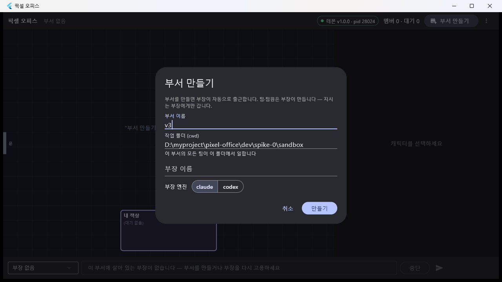

```
22:54:13.8  [만들기] 클릭 → department.create
22:54:14    문 옆에서 "(출근 중)" 말풍선으로 책상 1 을 향해 걷는다
22:54:17    책상 1 착석, 파생 free → "(한가함)"
```

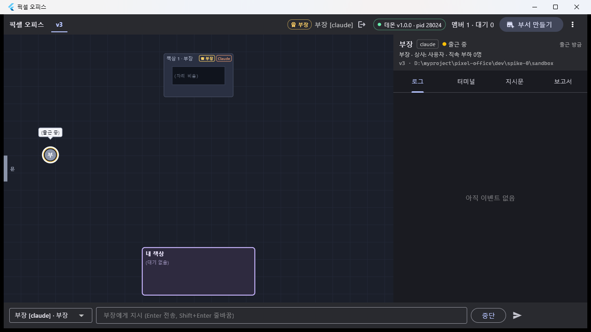 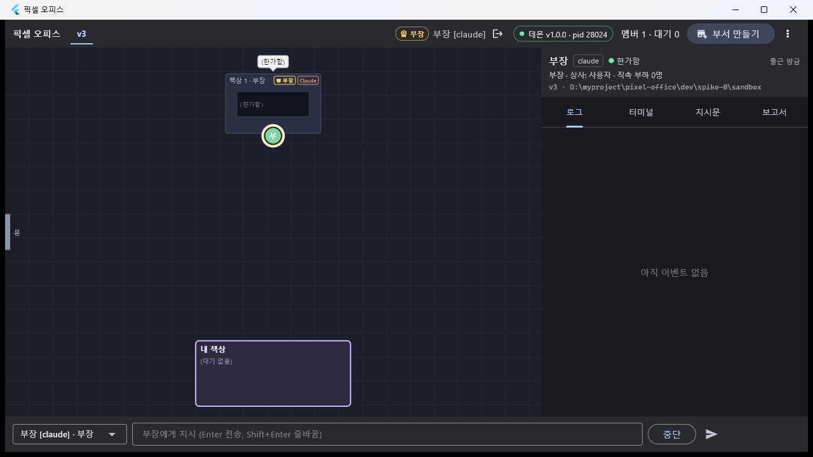

캡처에서 확인: 상단 탭 `v3`, **♛ 부장 배지 + 금색 링**, 책상 1 이 맨 윗줄 가운데, 패널 머리 `부장 · 상사: 사용자 · 직속 부하 0명`,
지시 바가 `부장 [claude] · 부장` 으로 고정(`부장에게 지시`). 콘솔 `tree`:

```
v3 (d_fe7c6b7c9f0c)  D:\myproject\pixel-office\dev\spike-0\sandbox
  └ 부장 부장 [claude] free (m_0004d07c96bb)
     ├ (팀 없음)
```

### 시나리오 2 — 부장 지시 → 팀 생성 → 팀원 고용·위임 → 보고 상향

지시는 콘솔로(한글은 Flutter 창에 넣을 수 없다 — 함정 4). `say 부장 team MCP로 팀 '개발'을 만들고(팀장 이름 '팀장A'), …`

| 시각 | 이벤트 | 내용 |
|---|---|---|
| 22:55:04 | task#3 | `[TASK#3 from user]` |
| 22:55:06 | #437 running | `ToolSearch` (도구 이름 줄 → 지연 로딩 MCP 도구, D-22/T25) |
| 22:55:08 | #438 running | `mcp__team__create_team` → 팀 `개발` + 팀장A 자동 출근 |
| 22:55:12 | #440 delegating | task#4 부장→팀장A |
| 22:55:13 | #441 thinking | 팀장A `[TASK#4 from 부장(부장)]` ← **직급이 봉투에 실린다** |
| 22:55:17·18 | #445·#446 | `mcp__team__hire` ×2 → 팀원1·팀원2 |
| 22:55:22·23 | #448·#451 | `delegate` ×2 → task#5·task#6 (팀원1 → demo39-a.txt, 팀원2 → demo39-b.txt) |
| 22:55:25·26 | #453·#456 editing | 두 팀원 `Write` → **여기서 멈췄다(함정 1 = 결함 A)** |
| 22:59:35~38 | — | 콘솔 `type 팀원1 1` / `type 팀원2 1` 로 CLI TUI 프롬프트에 직접 답해 통과(D-11 폴백) |
| 22:59:42·44 | #462·#464 reporting | 팀원1·팀원2 `report(status=done)` → 팀장A |
| 22:59:44 | #467 thinking | 팀장A `[REPORTS task#5 팀원1 status=done] …` (버퍼 flush) |
| 22:59:47 | #470·#471 reading | 팀장A 가 두 파일을 직접 열어 교차 확인 |
| 22:59:49~52 | #472·#474 | `mcp__team__dismiss` ×2 → 팀원 퇴장 |
| 22:59:52 | #477 reporting | 팀장A → 부장 `report(task#4, done)` |
| 22:59:53 | #478 thinking | 부장 `[REPORTS task#4 팀장A status=done]` |
| 23:00:01 | #483 reporting | **부장 → 사용자** `report(task#3, done)` → 내 책상 |

지시→부장 보고 **4분 57초**. 그중 결함 A 로 멈춰 있던 시간이 4분 9초이므로 **실제 모델 왕복은 48초**(4단 트리 6명).

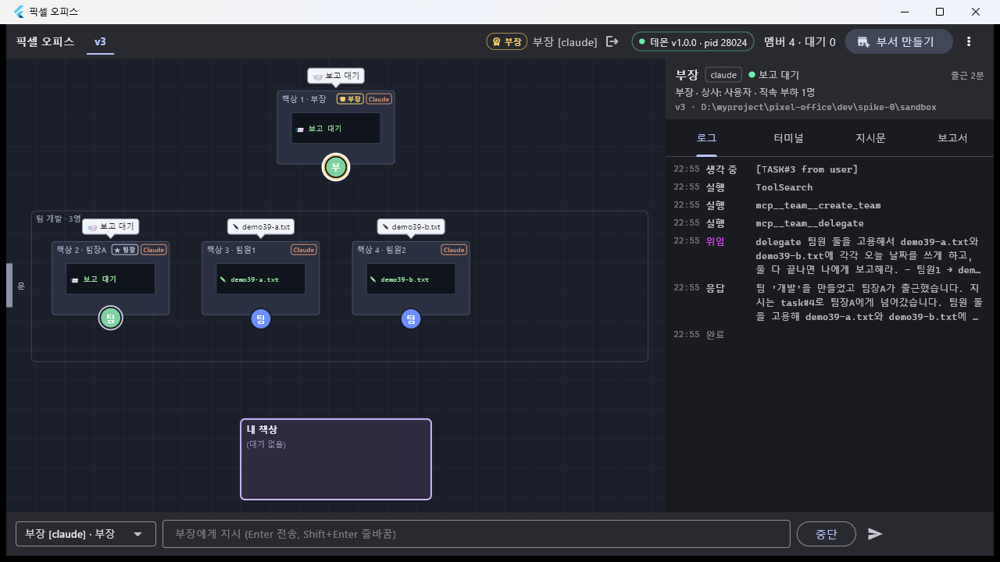
책상 1 부장 `📨 보고 대기`(파생 `waiting_reports`), 클러스터 `팀 개발 · 3명` 안에 ★ 팀장A(보고 대기) + 팀원1 `✎ demo39-a.txt` ·
팀원2 `✎ demo39-b.txt`.

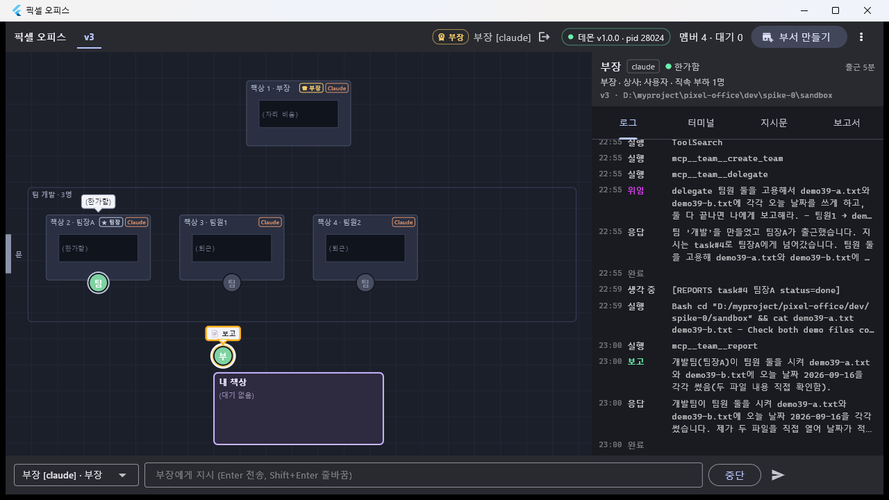 — `📋 보고` 말풍선(T29 결함 ④ 수정 뒤 방문이 취소되지 않는다).
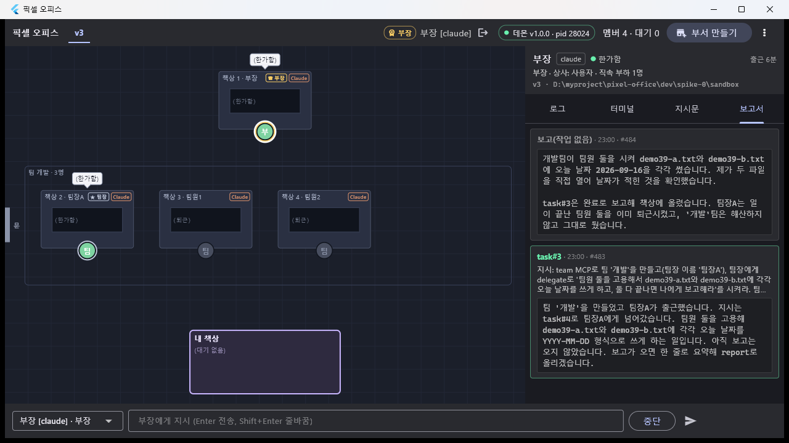 — `task#3 · 23:00 · #483` 카드(지시문 + 취합 보고).

파일도 실제로 생겼다: `dev/spike-0/sandbox/demo39-a.txt` = `demo39-b.txt` = `2026-09-16`. task 표:

```
task#3 user→부장   reported done
task#4 부장→팀장A  reported done
task#5 팀장A→팀원1 reported done
task#6 팀장A→팀원2 reported done
```

### 시나리오 3 — `ask_parent` → `ask_parent` → `ask_user` → 답이 내려간다

(첫 시도는 결함 A 로 `ask_parent 실패: no such table: main.members_v1` — 팀원3 `blocked` 보고 #503, 팀장A `blocked` 보고 #508.
데몬을 고쳐 재기동한 **뒤** 다시 돌린 것이 아래다. 재시도는 부장이 스스로 판단해 task#11 로 걸었다 — 함정 7.)

| 시각 | 이벤트 | 내용 |
|---|---|---|
| 23:06:58 | #533·#534 asking | 팀원3 `ask_parent` 「파일 인코딩은 UTF-8 인가 EUC-KR 인가?」 |
| 23:07:01 | #541 thinking | 팀장A `[QUESTION from 팀원3 q#q_cefd71a33b6e] … (옵션: UTF-8 / EUC-KR)` |
| 23:07:04 | #543 asking | 팀장A `ask_parent` → 부장 ("제가 정할 수 없는 문제라 올립니다") |
| 23:07:06 | #546 thinking | 부장 `[QUESTION from 팀장A q#q_8104ca18737f]` |
| 23:07:12 | #551 asking | 부장 `ask_user` → **내 책상** |
| 23:07:40 | #554 thinking | 앱 카드에서 `UTF-8` 클릭 → 부장 `[ANSWER q#q_7b23bd548d86] UTF-8` |
| 23:07:43 | #555·#556 | 부장 `reply` → 팀장A `[ANSWER q#q_8104ca18737f] 사용자 답: UTF-8` |
| 23:07:46 | #559·#560 | 팀장A `reply` → 팀원3 `[ANSWER q#q_cefd71a33b6e] UTF-8. (부장 경유 사용자 답)` |
| 23:07:48 | #562 reporting | 팀원3 `report(task#12, done)` = `UTF-8. (부장 경유 사용자 답)` |
| 23:07:59 | #575 thinking | 팀장A `[REPORTS task#12 팀원3 status=done] … **[ALL_REPORTS_IN]**` |

질문이 3단을 **올라가는 데 14초**, 내 답이 **내려가는 데 6초**. 아무도 중간에서 자기가 답해 버리지 않았다.
부장은 task#7 을 이렇게 닫았다(#574):
`질문 경로 작동 확인: 팀원3 ask_parent → 팀장A ask_parent → 부장 ask_user → 사용자 답 UTF-8 → 부장이 팀장A에게 reply → 팀장A가 팀원3에게 reply로 전달함.`

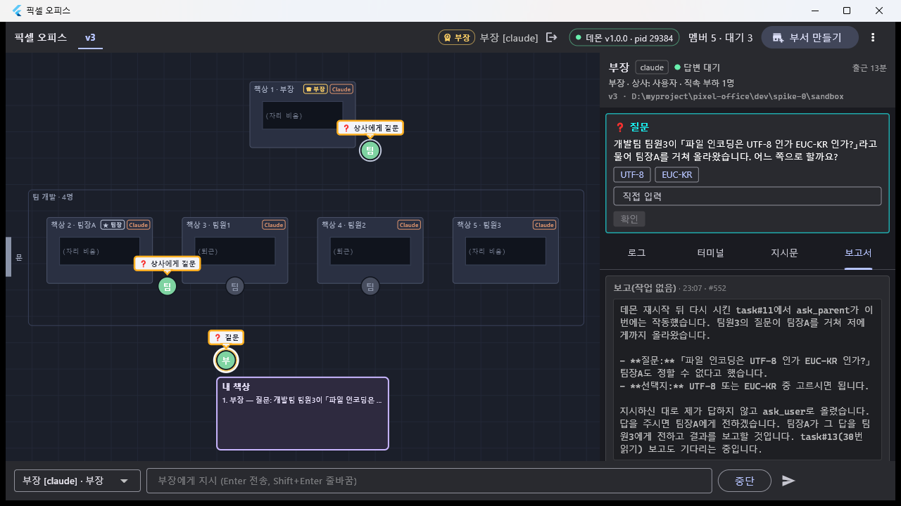
한 장에 전부 들어왔다 — 팀원3 이 **팀장A 책상 옆**에 `❓ 상사에게 질문`, 팀장A 가 **부장 책상 옆**에 `❓ 상사에게 질문`,
부장이 **내 책상 앞**에 `❓ 질문`, 내 책상 줄 `1. 부장 — 질문: 개발팀 팀원3이「파일 인코딩은 …`, 오른쪽에 `UTF-8 / EUC-KR` 카드,
상단 `대기 3`. (T37 이 가짜 pending 으로만 검증했던 `ask_parent` 이동·카드가 실기로 확인됐다 — T37 "남은 것" 하나 닫힘.)

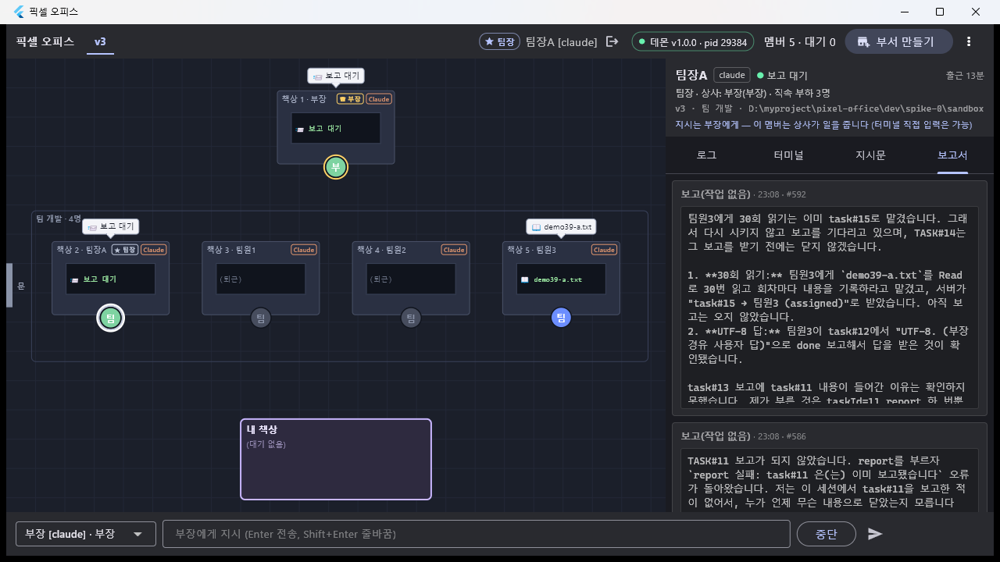
팀장A 를 고르면 패널이 `팀장 · 상사: 부장(부장) · 직속 부하 3명` + `지시는 부장에게 — 이 멤버는 상사가 일을 줍니다
(터미널 직접 입력은 가능)` 이고, 지시 바는 **여전히 부장 고정**이다.

### 시나리오 4 — 상위 퇴근 = 하위 트리 정리 (잎부터)

팀원3 이 task#15(demo39-a.txt 30회 읽기)를 도는 중에 앱에서 팀장A 선택 → 상단 퇴근 아이콘 → 확인.

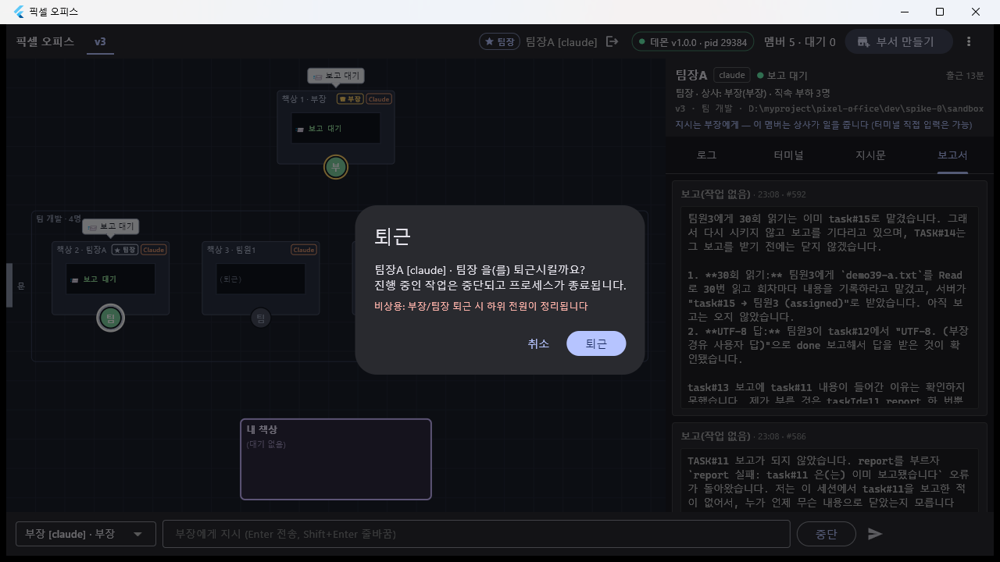 — "비상용: 부장/팀장 퇴근 시 하위 전원이 정리됩니다".

```
23:09:01.8  [퇴근] 클릭 (member.clockOut)
23:09:02  #609 idle 팀원3  task#15 aborted (상위 정리)      ← 잎부터
23:09:02  #610 idle 팀원3  clocked out (상위 정리)
23:09:03  #611 idle 팀원3  session ended: prompt_input_exit
23:09:03  #612 idle 팀장A  session ended: prompt_input_exit  ← 팀장은 마지막
23:09:03  #613 thinking 부장 [REPORTS task#14 팀장A status=aborted] ⏎ 팀장A 의 작업이 중단됐습니다 (퇴근).
23:09:04  #614 idle 팀장A  clocked out
[office] 팀원3 후처리(상위 정리): task 1건 중단
[office] 팀장A 후처리(퇴근): task 2건 중단, 하위 1명 정리
```

**사라지는 상위에게는 보고가 되돌아가지 않는다**(팀원3 의 aborted 는 팀장A 에게 가지 않았다). 반대로 **살아 있는 부장**은
자기가 발행한 task#14 의 aborted 를 즉시 받았다(버퍼를 타지 않는다) — T36 `SETTLE_MATRIX` 의 `parentGone` 규칙 그대로.
전체 3초.

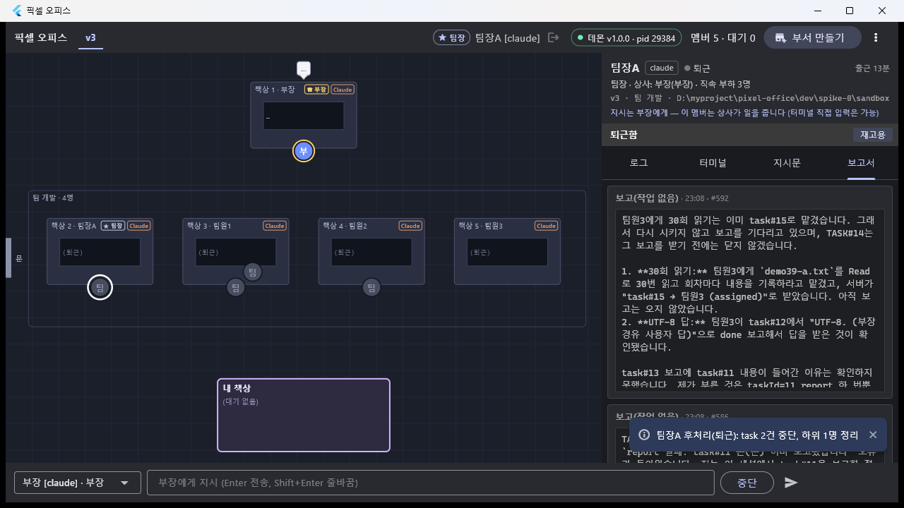 — 토스트 `팀장A 후처리(퇴근): task 2건 중단, 하위 1명 정리`, 클러스터 책상이 전부 `(퇴근)`,
팀원3 이 문 쪽으로 걸어 나가는 중, 팀장A 패널은 `퇴근함` + `재고용`. (팀 행은 지우지 않았으므로 **클러스터 상자는 남는다** —
클러스터가 없어지는 것은 팀 삭제·부서 삭제 때다. 함정 6.)

### 시나리오 5 — 강제 종료 → 트리 순서 복구

```
23:06:19  taskkill /F /PID 28024
```
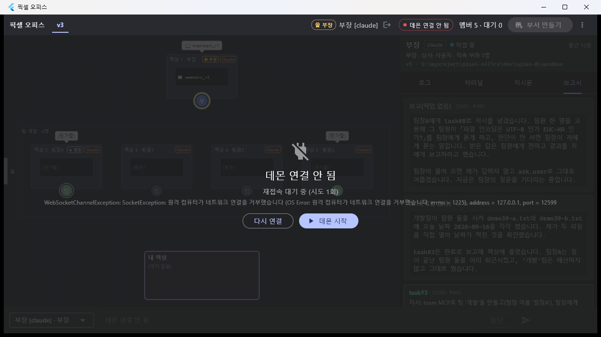 — 회색 사무실 + `데몬 연결 안 됨 · 재접속 대기 중 (시도 1회)` + `다시 연결` / `데몬 시작`.

```
$ cd dev/daemon && npx tsx src/index.ts            # 수정 코드
[store] pending.member_id FK 복구: members_v1 → members (T39)     ← 결함 A 자가 복구
[office] recover 부장(m_0004d07c96bb):  --resume 96f1c807-…, assigned 1, requeued 1, expired 0
[office] recover 팀장A(m_4ac5e2a3c589): --resume 91a0726a-…, assigned 0, requeued 0, expired 0
[office] recover 팀원3(m_20fca38863f5): --resume 5e2952f0-…, assigned 0, requeued 0, expired 0
[office] 복구: 3명 재개, 0건 만료
[daemon] pixel-office daemon v1.0.0 pid=29384
```

복구 순서가 **부장 → 팀장 → 팀원**(T36). 이어서 세 명 모두 `resumed` → `[RESUMED]` 가 들어갔고, 봉투에 **맡긴 일과 직속 부하**가 실렸다:

```
#516 부장   [RESUMED] … 진행 중이던 작업: task#7: … 직속 부하: 팀장A(팀장). 마지막 확인된 행동: …
#517 팀장A  [RESUMED] … 진행 중이던 작업: 없음. 직속 부하: 팀원3(팀원). …
#518 팀원3  [RESUMED] … 진행 중이던 작업: 없음. …
```

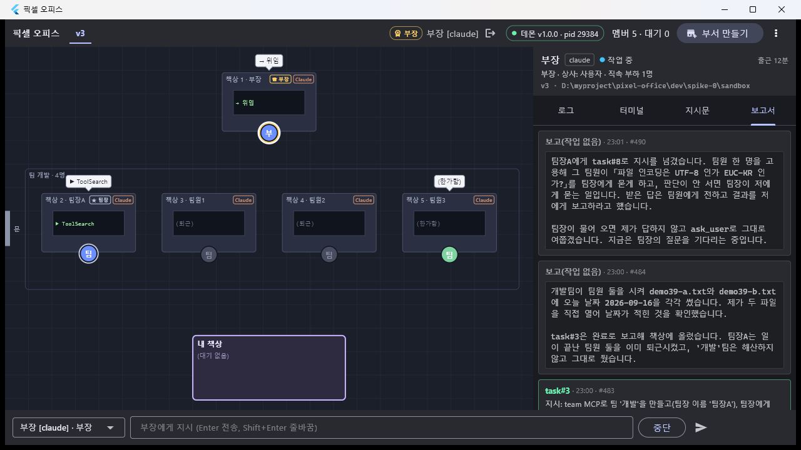 — 새 pid 29384 를 물고 트리(부장 + 클러스터 4명)가 그대로. 부장은 requeue 된 task#10 을 이어서 `→ 위임`.
유령 프로세스 없음(복구가 `child_pid` 를 reap 한다, D-17).

### 시나리오 6 — 셸 뮤텍스 + 허가 카드

부장에게 "새 팀 `셸`(팀장B) 을 만들고 팀원 둘에게 PowerShell 쓰기를 **연달아** 위임하라".

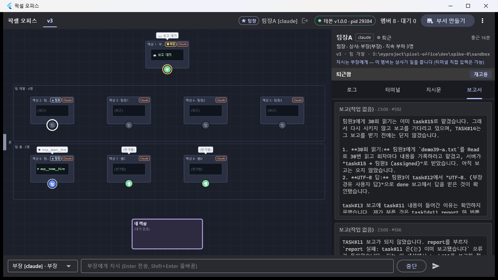 — `팀 개발 · 4명`(전원 퇴근) 아래 `팀 셸 · 3명`(팀장B + 셸C + 셸D). 멤버 8.

```
23:11:49  #638 running        셸C  PowerShell (…Set-Content … demo39-c.txt)      ← 락 획득
23:11:49  #639 waiting_approval 셸C                                              ← 락을 쥔 채 허가 대기
23:11:50  #642 running        셸D  PowerShell (…demo39-d.txt)
23:11:50  #643 running        셸D  {"summary":"셸 대기 중 (락: 셸C)","waiting":"shell-lock","holder":"m_17d24a745866","cmd":"…"}
23:12:29  앱 카드 [허가]       셸C  → 실행 → PostToolUse → 락 해제
23:12:32  #644 waiting_approval 셸D                                              ← 42초 만에 자기 차례
23:12:47  콘솔 allow a_ec2ebd76be3f
23:12:54  #652 reporting      셸D  task#19 done
```

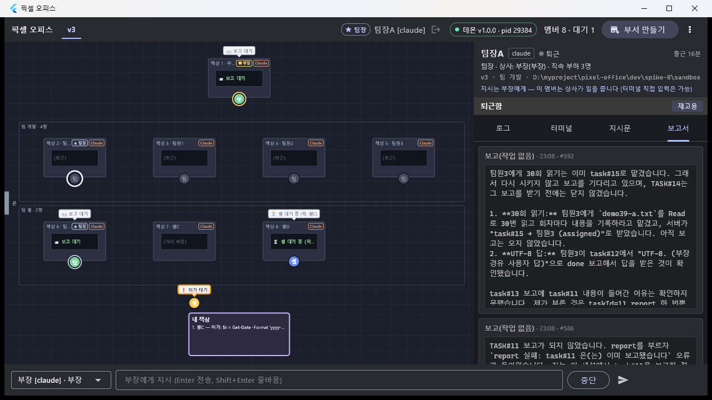
**T29 결함 ③ 이 고쳐진 것을 실기로 확인**했다 — 셸D 의 말풍선과 책상 모니터가 명령어가 아니라 `⏳ 셸 대기 중 (락: 셸C)` 를 보여 준다
(T37 수정). 같은 화면에서 셸C 는 내 책상 앞 `❗ 허가 대기`, 내 책상 줄 `1. 셸C — 허가: $t = Get-Date -Format 'yyyy-…`, 상단 `대기 1`.

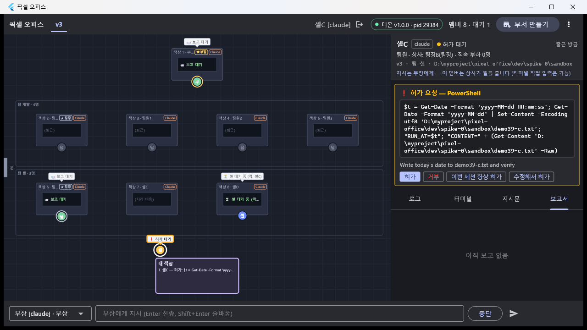 — `❗ 허가 요청 — PowerShell` + 명령 전문 + `허가 / 거부 / 이번 세션 항상 허가 / 수정해서 허가`,
패널 머리 `팀원 · 상사: 팀장B(팀장) · 직속 부하 0명`. **허가는 직급과 무관하게 전부 사용자에게 온다**(D-32 3).

### 시나리오 7 — 결함 A 재확인(Write 허가) · 정리

고친 뒤 시나리오 2 에서 죽었던 그 경로를 그대로 다시 밟았다.

```
23:13:40  #673 thinking  부장 [TASK#20 from user] 네가 직접 Write 도구로 … demo39-e.txt …
23:13:45  #675 waiting_approval 부장 Write      ← 예전에는 여기서 카드 없이 영영 멈췄다
          po> pending → a_2b7999106995  approval  부장  Write D:\…\demo39-e.txt
          po> allow a_2b7999106995
23:14:10  #676 text 부장 "… demo39-e.txt를 만들고 `ok` 한 줄만 썼습니다"      → 파일 확인: ok
```

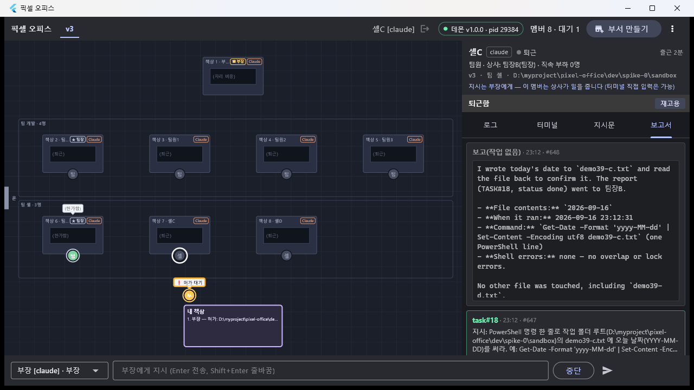

정리:

```
23:14:27  po> dept delete v3
#679 idle 팀장B session ended: prompt_input_exit   ← 잎부터(살아 있던 팀장B 먼저)
#680 idle 팀장B clocked out
#681 idle 부장  session ended: prompt_input_exit   ← 부장 마지막
#682 idle 부장  clocked out
부서 삭제: v3        (23:14:31, 4초)
po> tree     → (부서 없음)
po> tasks    → (아는 task 없음 — 스냅샷 기준)
```

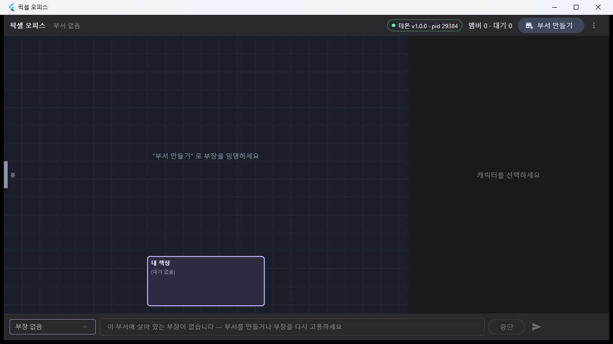 — **앱을 재접속하지 않았는데** 부서 탭·책상 8개·클러스터 2개가 한 번에 사라지고 `멤버 0 · 대기 0`.
T38 의 스냅샷 푸시가 앱에서 눈으로 확인된 것(T38 "남은 것" 하나 닫힘).

```
$ Stop-Process -Name pixel_office -Force        → 앱 종료
claude.exe: 삭제 전 16 → 후 14 (14개는 시연과 무관한 사용자 세션) — 유령 없음
데몬은 켜 둔 채로 끝낸다 — 시연용 pid 29384 는 로그를 받으려고 셸에 붙여 띄운 것이라 `shutdown` 하고
**떼어 놓은 프로세스로 다시 띄웠다(pid 22524, 같은 코드·같은 포트)**. `tree` → (부서 없음).
```

### 테스트

```
$ cd dev/daemon && npx tsc --noEmit
TYPECHECK OK            (출력 없음)

$ npx tsx --test "test/**/*.test.ts"
ℹ tests 481
ℹ suites 66
ℹ pass 474
ℹ fail 0
ℹ skipped 7             (T38 479 → 481, 새 회귀 2건)

$ npx tsx --test "test/store/Migration.test.ts"
✔ T39: 마이그레이션 뒤에도 pending 을 새로 만들 수 있다 (FK 가 members 를 가리킨다)
✔ T39: 복구된 DB 를 다시 열어도 그대로 동작한다(멱등)
ℹ pass 6  fail 0
```

앱은 코드를 안 고쳐 스위트를 다시 돌리지 않았다(T38 기준 `flutter test` 192건 그대로).

### rev 3 규칙 ↔ 증거

| # | 규칙 | 증거 | 결과 |
|---|---|---|---|
| 1 | **부서 = 프로젝트(cwd), 사용자는 부장만 임명** | 앱 "부서 만들기" 다이얼로그 → `department.create` → 문 입장 → 책상 1 ♛, 지시 바 부장 고정. 출근 버튼 없음 | ✅    |
| 2 | **지시는 부장에게만** | 지시 바 대상이 부장 하나로 고정, 팀장 선택 시 `지시는 부장에게 —` 안내(콘솔에서 팀장에게 `say` 하면 -32004, T38 실기) | ✅  |
| 3 | **부장 → 팀 생성·팀장 배치** | #438 `create_team` → 팀 `개발` + 팀장A 자동 출근 → 클러스터 표시. 시나리오 6 에서 두 번째 팀 `셸` | ✅   |
| 4 | **팀장 → 팀원 고용·위임** | #445·#446 `hire` ×2, #448·#451 `delegate` → `[TASK#n from 팀장A(팀장)]` | ✅ |
| 5 | **보고 상향 팀원→팀장→부장→내 책상** | #462·#464 → #467 `[REPORTS …]` → #477 → #478 → #483, 보고 방문 + 보고서 탭 | ✅   |
| 5-1 | 보고 버퍼링 `[ALL_REPORTS_IN]` · 파생 `waiting_reports` | #575 `[REPORTS task#12 …][ALL_REPORTS_IN]`, 부장·팀장 말풍선 `📨 보고 대기` | ✅  |
| 6 | **`ask_parent` → `ask_parent` → `ask_user`**, 답은 `reply` 로 내려간다 | #534 → #541 → #543 → #546 → #551 → 앱 카드 `UTF-8` → #555/#556 → #559/#560 → #562. 상사 책상 옆 이동 | ✅  |
| 7 | **상위 퇴근 = 하위 트리 정리(잎부터), 사라진 상위에는 보고 안 감** | #609·#610(팀원3 aborted·clocked out, "상위 정리") → #611 → #612, 부장만 `[REPORTS task#14 … aborted]` 수신 | ✅   |
| 8 | **강제 종료 → 트리 순서 복구** | `taskkill /F` → 재기동 로그 `recover 부장 → 팀장A → 팀원3`, `[RESUMED]` 에 맡긴 일·직속 부하, 앱 자동 재접속 | ✅   |
| 9 | **셸 뮤텍스(부서 범위) + 화면 표시** | #643 `{waiting:'shell-lock', holder:셸C}` → 42초 뒤 #644, 말풍선·모니터 `⏳ 셸 대기 중 (락: 셸C)` (T29 결함 ③ 해소 확인) | ✅  |
| 10 | **허가는 직급 무관 전부 사용자** | 셸C(팀원)·팀장B(팀장)·부장(부장) 세 직급의 허가가 전부 내 책상 카드로. 앱 카드 2건 + 콘솔 `allow` 3건 | ✅   |
| 11 | 부서 삭제 = 잎부터 + 스냅샷 푸시 | #679~#682, 앱이 재접속 없이 비워짐 | ✅  |
| — | Codex 엔진으로 같은 표 | **미실시** — ChatGPT 사용량 한도(D-23, 리셋 9/21) | ⏭ T23 §"9/21 이후 확인 목록" |

## 발견한 함정

1. **(치명, 고침) 마이그레이션이 `pending` 의 FK 를 `members_v1` 로 바꿔 놓아 허가·질문이 전부 죽어 있었다.**
   위 "한 것 2" + D-38. 재현 조건은 **v1 DB 를 마이그레이션한 파일 DB**(개발 DB 하나). 증상이 고약한 이유는 세 겹이다 —
   ① 단위 테스트는 `:memory:` 라 절대 안 걸린다, ② 데몬 stdout 한 줄 말고는 아무 데도 안 남는다(이벤트도 pending 행도 없다),
   ③ **hook 이 `hold()` 뒤에 던지면 `respond()` 가 먹지 않아** CLI 가 제 TUI 프롬프트를 띄운 채 영원히 선다 — 화면만 보면
   "우리 카드가 안 뜬다" 가 아니라 "CLI 가 그냥 물어본다" 로 보인다.
   → **관측 개선 후보(T30)**: `handleHook` 의 catch 가 이미 hold 된 요청이면 `handle.resolve(PASS_THROUGH)` 까지 해 주고,
   `handler-error` 를 `daemon.notice{error}` 로 클라이언트에도 올릴 것. 이번엔 시연 범위를 지키려고 근본 원인만 고쳤다.
2. **읽기 전용 셸은 허가를 안 탄다**(T19 함정 5 재확인). 부장의 `cat demo39-a.txt demo39-b.txt` 는 `running` 만 찍고 지나갔다.
   허가 흐름을 보이려면 쓰기 명령(`Set-Content`)이나 `Write` 를 써야 한다.
3. **콘솔 클라이언트는 데몬이 죽으면 재접속을 무한 폭주한다.** 시연 내내 붙여 둔 관전용 REPL 이 데몬 강제 종료 뒤 5분 남짓
   재시도하는 사이 `TIME_WAIT` 이 16,000개까지 쌓여 **새 연결이 `EADDRINUSE 127.0.0.1:7420`**(에페메럴 포트 고갈)로 실패했다.
   그 프로세스를 죽이니 곧 정상. → CLI 재접속에 백오프 상한/횟수 제한이 필요하다(T30 후보).
4. **Flutter 창 입력은 IME 상태를 탄다.** T29 함정 7("한글은 못 넣는다")에 더해, **ASCII 도 한글 입력 모드면 자모로 들어간다**
   (`v3` → `ㅍ3`). `keybd_event(VK_HANGUL=0x15)` 로 영문 모드로 돌린 뒤에야 경로 문자열이 제대로 들어갔다. 또 필드 비우기는
   `Ctrl+A`+`Del` 이 안 먹고 `{END}{BS 120}` 로 지워야 했다. 클릭 좌표는 이번엔 캡처 좌표 그대로 맞았다(T29 의 +13px 은 불필요,
   창이 1280x720 고정이고 다이얼로그가 창 크기를 바꾸지 않았다).
5. **`--exec` 한 줄에 긴 한글 지시를 넣는 것은 잘 된다**(bash 큰따옴표). 다만 `--exec` 는 첫 실패에서 멈추므로(T38 함정 4)
   기대된 실패는 따로 실행해야 한다.
6. **팀원이 다 퇴근해도 팀 클러스터 상자는 남는다.** 팀 행이 살아 있으니 설계대로지만, "상위 퇴근 → 클러스터가 사라진다" 를
   기대하고 보면 어긋난다. 클러스터가 없어지는 것은 `dismiss_team`·`dept delete` 때다.
7. **모델이 스스로 재시도·조사한다.** 부장은 `ask_parent` 실패 보고를 받고 `Grep members_v1` 로 원인을 찾아보려 했고(#512),
   데몬 재시작 뒤에는 **시키지 않았는데** task#8 을 task#11 로 다시 걸었다(#524). 시연에서는 편했지만, 실패를 재현하려면
   부장에게 "다시 시도하지 마라" 를 미리 박아 둬야 한다.
8. **팀장이 부하 보고를 기다리지 않고 상위 task 를 닫는 일이 있다.** 팀장A 가 팀원3 의 확인 보고 전에 task#11 을 `done` 으로
   닫아 부장이 "확인이 안 왔다" 고 적었다(#579). 데몬은 규칙대로 받아 줬다(발행자만 닫을 수 있고, 닫는 시점은 모델 판단).
   지시문 템플릿에 "부하 보고를 다 받은 뒤 보고" 를 더 강하게 쓸지는 M5 에서.
9. **`type <member> 1` 은 여전히 유효한 비상구다**(T19 와 같다). 카드가 안 뜨는 상황에서 CLI TUI 프롬프트에 직접 답해
   시연을 이어 갈 수 있었다.

## 결정

- **D-38** (04-결정기록.md) — v1→v2 마이그레이션이 남긴 `pending` FK 상처를 **스키마 버전을 올리지 않고 열 때마다 자가 복구**한다.
- 그 밖에 새 설계 결정은 없다. D-32~D-37 의 마감 시연이다.

## 남은 것

> **Codex rev 3 한 바퀴는 2026-09-21 에 돌렸다 — `T42-CodexLive.md`.** 부장을 codex 로 임명해
> `create_team`/`delegate`/`report`/`ask_user`/`ask_parent` 가 모두 같은 봉투로 도는 것을 확인했고,
> 혼합 팀(부장 codex → 팀장 codex/claude → 팀원 claude/codex)도 4단 보고까지 통과했다.

- **Codex 엔진으로 rev 3 한 바퀴** — 2026-09-21 이후(D-23 한도). 항목은 `docs/worklog/T23-MixedTeam.md` §"9/21 이후 확인 목록 A~J"
  에 합쳐 두었고, 여기서 더할 것은 **부서의 부장을 codex 로 임명 → `create_team`/`delegate`/`report`/`ask_parent` 4종이
  Codex 어댑터에서도 같은 봉투로 도는지**(T22 폴백 포함) 하나다.
- **T30(안정화) 후보 2건이 이번에 늘었다**: ① hook 이 `hold()` 뒤 예외를 던졌을 때의 구제(함정 1), ② CLI 재접속 백오프(함정 3).
- 성공 기준 9~10(세션 오류 → error 포즈 → 재고용)은 T31 그대로.
- 앱 클러스터 스크롤·접기(5개 이상), 팀장/팀원 패널의 "읽기 전용 관전" 강조는 M6 (T37 "남은 것" 그대로).
