# T40 — 레이아웃 v2 구현 (T40a 캔버스 · T40b 패널 · T40c 접점·실기)

- 날짜: 2026-09-17
- 마일스톤: M6
- 관련 설계: `docs/design/레이아웃-v2.md`(§3 패스 1~7 · §6 T40-1~6) · 04-결정기록 **D-42 / D-43**
- 반쪽 worklog: **[T40a — 사무실 캔버스](T40a-Canvas.md)**(T40-1·2·3·6) · **[T40b — 오른쪽 패널·크롬](T40b-Panel.md)**(T40-4·5)
- 커밋: `98f0955` `7cad447` `a55a807` `ded002b` `76fa17e`(T40a) · `3fbcafb` `d3a3b67` `f1fab1d`(T40b) ·
  `dc526e4` `cfa6cac`(머지) · `ed52628`(T40c-1 접점) · `cf91cd5`(T40c-2 실기 결함) · 이 문서(T40c-3)

## 목표

T32 리뷰(D-42·D-43)가 종이 위에서 확정한 레이아웃 v2 를 **움직이는 앱**으로 만든다. 끝나면
① 사무실이 팀 수에 따라 세로로 스크롤되고 내 책상·범례는 바닥에 고정, ② 팀마다 색 카펫·부장은 금색 카펫+왕관,
③ 상태 13종이 **범례 7칸 한 매핑**으로 링·범례·패널 상태 점에 같은 색으로 나오고, ④ 허가·질문이 선택 멤버와
무관하게 **전역 인박스** 한 곳에 모이며, ⑤ 허가 카드가 "생각 없이 누를 수 있는" 요약 줄 + 주 버튼 둘이 되고,
⑥ 보고서가 카드 스택이 아니라 문서로 읽히고, ⑦ 창 크기 1100~1920 에서 규칙대로 배율이 움직인다.

작업은 **파일을 갈라 병렬로** 했다 — T40a 는 `lib/office/**` 만, T40b 는 `lib/panel/**`·`lib/topbar/**`·
`lib/command/**`·`main.dart` 만. 겹치는 파일이 0 이라 머지 충돌 없이 붙었고, 남은 **접점 3개**(콜백 2개 + 범례
사본 1개)를 T40c 가 잇고 실기로 확인했다.

## 한 것

### T40a — 사무실 캔버스 (T40-1·2·3·6) → [T40a-Canvas.md](T40a-Canvas.md)

좌표계를 **콘텐츠(스크롤) / 뷰포트(고정)** 둘로 가르고, 배율 곡선(폭 <900 선형 하한 0.6 · 900~1440 평평 ·
1440~2080 → 1.5 상한)·5열·클러스터 폭 `min(인원, 열 수)` 왼쪽 정렬·나란히 배치, 카펫 6색 토큰과 제목 태그,
부장 금색 카펫+왕관, 책상 라벨 글자 빼기 순서, 모니터 2줄, **`LegendSlot` 7칸 + `legendSlotOf` 단일 매핑**,
내 책상 슬롯 4칸 + "+N", `visitorSpot(desk, k)`, 빈 상태 3종·출근 1.2초·복구 점선 3초·퇴근 10분 접기,
T33 이 꽂을 `spriteScale`/`spriteCell` 훅. 테스트 +80(193 → 273).

### T40b — 오른쪽 패널 · 상단 바 · 지시 바 (T40-4·5) → [T40b-Panel.md](T40b-Panel.md)

전역 인박스(`inbox.dart` 신규: 사용자 몫 pending + 만료 흔적을 오래된 순, 카드 2장 + "+N", `Alt+Y/N`,
`inboxFocusProvider`), 허가 카드 재설계(`approval_summary.dart` 순수 함수 + `_CardFrame`: 요약 줄·위험 틴트·
3줄 클램프·주 버튼 2·만료 메타), 보고서 문서 흐름 + 미확인 배지, 패널 폭 420~720·터미널 660·`Ctrl+T` 오버레이,
데몬 pill 3상태 + 끊김 오버레이("자세히" 접힘), 폴더 부서 탭·"보고 N", 정적 칩 `♛ 부장에게`, 단축키·포커스 링·
스크롤바. 테스트 +67(193 → 260).

### T40c — 접점 · 실기 · 문서 (이 태스크)

**1. 접점 배선(`ed52628`)**

- `main.dart` 가 `OfficeView` 에 `onSelectPending`(→ `selectPendingFromOffice`)과
  `onCreateDepartment`(→ 상단 바와 **같은** `showCreateDepartmentDialog`)를 넘긴다. `TODO(T40a 병합)` 두 자리 삭제.
- **범례 매핑 일원화.** `office_scene.dart` 에 `legendSlotFor({status, derived, eventKind, askingParent,
  shellWaiting, queued})` 를 만들고 `legendSlotOf(SceneMember)` 는 그 껍데기로. `panel/labels.dart` 의 사본
  `LegendCategory`/`legendCategory` 를 **지웠다** — 패널 헤더 상태 점 · 인박스 헤더 · 보고서 배지 · 데몬 pill 이
  전부 `legendSlotFor` + `legendColor` 를 import 한다. `test/panel/legend_test.dart` 재작성.
- **슬롯 번호 = 카드 번호로 맞췄다(버그 수정).** 전에는 `queue`(사용자 몫 pending 목록)와 `queued`(줄 선 멤버
  순번)를 **따로 압축**해서, 한 멤버가 카드 2장을 들면 옆 사람 슬롯을 눌렀을 때 **남의 카드가 열렸다**.
  이제 멤버는 `queue` 에서 자기 **첫 카드** 자리에 서고, 카드 없이 상태만 waiting 인 멤버는 카드 뒤에 선다.
- `test/app_shell_test.dart`(신규 2건) — `OfficeShell` 을 통째로 세워 접점 2개를 회귀로 고정.
- `rpc_client_test` 의 타이밍 민감한 두 자리를 결정적으로: 브로드캐스트 `stateStream` 을 `firstWhere` 로 기다리다
  **구독 전에 붙으면 영영 못 보는** 자리를 폴링(`waitFor`)으로 바꾸고, 닫힌 포트 재시도 대기를 15 → 30초.

**2. 실기에서 찾아 고친 결함 2건(`cf91cd5`)** — 아래 "검증 · 실기" 참조.

## 검증

### 단위·위젯 테스트

```
$ flutter analyze
No issues found! (ran in 3.7s)

$ flutter test
00:17 +344 ~1: All tests passed!
```

| 시점 | 건수 |
|---|---|
| T40 착수 전 | 193 (+1 skip) |
| T40a·T40b 머지 직후 | 340 |
| T40c 접점(`app_shell_test` 2 · `office_mydesk_test` 슬롯/카드 1) | 343 |
| T40c 실기 결함(`shortcuts_test` 포커스 1) | **344** (+1 skip) |

머지 직후 `rpc_client_test` 의 "데몬이 없으면 실패 횟수를 세며 재시도…" 근처가 **한 번 깜빡였다**. 원인 둘 중
하나는 고쳤고(스트림 구독 경합 → 폴링), 닫힌 loopback 포트 재시도는 여유를 두 배로 늘렸다.
`panel_width_test` 의 "터미널 크기가 바뀌면 `member.resize`" 는 **전체 suite 4판 중 1판꼴**로 깜빡인다
(단독 실행 `flutter test test/panel/panel_width_test.dart` 는 언제나 통과). 진짜 WebSocket 가짜 데몬 위에서
같은 트리를 폭만 바꿔 다시 띄우는 테스트라, 새 폭에서 `member.resize` 가 아예 안 나가는 경합이 있는 것으로 보인다
— `pumpUntil` 상한(20초)을 올려서 될 문제가 아니다. 이번 태스크 범위 밖이라 **기록만** 한다(아래 "남은 것").

### 실기 (데몬 pid 26364 재사용 · 릴리스 창)

```
데몬   이미 떠 있던 T30 데몬 pid 26364(ws 7420 / hook 7421 / mcp 7422)를 그대로 썼다 — D-40 단일 데몬 가드.
앱     flutter build windows --release → build\windows\x64\runner\Release\pixel_office.exe
콘솔   dev/daemon, npx tsx src/cli/index.ts --exec "..."
캡처   dev/app/tool/capture-window.ps1(창 단위) → docs/worklog/img/T40-*.png 16장
부서   t40 (d_f470ee813c5c), cwd = dev/spike-0/sandbox, 엔진 claude, 부장 1 · 팀 demo(팀장 + 팀원 3)
정리   dept delete t40 → 부서 0 · pending 0, 데몬은 켜 둔 채 앱만 종료
```

시나리오: 앱 다이얼로그로 부서 만들기 → 부장 출근 → (콘솔) 부장 지시 → `create_team` → 팀장이 팀원 2 고용 →
두 팀원이 `Write` 로 파일 생성(허가 2건) → 부장 `ask_user`(질문 카드) → 팀원1 `ask_parent`(인코딩) →
셸 검증 명령 허가 → 보고 상향(팀원→팀장→부장→내 책상) → 팀원 퇴근 → 팀장이 부장에게 `ask_parent`(옵션 2개).

| # | 캡처 | 확인한 것 |
|---|---|---|
| 1 | `T40-1-empty-office.png` | 부서 0: 가운데 큰 **부서 만들기** + 한 줄, 빈 슬롯 4칸 점선, 범례 7칸, pill 초록 `데몬 v1.0.0 · pid 26364` |
| 2 | `T40-2-create-dialog.png` | 캔버스 버튼이 **상단 바와 같은** 다이얼로그를 연다(T40c 접점 2) |
| 3 | `T40-3-head-walkin.png` | 출근 걷기 중 — 모니터·말풍선 `(출근 중)` + 노란 링, 부장 금색 카펫 + 왕관, 폴더 부서 탭, 점선 팀 자리 + 문구, 지시 바 placeholder 예시 |
| 4 | `T40-4-head-only.png` | 착석 → `(한가함)` 초록 링, 패널 헤더 상태 점 초록 |
| 5 | `T40-5-clusters-inbox.png` | 팀 카펫(초록) + 제목 태그 `팀 demo · 3명`, 부장 `(자리 비움)`, 슬롯 2칸 사용, 인박스에 질문 카드 + 허가 카드 |
| 6 | `T40-6-inbox-plusN.png` | 사용자 몫 3건 → 카드 **2장 + `+1 팀원1` 접힌 줄**(스크롤해야 보인다 — 아래 편차 ②) |
| 7 | `T40-7-approval-card.png` | 허가 카드가 맨 위일 때 `Alt+Y 허가 · Alt+N 거부` 힌트, 만료 메타 `요청 3분 전 · 내일 13:00 만료` |
| 8 | `T40-8-approval-shell.png` | 셸 카드: 요약 줄 + CLI `description` 둘째 줄 + 고정폭 명령 + 보조 버튼 둘(`이번 세션 항상 허가`·`수정해서 허가`) |
| 9 | `T40-9-exited-desks.png` | 퇴근 = 회색 책상 + 의자만(캐릭터 원 없음), 보고서 탭 **미확인 배지 2** + 상단 바 `보고 2` |
| 10 | `T40-10-report-tab.png` | 보고서 문서 흐름 — 날짜 구분선 `2026-09-17`, 헤더 줄 `보고 · 부장 · 13:08 · task#36 · done`, 테두리 카드 없음, 배지는 열자마자 지워짐 |
| 11 | `T40-11-terminal-660.png` | 터미널 탭 → 패널 **660 자동**, 사무실 620(scale 0.69)로 줄며 **엔진 배지 사라지고 직급은 ★ 아이콘만** (글자 빼기 순서) |
| 12 | `T40-12-terminal-overlay.png` | `Ctrl+T` 전체 폭 터미널 오버레이 `터미널 · 부장` + `Esc 닫기` (**고친 뒤** 동작) |
| 13 | `T40-13-wide-1920.png` | 1920×1080: 사무실 1440 → scale 1.0, 배지 전부 복귀, 4열, 바닥 바 고정 |
| 14 | `T40-14-min-1100.png` | 최소 1100×640: 사무실 620 → scale 0.69, 범례·슬롯·지시 바 다 들어감 |
| 15 | `T40-15-askparent-visitor.png` | `ask_parent` 방문 — 팀장이 **부장 책상 옆**에 서서 `❓ 상사에게 질문`(노란 링), 클러스터 제목에 **`퇴근 3` 배지**(10분 접기) |
| 16 | `T40-16-askparent-card.png` | 팀장을 골라도 인박스(부장 허가)는 그대로, 그 아래 `↑ 팀장/부장에게 질문 중` 안내 카드 — `PendingCards(memberId)` 의 새 뜻 |

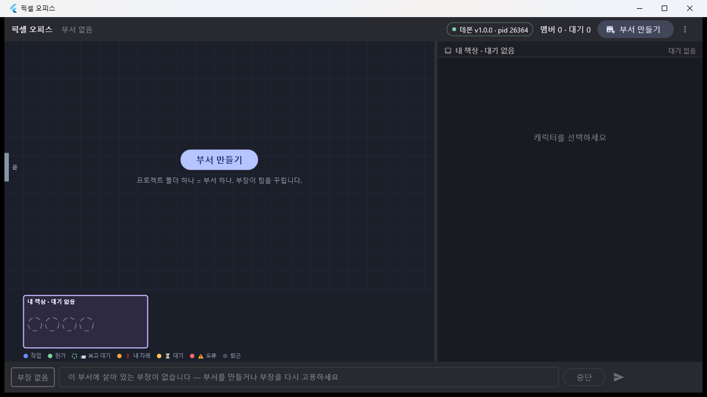 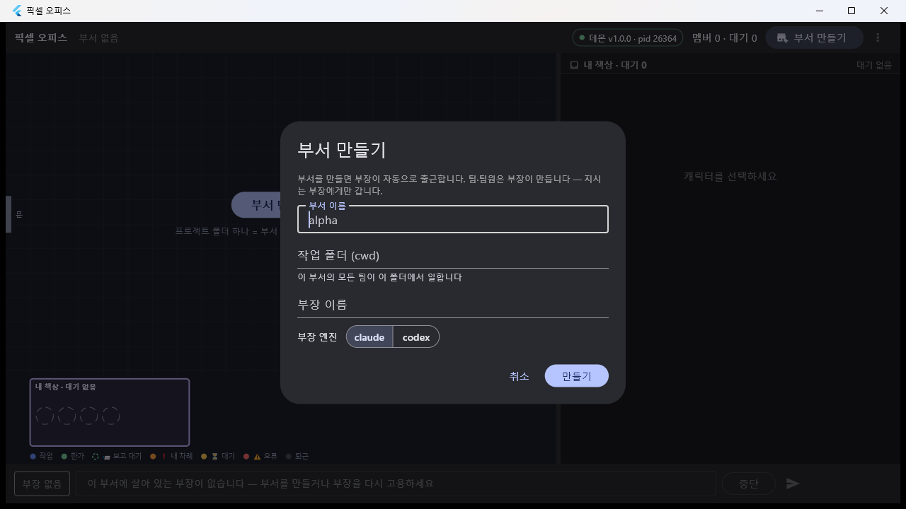

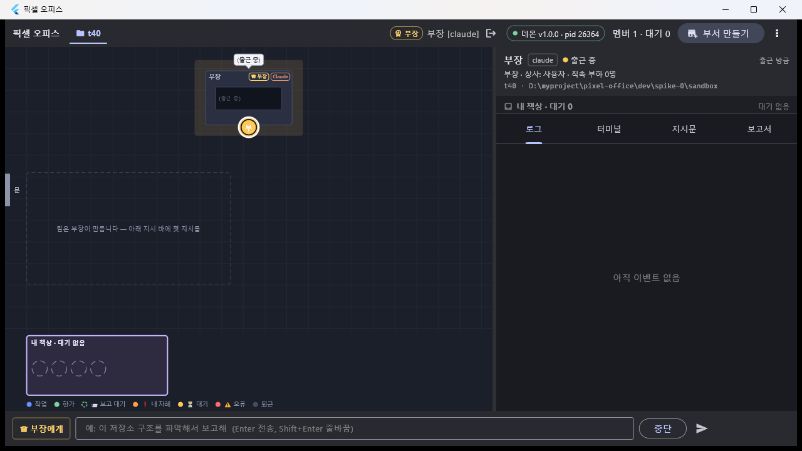 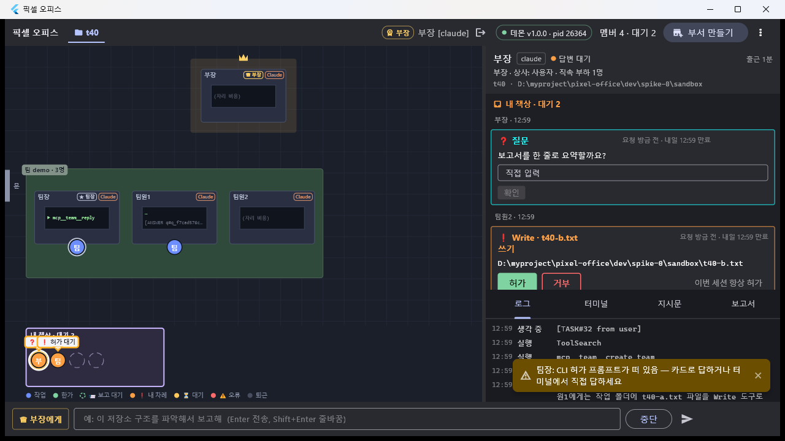

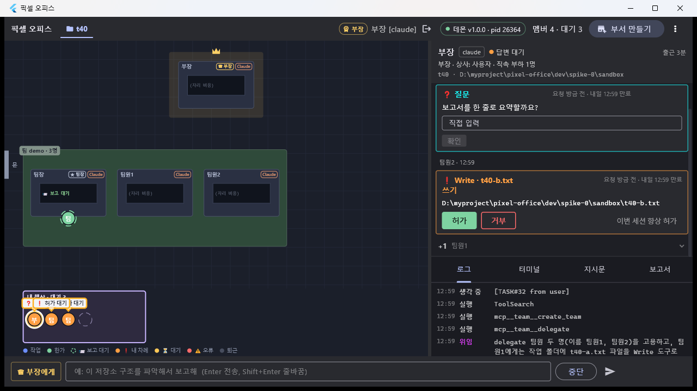 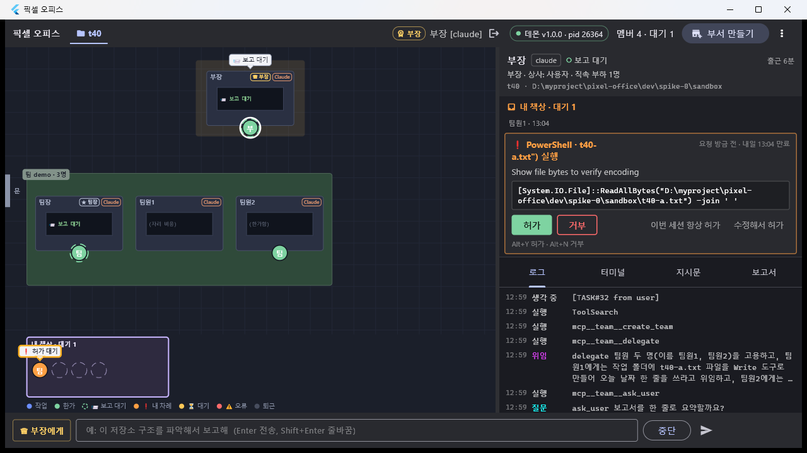

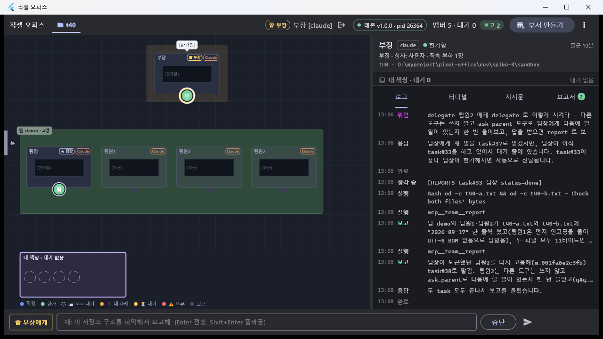 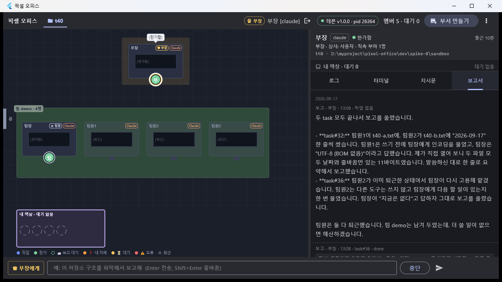

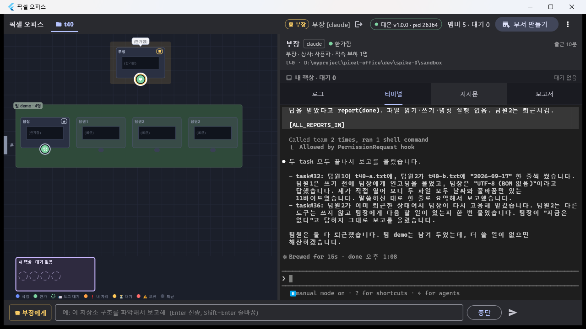 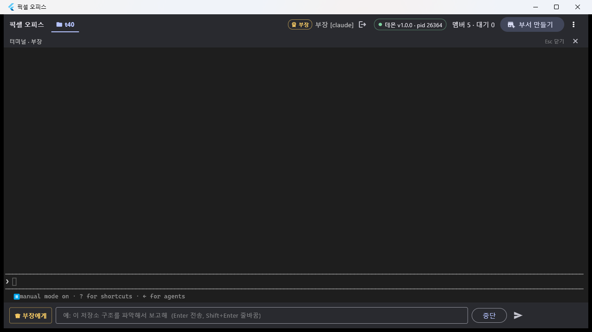

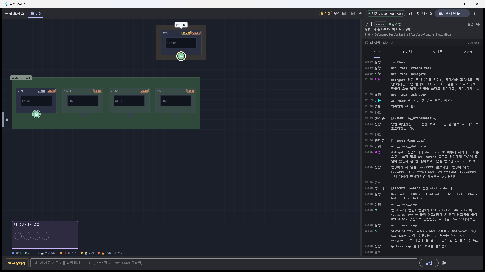 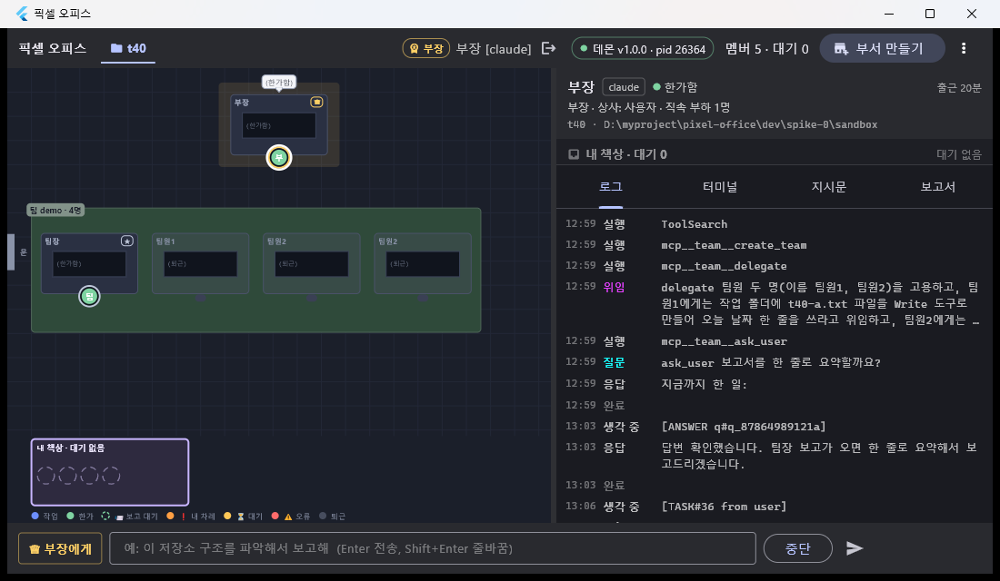

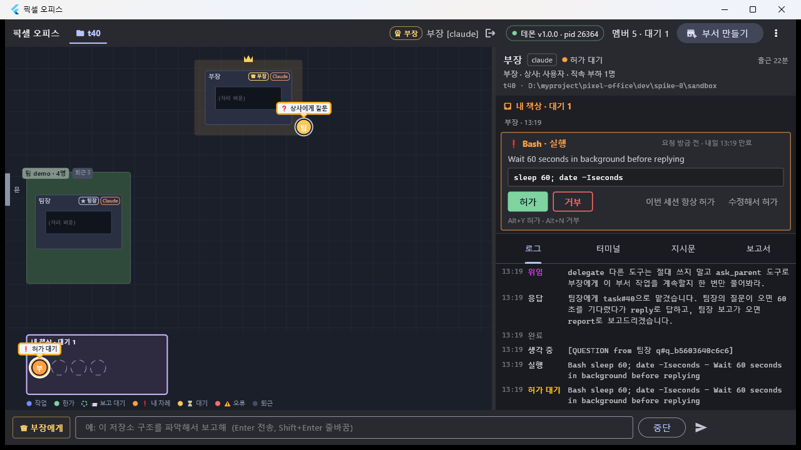 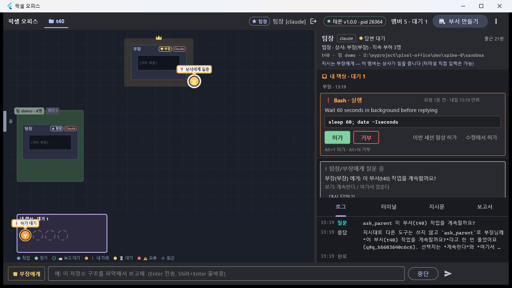

동작으로 확인한 것(캡처 외): 카드 **허가** 버튼 클릭 · **Alt+Y** 허가 · **Alt+N** 거부 · 질문 카드 자유 입력 +
`확인` · 슬롯 클릭 → 멤버 선택 + 인박스 스크롤 · 터미널 660 ↔ 480 왕복 · `dept delete` 정리.

### 실기에서 찾아 고친 결함 2건

1. **전역 단축키가 실제 앱에서 하나도 듣지 않았다(치명).** `Ctrl+K/L/T/I/R`·`Esc` 전부. `AppShortcuts` 가 자식을
   `Focus(autofocus: true)` 로만 감쌌기 때문에, **터미널 탭에 포커스가 갔다가 다른 탭으로 가면** 터미널
   FocusNode 가 dispose 되고 포커스가 `CallbackShortcuts` **보다 위**(라우트 스코프)로 올라가 그 뒤로 키가
   영영 오지 않는다. 위젯 테스트는 시작 직후만 봐서 못 잡았다.
   → `FocusScope` + FocusManager 리스너: 포커스가 **우리 스코프의 조상으로 떠오르면**(= 아무도 안 들고 있다)
   다음 프레임에 도로 가져온다. 다른 라우트(다이얼로그)가 들고 있으면 건드리지 않는다. 재빌드 후 실기에서
   `Ctrl+T` 오버레이·`Ctrl+R` 보고서 탭 동작 확인. 회귀 테스트 1건 추가(고치기 전 빨강 확인).
2. **내 책상 헤더가 한 화면에서 두 말을 했다** — 캔버스 `내 책상 · 대기 없음` vs 패널 `내 책상 · 대기 0`.
   `myDeskHeaderLabel(int)` 하나로 합쳤다(캔버스·패널 공용).

## 발견한 함정

1. **`SendKeys("%y")` 는 Flutter 창에 닿지 않는다.** WScript.Shell 의 SendKeys 로 보낸 `Alt+Y` 는 아무 일도
   안 했지만, **`keybd_event` 로 직접** 누르면(VK_MENU 누른 채 VK_Y down/up) 그대로 들어간다. 단축키를 실기로
   확인할 때는 SendKeys 로 "안 되네" 판정하면 안 된다. (텍스트 타이핑은 SendKeys 로 잘 된다.)
2. **VK_HANGUL 은 "영문으로" 가 아니라 토글이다**(T39 함정 4 의 정정). 무조건 한 번 누르면 **영문이던 입력기를
   한글로** 바꿔 버린다(`t40` → `ㅅ40`). 상태를 모르면 한 번 넣고 캡처로 확인하는 수밖에 없다.
3. **PowerShell 변수는 대소문자를 안 가린다.** 창 조작 스크립트에서 `$h = $proc.MainWindowHandle` 이
   `-H`(높이) 파라미터를 덮어써서, `MoveWindow` 가 창 높이에 **핸들 값**을 넣고 있었다(폭만 먹히고 높이는
   1100 에 붙박이). 핸들은 `$hw` 처럼 겹치지 않는 이름으로.
4. **창을 화면보다 넓게 만들 수 없다.** `MoveWindow`/`SetWindowPos` 로 2200·2320 을 줘도 1940 에서 잘린다
   (작업 영역 추적 한도). 1920 화면에서는 사무실 폭이 최대 ≈1520 이라 **5열(≥1600)은 실기로 볼 수 없다** —
   레이아웃 단위 테스트(`office_layout_test`)의 폭 2080 케이스가 그 자리를 대신한다.
5. **읽기 전용 셸은 여전히 허가를 안 탄다**(T39 함정 2 재확인). 모델이 스스로 `Write` → `od -c` 검증으로
   넘어가면서 셸 허가가 따라 나왔다 — 허가 카드 실기는 **쓰기 도구**로 유도하는 편이 확실하다.
6. **`say` 는 부장에게만 간다**(D-32). 팀원에게 `ask_parent` 를 시키려면 부장→팀장→팀원으로 **지시를 실어
   내려보내야** 한다. 시연 대본을 짤 때 한 번에 되는 줄 알고 `say 팀원2 …` 를 쓰면 `-32004` 로 막힌다.
7. **캡처 좌표로 클릭할 때 카드가 움직인다.** 인박스는 위 카드가 사라지면 아래 카드가 올라오므로, 캡처 →
   클릭 사이에 상태가 바뀌면 **다른 버튼을 누른다.** 맨 위 카드는 `Alt+Y`/`Alt+N` 이 훨씬 안전하다.
8. **위젯 테스트가 통과해도 포커스 경로는 다르다.** 결함 ①이 전형 — 테스트는 `pumpWidget` 직후(autofocus 가
   막 잡은 상태)만 보고, 실제 앱은 사용자가 여기저기 클릭한 뒤의 포커스 상태로 산다. 키보드 기능은
   **"포커스를 한 번 잃은 뒤"** 를 테스트에 넣어야 한다.

## 결정

04-결정기록에 새로 적을 것은 없다 — 전부 D-42·D-43 의 구현이고, **뒤집은 항목이 없다.** 문서가 정하지 않은
갈래를 고른 것만(실사용에서 뒤집히면 그때 D-##):

1. **내 책상 슬롯은 "카드 1:1"** — 슬롯 k 는 인박스 카드 k 다. 한 멤버가 카드 2장을 들면 그 멤버는 첫 카드
   자리에 서고 둘째 칸은 **카드만 있는 빈 슬롯**으로 남는다(그 칸을 눌러도 올바른 카드가 열린다).
2. **캔버스의 "대기 N" 과 패널의 "대기 N" 은 셈이 다를 수 있다** — 캔버스는 **살아 있는 대기자**(열린 사용자 몫
   pending)만, 패널 인박스는 거기에 **만료 흔적 카드**를 더한다. 사무실은 "지금 내 책상 앞에 선 사람"의 그림이고
   만료 카드에는 서 있는 사람이 없다. 문구는 같은 함수로 맞췄고, 수가 갈리는 것은 의도다.
3. **범례 매핑의 우선순위는 사무실 쪽 순서를 정본으로 삼았다** — `exited → error → ask_parent → 내 차례 →
   starting/셸락 → 보고 대기 → 한가 → 작업`. 패널 사본은 `starting/셸락`을 `내 차례`보다 먼저 봤는데, 둘이
   동시에 성립하는 상태가 없어 실동작 차이는 없다.
4. **실기 캡처는 16장으로 줄였다** — 끊김 오버레이·5열은 아래 "남은 것" 사유로 뺐다.

## 남은 것

### 사양과 어긋나는데 **안 고친** 것 (T40 후속 후보)

> **① ② ③ ④ 와 아래 `panel_width_test` 깜빡임은 [T40d](T40d-PanelFollowup.md) 에서 고쳤다.**
> ⑤ ⑥(서체·캔버스 기하)은 T33, ⑦ ⑧ 은 환경 제약으로 그대로다.

| # | 편차 | 왜 안 고쳤나 |
|---|---|---|
| ① | **허가 카드 첫 줄이 두 줄로 접힌다** — `❗ Write · t40-a.txt 쓰` / `기` 처럼 낱말 중간에서 끊긴다(패널 480 + 오른쪽 만료 메타). 사양(패스 3 D12 1)은 한 줄 요약이다 | 폭 배분·말줄임 규칙을 새로 정해야 한다(메타를 아래로 내릴지, 대상만 말줄임할지) — 디자인 판단이 필요 |
| ② | **인박스 "+N" 접힌 줄과 `ask_parent` 안내 카드가 1280×720 에서 접힘선 아래로 밀린다.** 인박스가 패널 높이의 55%(`inboxMaxHeightFraction`)까지만 쓰고 그 안에서 스크롤하기 때문 | "+N" 은 카드보다 먼저 보여야 하는 정보다. 고치려면 인박스 안에서 **접힌 줄을 sticky 하게** 두거나 55% 규칙을 손봐야 한다 |
| ③ | **셸 카드 대상이 따옴표·괄호를 달고 나온다** — `❗ PowerShell · t40-a.txt") 실행`. `approvalTarget` 이 마지막 토큰을 그대로 쓴다 | 한 줄 수정이지만 `approval_summary_test` 의 동사·대상 규칙 표를 같이 손봐야 해서 후속으로 |
| ④ | **보고서 6줄 클램프가 "원문 줄" 기준**이라 긴 문단 하나는 화면을 다 채운다(캡처 10 의 첫 보고 ≈11줄 표시) | 사양(패스 4 ①)은 "6줄 클램프"만 적었고 어느 줄인지 안 정했다. 표시 줄 기준으로 바꾸려면 `TextPainter` 계산이 필요 |
| ⑤ | **범례·배지의 📨 ⏳ ♛ 가 두부(□)로 나온다** — 캔버스와 상단 바 모두. ❗ ⚠ ★ 는 나온다 | **T33 몫**이다(서체 3종 동봉). 캔버스의 왕관은 도형으로 그려서 멀쩡하고, 두부인 것은 **글자로 넣은** 이모지뿐 |
| ⑥ | **슬롯 대기자의 말풍선이 내 책상 헤더 글자를 덮는다**(캡처 5·6 의 `내 책상 · 대기 3`) | 말풍선 앵커를 바 안에서 위로 밀거나 헤더를 내려야 한다 — 바 높이(120) 재배분이라 캔버스 기하 변경 |
| ⑦ | **5열(사무실 폭 ≥1600)은 실기로 못 봤다** | 1920 화면에서 창 최대 1940 → 사무실 최대 ≈1520(함정 4). 단위 테스트가 폭 2080 을 덮는다 |
| ⑧ | **끊김 오버레이는 캡처하지 않았다** | 데몬을 죽여야 나오는데 지시가 "데몬은 켜 둔 채"였다. 내용은 `test/command/overlay_test.dart` 4건이 덮는다 |

### 다음 태스크로 넘기는 것

- **T33(스프라이트)에게**: ① 캐릭터는 아직 원이다 — `spriteScale(scale ≥ 0.75 ? 2 : 1)` · `spriteCell(center)` 훅이
  `office_layout.dart` 에 있다. ② **서체 3종이 들어오면 편차 ⑤가 같이 풀린다** — 범례 아이콘 📨 ⏳ 와 직급 배지 ♛ 는
  글자로 그리고 있어 지금 두부다. ③ T40a 함정 ③(스크롤 중 걷는 캐릭터가 두 좌표계를 가로질러 경로가 스크롤량만큼
  어긋난다)은 실기에서 거슬릴 만큼은 아니었다(정지 상태는 언제나 정확) — 스프라이트로 바뀌면 다시 볼 것.
  ④ 왕관은 지금 도형으로 그려져 있으니 스프라이트로 바꿀 때 `_crown` 자리를 그대로 쓰면 된다.
- **테스트 안정화(작지만 실재)**: `panel_width_test` 의 `member.resize` 케이스가 **전체 suite 4판 중 1판꼴**로
  깨진다(단독 실행은 항상 통과). 같은 트리를 폭만 바꿔 다시 띄웠을 때 새 폭에서 `member.resize` 가 안 나가는
  경합으로 보인다 — 타임아웃 문제가 아니므로(20초) 터미널 cols/rows 계산 시점을 봐야 한다.
- 가로 스크롤·줌·모바일·사운드·보고서 마크다운은 설계 §4 범위 밖 그대로.
